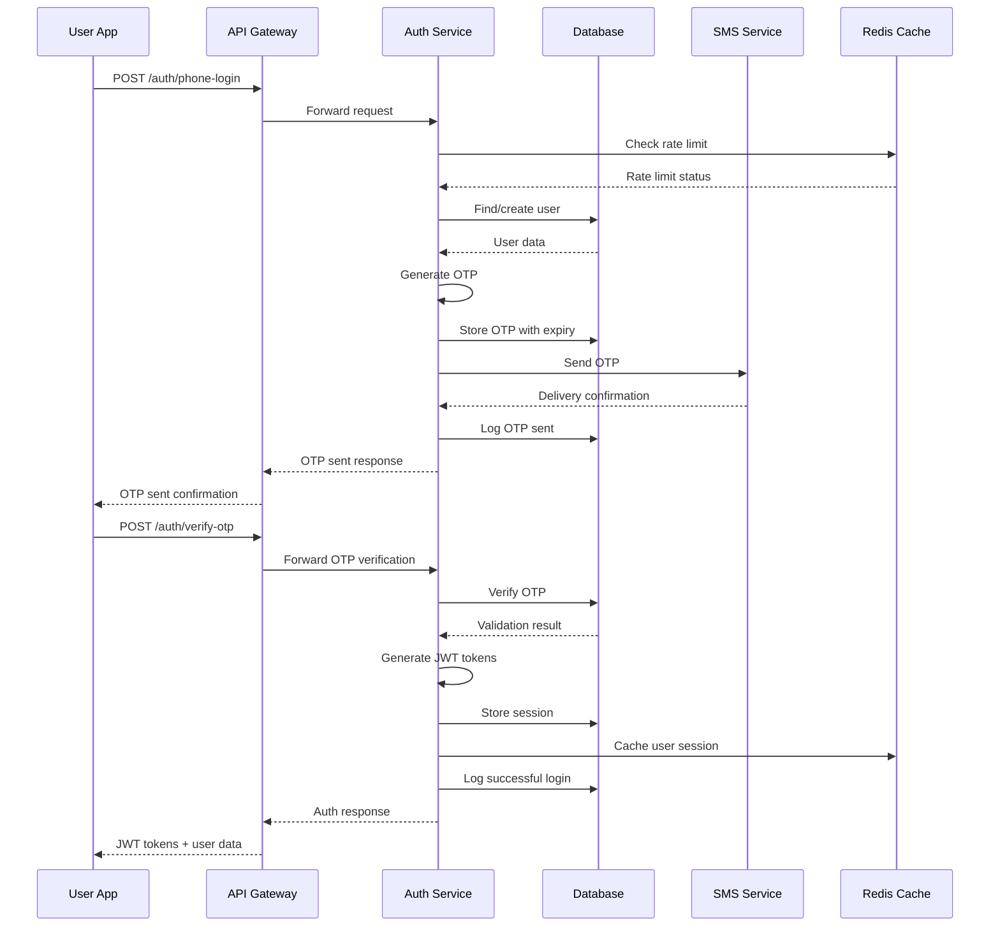
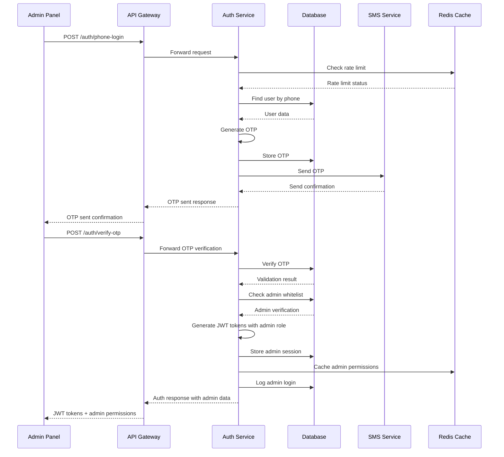

# Authentication System Technical Specification - FINAL VERSION

## Executive Summary

This document provides the complete and final technical specification for the unified phone-based authentication system supporting three distinct user roles (BUYER, MERCHANT, ADMIN) with consistent security and user experience across all platforms.

---

## 1. System Architecture

### 1.1 Core Design Principles

✅ **Unified Phone Authentication**
- All users authenticate via phone number + OTP
- No email/password authentication required
- Simplified user experience across all platforms
- Reduced security surface area

✅ **Role-Based Access Control**
- JWT tokens with embedded role information
- Permission-based feature access
- Admin users verified through phone whitelist
- Merchant verification workflow for business users

✅ **Security-First Approach**
- OTP-based authentication eliminates password risks
- Comprehensive rate limiting and anomaly detection
- Device fingerprinting and session management
- Complete audit logging and monitoring

### 1.2 Platform Integration

| Platform | Authentication Flow | Role Verification | Session Management |
|----------|-------------------|-------------------|-------------------|
| **Admin Panel** | Phone → OTP → Admin Whitelist Check | Pre-registered admin phones | 8-hour timeout |
| **Buyer App** | Phone → OTP → Direct Access | None | 30-day timeout |
| **Merchant App** | Phone → OTP → Business Verification | Merchant verification status | 30-day timeout |

---

## 2. Database Schema Specification

### 2.1 Core User Tables

#### `users` Table
```sql
CREATE TABLE users (
    id UUID PRIMARY KEY DEFAULT gen_random_uuid(),
    phone VARCHAR(20) UNIQUE NOT NULL,
    role user_role NOT NULL DEFAULT 'BUYER',
    status user_status NOT NULL DEFAULT 'PENDING',
    phone_verified BOOLEAN DEFAULT FALSE,
    created_at TIMESTAMP WITH TIME ZONE DEFAULT NOW(),
    updated_at TIMESTAMP WITH TIME ZONE DEFAULT NOW(),
    last_login_at TIMESTAMP WITH TIME ZONE NULL,
    failed_login_attempts INTEGER DEFAULT 0,
    locked_until TIMESTAMP WITH TIME ZONE NULL
);

CREATE TYPE user_role AS ENUM ('BUYER', 'MERCHANT', 'ADMIN');
CREATE TYPE user_status AS ENUM ('PENDING', 'ACTIVE', 'BANNED', 'SUSPENDED');

-- Performance indexes
CREATE INDEX idx_users_phone ON users(phone);
CREATE INDEX idx_users_role ON users(role);
CREATE INDEX idx_users_status ON users(status);
CREATE INDEX idx_users_phone_status ON users(phone, status);
```

#### `admin_whitelist` Table
```sql
CREATE TABLE admin_whitelist (
    id UUID PRIMARY KEY DEFAULT gen_random_uuid(),
    phone VARCHAR(20) UNIQUE NOT NULL,
    admin_level admin_level NOT NULL DEFAULT 'ADMIN',
    name VARCHAR(255) NOT NULL,
    department VARCHAR(100) NULL,
    is_active BOOLEAN DEFAULT TRUE,
    created_at TIMESTAMP WITH TIME ZONE DEFAULT NOW(),
    updated_at TIMESTAMP WITH TIME ZONE DEFAULT NOW()
);

CREATE TYPE admin_level AS ENUM ('SUPER_ADMIN', 'ADMIN', 'SUPPORT');

-- Indexes
CREATE INDEX idx_admin_whitelist_phone ON admin_whitelist(phone);
CREATE INDEX idx_admin_whitelist_active ON admin_whitelist(is_active);
```

#### `user_profiles` Table
```sql
CREATE TABLE user_profiles (
    id UUID PRIMARY KEY DEFAULT gen_random_uuid(),
    user_id UUID REFERENCES users(id) ON DELETE CASCADE,
    first_name VARCHAR(100) NOT NULL,
    last_name VARCHAR(100) NOT NULL,
    profile_image_url VARCHAR(500) NULL,
    location_lat DECIMAL(10, 8) NULL,
    location_lng DECIMAL(11, 8) NULL,
    address TEXT NULL,
    city VARCHAR(100) NULL,
    country VARCHAR(100) NULL,
    preferences JSONB DEFAULT '{}',
    created_at TIMESTAMP WITH TIME ZONE DEFAULT NOW(),
    updated_at TIMESTAMP WITH TIME ZONE DEFAULT NOW(),
    UNIQUE(user_id)
);

-- Indexes
CREATE INDEX idx_user_profiles_user_id ON user_profiles(user_id);
CREATE INDEX idx_user_profiles_location ON user_profiles(location_lat, location_lng);
```

### 2.2 Authentication Tables

#### `otp_codes` Table
```sql
CREATE TABLE otp_codes (
    id UUID PRIMARY KEY DEFAULT gen_random_uuid(),
    user_id UUID REFERENCES users(id) ON DELETE CASCADE,
    phone VARCHAR(20) NOT NULL,
    code VARCHAR(6) NOT NULL,
    purpose otp_purpose NOT NULL,
    attempts INTEGER DEFAULT 0,
    expires_at TIMESTAMP WITH TIME ZONE NOT NULL,
    used_at TIMESTAMP WITH TIME ZONE NULL,
    created_at TIMESTAMP WITH TIME ZONE DEFAULT NOW()
);

CREATE TYPE otp_purpose AS ENUM ('LOGIN', 'PHONE_VERIFICATION', 'ADMIN_VERIFICATION');

-- Indexes for cleanup and performance
CREATE INDEX idx_otp_codes_expires_at ON otp_codes(expires_at);
CREATE INDEX idx_otp_codes_phone ON otp_codes(phone);
CREATE INDEX idx_otp_codes_user_id ON otp_codes(user_id);
```

#### `auth_tokens` Table
```sql
CREATE TABLE auth_tokens (
    id UUID PRIMARY KEY DEFAULT gen_random_uuid(),
    user_id UUID REFERENCES users(id) ON DELETE CASCADE,
    token_type token_type NOT NULL,
    token_hash VARCHAR(255) NOT NULL,
    device_fingerprint VARCHAR(255) NULL,
    ip_address INET NULL,
    user_agent TEXT NULL,
    expires_at TIMESTAMP WITH TIME ZONE NOT NULL,
    last_used_at TIMESTAMP WITH TIME ZONE NULL,
    created_at TIMESTAMP WITH TIME ZONE DEFAULT NOW(),
    revoked_at TIMESTAMP WITH TIME ZONE NULL
);

CREATE TYPE token_type AS ENUM ('ACCESS', 'REFRESH');

-- Indexes
CREATE INDEX idx_auth_tokens_expires_at ON auth_tokens(expires_at);
CREATE INDEX idx_auth_tokens_user_id ON auth_tokens(user_id);
CREATE INDEX idx_auth_tokens_hash ON auth_tokens(token_hash);
```

#### `user_sessions` Table
```sql
CREATE TABLE user_sessions (
    id UUID PRIMARY KEY DEFAULT gen_random_uuid(),
    user_id UUID REFERENCES users(id) ON DELETE CASCADE,
    session_token VARCHAR(255) UNIQUE NOT NULL,
    device_fingerprint VARCHAR(255) NULL,
    ip_address INET NULL,
    user_agent TEXT NULL,
    is_active BOOLEAN DEFAULT TRUE,
    last_activity_at TIMESTAMP WITH TIME ZONE DEFAULT NOW(),
    created_at TIMESTAMP WITH TIME ZONE DEFAULT NOW(),
    expires_at TIMESTAMP WITH TIME ZONE NOT NULL
);

-- Indexes
CREATE INDEX idx_user_sessions_user_id ON user_sessions(user_id);
CREATE INDEX idx_user_sessions_token ON user_sessions(session_token);
CREATE INDEX idx_user_sessions_active ON user_sessions(is_active);
CREATE INDEX idx_user_sessions_expires_at ON user_sessions(expires_at);
```

### 2.3 Security & Audit Tables

#### `auth_audit_logs` Table
```sql
CREATE TABLE auth_audit_logs (
    id UUID PRIMARY KEY DEFAULT gen_random_uuid(),
    user_id UUID REFERENCES users(id) ON DELETE SET NULL,
    event_type auth_event_type NOT NULL,
    phone VARCHAR(20) NULL,
    ip_address INET NULL,
    user_agent TEXT NULL,
    device_fingerprint VARCHAR(255) NULL,
    success BOOLEAN NOT NULL,
    failure_reason TEXT NULL,
    metadata JSONB DEFAULT '{}',
    created_at TIMESTAMP WITH TIME ZONE DEFAULT NOW()
);

CREATE TYPE auth_event_type AS ENUM (
    'PHONE_LOGIN_ATTEMPT', 'OTP_SENT', 'OTP_VERIFICATION_SUCCESS', 'OTP_VERIFICATION_FAILURE',
    'LOGIN_SUCCESS', 'LOGIN_FAILURE', 'LOGOUT', 'TOKEN_REFRESH',
    'ACCOUNT_LOCKED', 'ACCOUNT_UNLOCKED', 'ADMIN_VERIFICATION_SUCCESS', 'ADMIN_VERIFICATION_FAILURE'
);

-- Indexes
CREATE INDEX idx_auth_audit_logs_created_at ON auth_audit_logs(created_at);
CREATE INDEX idx_auth_audit_logs_user_id ON auth_audit_logs(user_id);
CREATE INDEX idx_auth_audit_logs_event_type ON auth_audit_logs(event_type);
CREATE INDEX idx_auth_audit_logs_phone ON auth_audit_logs(phone);
```

---

## 3. API Specifications

### 3.1 Authentication Endpoints

#### POST `/auth/phone-login`
```typescript
interface PhoneLoginRequest {
  phone: string;
  countryCode: string;
}

interface PhoneLoginResponse {
  success: boolean;
  message: string;
  otpSent: boolean;
  expiresAt?: string; // ISO 8601 timestamp
  rateLimitExceeded?: boolean;
  nextAttemptAt?: string;
}
```

#### POST `/auth/verify-otp`
```typescript
interface OTPVerificationRequest {
  phone: string;
  otpCode: string;
  deviceFingerprint?: string;
}

interface OTPVerificationResponse {
  success: boolean;
  user: {
    id: string;
    phone: string;
    role: 'BUYER' | 'MERCHANT' | 'ADMIN';
    status: string;
    profile?: UserProfile;
    adminLevel?: 'SUPER_ADMIN' | 'ADMIN' | 'SUPPORT';
  };
  tokens: {
    accessToken: string;
    refreshToken: string;
    expiresIn: number;
  };
  sessionTimeout: number;
}
```

#### POST `/auth/resend-otp`
```typescript
interface ResendOTPRequest {
  phone: string;
}

interface ResendOTPResponse {
  success: boolean;
  message: string;
  cooldownRemaining?: number; // seconds
}
```

#### POST `/auth/refresh-token`
```typescript
interface RefreshTokenRequest {
  refreshToken: string;
}

interface RefreshTokenResponse {
  success: boolean;
  tokens: {
    accessToken: string;
    refreshToken: string;
    expiresIn: number;
  };
}
```

#### POST `/auth/logout`
```typescript
interface LogoutRequest {
  refreshToken?: string;
  allDevices?: boolean;
}

interface LogoutResponse {
  success: boolean;
  message: string;
}
```

### 3.2 Admin Management Endpoints

#### POST `/admin/whitelist`
```typescript
interface AddAdminRequest {
  phone: string;
  name: string;
  adminLevel: 'SUPER_ADMIN' | 'ADMIN' | 'SUPPORT';
  department?: string;
}

interface AddAdminResponse {
  success: boolean;
  adminId: string;
  message: string;
}
```

#### GET `/admin/whitelist`
```typescript
interface AdminWhitelistResponse {
  admins: Array<{
    id: string;
    phone: string;
    name: string;
    adminLevel: string;
    department?: string;
    isActive: boolean;
    createdAt: string;
  }>;
  pagination: {
    page: number;
    limit: number;
    total: number;
  };
}
```

---

## 4. Security Configuration

### 4.1 OTP Settings
```yaml
otp_configuration:
  length: 6
  expiry_minutes: 10
  max_attempts: 3
  resend_cooldown_seconds: 60
  rate_limit_per_phone: 3 per 5 minutes
  rate_limit_global: 100 per minute
  characters: "0123456789" # Numeric only
  case_sensitive: false
```

### 4.2 Session Management
```yaml
session_configuration:
  access_token_expiry: 15 minutes
  refresh_token_expiry: 30 days
  admin_session_timeout: 8 hours
  max_concurrent_sessions: 5
  device_fingerprint_required: true
  session_cleanup_interval: 1 hour
  inactive_session_cleanup: 24 hours
```

### 4.3 Rate Limiting
```yaml
rate_limits:
  phone_login: 5 per minute per IP
  otp_verification: 10 per minute per phone
  otp_resend: 3 per 5 minutes per phone
  token_refresh: 20 per hour per user
  admin_access: 10 per minute per admin
  global_auth_requests: 1000 per minute
```

### 4.4 Security Policies
```yaml
security_policies:
  account_lockout:
    max_failed_attempts: 5
    lockout_duration: 30 minutes
    progressive_lockout: true # 30min, 1hr, 4hr, 24hr
  
  device_tracking:
    max_devices_per_user: 5
    new_device_notification: true
    suspicious_device_detection: true
  
  ip_security:
    max_concurrent_ips: 3 per user
    ip_whitelist_for_admin: true
    geo_anomaly_detection: true
```

---

## 5. Authentication Flows

### 5.1 Standard User Authentication


### 5.2 Admin Authentication


---

## 6. Implementation Phases

### 6.1 Phase 1: Core Authentication Backend (Week 1-2)
- [ ] Set up database tables and indexes
- [ ] Implement OTP generation and validation
- [ ] Create basic authentication APIs
- [ ] Set up rate limiting and security middleware
- [ ] Implement basic audit logging

### 6.2 Phase 2: Admin Whitelist System (Week 2-3)
- [ ] Create admin whitelist table and APIs
- [ ] Implement admin verification logic
- [ ] Build admin management interface
- [ ] Set up admin role-based permissions
- [ ] Create admin audit logging

### 6.3 Phase 3: Mobile Authentication Implementation (Week 3-4)
- [ ] Implement phone number validation and formatting
- [ ] Create mobile authentication UI components
- [ ] Build OTP verification screens
- [ ] Implement session management
- [ ] Add device fingerprinting

### 6.4 Phase 4: Admin Panel Authentication (Week 4-5)
- [ ] Create admin login interface
- [ ] Implement admin dashboard authentication
- [ ] Build admin session management
- [ ] Add admin security features
- [ ] Create admin permission management UI

### 6.5 Phase 5: Advanced Security Features (Week 5-6)
- [ ] Implement anomaly detection
- [ ] Add advanced rate limiting
- [ ] Create security monitoring dashboard
- [ ] Build device management
- [ ] Add comprehensive audit reporting

---

## 7. Testing Requirements

### 7.1 Unit Testing
- [ ] OTP generation and validation logic
- [ ] JWT token generation and validation
- [ ] Rate limiting functionality
- [ ] Permission checking logic
- [ ] Database operations and constraints

### 7.2 Integration Testing
- [ ] Complete authentication flows
- [ ] Admin verification process
- [ ] Cross-platform session management
- [ ] API integration across all clients
- [ ] Third-party service integrations

### 7.3 Security Testing
- [ ] OTP bypass attempts
- [ ] Rate limiting circumvention
- [ ] Session hijacking prevention
- [ ] Admin access control
- [ ] Data integrity validation

### 7.4 Performance Testing
- [ ] High-volume OTP requests
- [ ] Concurrent authentication attempts
- [ ] Database query performance
- [ ] Session management under load
- [ ] Rate limiting performance impact

---

## 8. Monitoring & Alerting

### 8.1 Key Metrics
- Authentication success/failure rates
- OTP delivery success rates
- Rate limiting trigger frequency
- Admin access attempts
- Session duration and patterns

### 8.2 Security Alerts
- Unusual authentication patterns
- Multiple failed attempts
- Suspicious IP addresses
- Admin access from new locations
- Rate limit exhaustion

### 8.3 Performance Monitoring
- API response times
- Database query performance
- OTP delivery latency
- Session validation performance
- Rate limiting effectiveness

---

## 9. Deployment Considerations

### 9.1 Environment Configuration
- Development: Test OTP providers, relaxed rate limits
- Staging: Production-like OTP providers, production rate limits
- Production: Full security measures, comprehensive monitoring

### 9.2 Database Optimization
- Proper indexing for all lookup queries
- Connection pooling for high traffic
- Read replicas for authentication queries
- Regular cleanup of expired tokens and OTPs

### 9.3 Security Hardening
- HTTPS everywhere with proper certificates
- IP whitelisting for admin access
- Comprehensive logging and monitoring
- Regular security audits and penetration testing

---

## 10. Conclusion

This final specification provides a complete, secure, and scalable phone-based authentication system that:

✅ **Simplifies User Experience** - Single authentication method across all platforms
✅ **Enhances Security** - Eliminates password-related vulnerabilities
✅ **Maintains Flexibility** - Supports all user roles with appropriate access controls
✅ **Ensures Scalability** - Designed for high-volume marketplace usage
✅ **Provides Visibility** - Comprehensive audit logging and monitoring

The system is ready for implementation with clear phases, testing strategies, and deployment guidelines. All security considerations have been addressed, and the architecture supports the specific needs of a reverse marketplace while maintaining consistency across all user interfaces.

---

## 11. Implementation Checklist

### 11.1 Pre-Implementation
- [ ] Review and approve security configurations
- [ ] Select and configure SMS provider
- [ ] Set up development and staging environments
- [ ] Prepare database migration scripts
- [ ] Configure monitoring and alerting

### 11.2 Implementation
- [ ] Implement all database schemas
- [ ] Develop authentication APIs
- [ ] Create mobile authentication UI
- [ ] Build admin authentication interface
- [ ] Implement security features

### 11.3 Post-Implementation
- [ ] Conduct comprehensive security testing
- [ ] Perform load testing
- [ ] Validate all authentication flows
- [ ] Deploy to production environment
- [ ] Monitor and optimize performance

This specification serves as the complete technical foundation for implementing a robust, secure, and user-friendly authentication system for the reverse marketplace platform.
