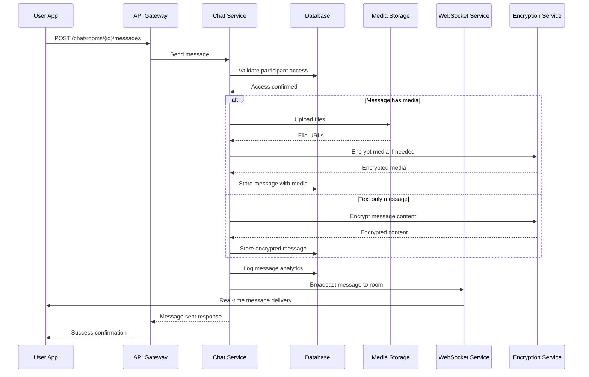
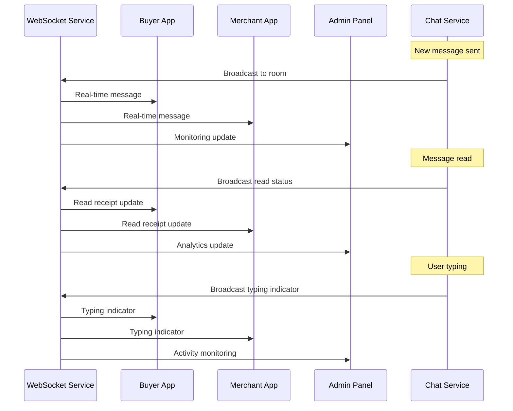

# Chat System Technical Specification - FINAL VERSION

## Executive Summary

This document provides the complete and final technical specification for the real-time chat communication system of the reverse marketplace platform, enabling buyers and merchants to discuss requests, negotiate deals, and share media with WhatsApp-like UX and robust message delivery.

---

## 1. System Architecture

### 1.1 Core Design Principles

✅ **Real-Time Communication**
- WebSocket-based instant messaging with delivery confirmation
- Multi-platform synchronization across all user interfaces
- Message threading and reply system for organized conversations
- Real-time typing indicators and presence status

✅ **Rich Media Support**
- Comprehensive file sharing with compression and CDN delivery
- Image, video, voice, and document support
- Media preview and gallery functionality
- Content moderation and security scanning

✅ **Business-Ready Features**
- Professional chat tools for merchants
- Customer service integration
- Chat analytics and insights
- Automated responses and templates

### 1.2 Platform Integration

| Platform | Primary Features | Secondary Features | Use Case |
|----------|------------------|-------------------|-----------|
| **Buyer App** | Direct chat, media sharing | Request context, deal negotiation | Personal communication |
| **Merchant App** | Multi-chat management, templates | Business tools, analytics | Professional customer service |
| **Admin Panel** | Monitoring, moderation | Analytics, compliance | Oversight and support |

---

## 2. Database Schema Specification

### 2.1 Core Chat Tables

#### `chat_rooms` Table
```sql
CREATE TABLE chat_rooms (
    id UUID PRIMARY KEY DEFAULT gen_random_uuid(),
    name VARCHAR(255) NOT NULL,
    description TEXT NULL,
    type room_type NOT NULL DEFAULT 'DIRECT',
    related_request_id UUID REFERENCES requests(id) ON DELETE CASCADE,
    related_bid_id UUID REFERENCES bids(id) ON DELETE CASCADE,
    created_by UUID NOT NULL REFERENCES users(id) ON DELETE CASCADE,
    is_active BOOLEAN DEFAULT TRUE,
    max_participants INTEGER DEFAULT 100,
    created_at TIMESTAMP WITH TIME ZONE DEFAULT NOW(),
    updated_at TIMESTAMP WITH TIME ZONE DEFAULT NOW()
);

CREATE TYPE room_type AS ENUM ('DIRECT', 'GROUP', 'REQUEST', 'BID', 'SUPPORT');

-- Indexes
CREATE INDEX idx_chat_rooms_type ON chat_rooms(type);
CREATE INDEX idx_chat_rooms_request_id ON chat_rooms(related_request_id);
CREATE INDEX idx_chat_rooms_bid_id ON chat_rooms(related_bid_id);
CREATE INDEX idx_chat_rooms_created_by ON chat_rooms(created_by);
CREATE INDEX idx_chat_rooms_active ON chat_rooms(is_active);
```

#### `chat_participants` Table
```sql
CREATE TABLE chat_participants (
    id UUID PRIMARY KEY DEFAULT gen_random_uuid(),
    room_id UUID NOT NULL REFERENCES chat_rooms(id) ON DELETE CASCADE,
    user_id UUID NOT NULL REFERENCES users(id) ON DELETE CASCADE,
    role participant_role NOT NULL DEFAULT 'MEMBER',
    joined_at TIMESTAMP WITH TIME ZONE DEFAULT NOW(),
    last_read_at TIMESTAMP WITH TIME ZONE NULL,
    is_muted BOOLEAN DEFAULT FALSE,
    is_banned BOOLEAN DEFAULT FALSE,
    banned_until TIMESTAMP WITH TIME ZONE NULL,
    banned_by UUID REFERENCES users(id) NULL,
    banned_reason TEXT NULL,
    left_at TIMESTAMP WITH TIME ZONE NULL
);

CREATE TYPE participant_role AS ENUM ('OWNER', 'ADMIN', 'MODERATOR', 'MEMBER');

-- Indexes
CREATE INDEX idx_chat_participants_room_id ON chat_participants(room_id);
CREATE INDEX idx_chat_participants_user_id ON chat_participants(user_id);
CREATE INDEX idx_chat_participants_role ON chat_participants(role);
CREATE INDEX idx_chat_participants_banned ON chat_participants(is_banned);
```

#### `chat_messages` Table
```sql
CREATE TABLE chat_messages (
    id UUID PRIMARY KEY DEFAULT gen_random_uuid(),
    room_id UUID NOT NULL REFERENCES chat_rooms(id) ON DELETE CASCADE,
    sender_id UUID NOT NULL REFERENCES users(id) ON DELETE CASCADE,
    type message_type NOT NULL DEFAULT 'TEXT',
    content TEXT NOT NULL,
    reply_to_id UUID REFERENCES chat_messages(id) NULL,
    thread_id UUID REFERENCES chat_messages(id) NULL,
    media_urls TEXT[] DEFAULT '{}',
    metadata JSONB DEFAULT '{}',
    is_edited BOOLEAN DEFAULT FALSE,
    edited_at TIMESTAMP WITH TIME ZONE NULL,
    is_deleted BOOLEAN DEFAULT FALSE,
    deleted_at TIMESTAMP WITH TIME ZONE NULL,
    created_at TIMESTAMP WITH TIME ZONE DEFAULT NOW()
);

CREATE TYPE message_type AS ENUM ('TEXT', 'IMAGE', 'FILE', 'VOICE', 'VIDEO', 'LOCATION', 'SYSTEM');

-- Indexes for performance
CREATE INDEX idx_chat_messages_room_id ON chat_messages(room_id);
CREATE INDEX idx_chat_messages_sender_id ON chat_messages(sender_id);
CREATE INDEX idx_chat_messages_type ON chat_messages(type);
CREATE INDEX idx_chat_messages_created_at ON chat_messages(created_at);
CREATE INDEX idx_chat_messages_thread_id ON chat_messages(thread_id);
CREATE INDEX idx_chat_messages_reply_to ON chat_messages(reply_to_id);
-- Full-text search index
CREATE INDEX idx_chat_messages_content ON chat_messages USING GIN(to_tsvector('english', content));
```

### 2.2 Message Status Tables

#### `message_read_status` Table
```sql
CREATE TABLE message_read_status (
    id UUID PRIMARY KEY DEFAULT gen_random_uuid(),
    message_id UUID NOT NULL REFERENCES chat_messages(id) ON DELETE CASCADE,
    user_id UUID NOT NULL REFERENCES chat_participants(user_id) ON DELETE CASCADE,
    read_at TIMESTAMP WITH TIME ZONE DEFAULT NOW(),
    UNIQUE(message_id, user_id)
);

-- Indexes
CREATE INDEX idx_message_read_status_message_id ON message_read_status(message_id);
CREATE INDEX idx_message_read_status_user_id ON message_read_status(user_id);
```

#### `message_reactions` Table
```sql
CREATE TABLE message_reactions (
    id UUID PRIMARY KEY DEFAULT gen_random_uuid(),
    message_id UUID NOT NULL REFERENCES chat_messages(id) ON DELETE CASCADE,
    user_id UUID NOT NULL REFERENCES users(id) ON DELETE CASCADE,
    reaction_type VARCHAR(50) NOT NULL,
    created_at TIMESTAMP WITH TIME ZONE DEFAULT NOW(),
    UNIQUE(message_id, user_id, reaction_type)
);

-- Indexes
CREATE INDEX idx_message_reactions_message_id ON message_reactions(message_id);
CREATE INDEX idx_message_reactions_user_id ON message_reactions(user_id);
```

### 2.3 Media Management Tables

#### `chat_media` Table
```sql
CREATE TABLE chat_media (
    id UUID PRIMARY KEY DEFAULT gen_random_uuid(),
    message_id UUID NOT NULL REFERENCES chat_messages(id) ON DELETE CASCADE,
    uploader_id UUID NOT NULL REFERENCES users(id) ON DELETE CASCADE,
    filename VARCHAR(255) NOT NULL,
    original_filename VARCHAR(255) NULL,
    file_path VARCHAR(500) NOT NULL,
    file_url VARCHAR(500) NOT NULL,
    thumbnail_url VARCHAR(500) NULL,
    file_size BIGINT NOT NULL,
    mime_type VARCHAR(100) NOT NULL,
    width INTEGER NULL,
    height INTEGER NULL,
    duration_seconds INTEGER NULL, -- For audio/video
    is_encrypted BOOLEAN DEFAULT FALSE,
    encryption_key_id VARCHAR(255) NULL,
    uploaded_at TIMESTAMP WITH TIME ZONE DEFAULT NOW(),
    expires_at TIMESTAMP WITH TIME ZONE NULL
);

-- Indexes
CREATE INDEX idx_chat_media_message_id ON chat_media(message_id);
CREATE INDEX idx_chat_media_uploader_id ON chat_media(uploader_id);
CREATE INDEX idx_chat_media_mime_type ON chat_media(mime_type);
CREATE INDEX idx_chat_media_expires_at ON chat_media(expires_at);
```

### 2.4 Analytics and Monitoring Tables

#### `chat_analytics` Table
```sql
CREATE TABLE chat_analytics (
    id UUID PRIMARY KEY DEFAULT gen_random_uuid(),
    room_id UUID REFERENCES chat_rooms(id) ON DELETE SET NULL,
    user_id UUID REFERENCES users(id) ON DELETE SET NULL,
    event_type analytics_event_type NOT NULL,
    metadata JSONB DEFAULT '{}',
    created_at TIMESTAMP WITH TIME ZONE DEFAULT NOW()
);

CREATE TYPE analytics_event_type AS ENUM (
    'MESSAGE_SENT', 'MESSAGE_READ', 'MEDIA_SHARED', 'REACTION_ADDED',
    'ROOM_JOINED', 'ROOM_LEFT', 'TYPING_STARTED', 'TYPING_STOPPED',
    'CALL_STARTED', 'CALL_ENDED', 'TRANSLATION_USED'
);

-- Indexes
CREATE INDEX idx_chat_analytics_room_id ON chat_analytics(room_id);
CREATE INDEX idx_chat_analytics_user_id ON chat_analytics(user_id);
CREATE INDEX idx_chat_analytics_event_type ON chat_analytics(event_type);
CREATE INDEX idx_chat_analytics_created_at ON chat_analytics(created_at);
```

---

## 3. API Specifications

### 3.1 Chat Management Endpoints

#### POST `/chat/rooms`
```typescript
interface CreateRoomRequest {
  name: string;
  description?: string;
  type: 'DIRECT' | 'GROUP' | 'REQUEST' | 'BID' | 'SUPPORT';
  relatedRequestId?: string;
  relatedBidId?: string;
  participantIds?: string[];
}

interface CreateRoomResponse {
  success: boolean;
  roomId?: string;
  message?: string;
}
```

#### GET `/chat/rooms`
```typescript
interface GetRoomsRequest {
  filters?: {
    type?: RoomType[];
    isActive?: boolean;
    participantId?: string;
  };
  pagination?: {
    page: number;
    limit: number;
  };
}

interface GetRoomsResponse {
  rooms: ChatRoom[];
  pagination: {
    page: number;
    limit: number;
    total: number;
    totalPages: number;
  };
}
```

#### GET `/chat/rooms/{id}/messages`
```typescript
interface GetMessagesRequest {
  filters?: {
    messageType?: MessageType[];
    dateRange?: {
      startDate: string;
      endDate: string;
    };
    senderId?: string;
  };
  pagination?: {
    page: number;
    limit: number;
  };
}

interface GetMessagesResponse {
  messages: ChatMessage[];
  pagination: {
    page: number;
    limit: number;
    total: number;
    totalPages: number;
  };
}
```

#### POST `/chat/rooms/{id}/messages`
```typescript
interface SendMessageRequest {
  type: MessageType;
  content: string;
  replyToId?: string;
  threadId?: string;
  media?: File[];
}

interface SendMessageResponse {
  success: boolean;
  messageId?: string;
  timestamp?: string;
  deliveryStatus?: MessageDeliveryStatus;
  error?: string;
}
```

### 3.2 Media Management Endpoints

#### POST `/chat/media/upload`
```typescript
interface UploadMediaRequest {
  file: File;
  roomId: string;
  encryptionEnabled?: boolean;
}

interface UploadMediaResponse {
  success: boolean;
  mediaId?: string;
  fileUrl?: string;
  thumbnailUrl?: string;
  message?: string;
}
```

### 3.3 Real-Time Events

#### WebSocket Events
```typescript
// Message Events
interface MessageSentEvent {
  type: 'MESSAGE_SENT';
  data: {
    messageId: string;
    roomId: string;
    senderId: string;
    content: string;
    messageType: MessageType;
    timestamp: string;
  };
}

interface MessageReadEvent {
  type: 'MESSAGE_READ';
  data: {
    messageId: string;
    roomId: string;
    readerId: string;
    timestamp: string;
  };
}

// Typing Events
interface TypingStartedEvent {
  type: 'TYPING_STARTED';
  data: {
    roomId: string;
    userId: string;
    timestamp: string;
  };
}

interface TypingStoppedEvent {
  type: 'TYPING_STOPPED';
  data: {
    roomId: string;
    userId: string;
    timestamp: string;
  };
}

// Room Events
interface RoomJoinedEvent {
  type: 'ROOM_JOINED';
  data: {
    roomId: string;
    userId: string;
    timestamp: string;
  };
}

interface RoomLeftEvent {
  type: 'ROOM_LEFT';
  data: {
    roomId: string;
    userId: string;
    timestamp: string;
  };
}
```

---

## 4. Message Encryption

### 4.1 Encryption Configuration
```yaml
message_encryption:
  algorithm: "AES-256-GCM"
  key_exchange: "ECDH"
  key_derivation: "PBKDF2"
  end_to_end: true
  key_rotation_days: 90
  backup_encryption: true
  compliance: "GDPR"
  key_management:
    provider: "AWS_KMS"
    key_rotation: "automatic"
    access_logging: true
    key_backup: true
```

### 4.2 Encryption Implementation
```typescript
interface EncryptionService {
  generateKeyPair(): Promise<KeyPair>;
  encryptMessage(message: string, publicKey: string): Promise<EncryptedMessage>;
  decryptMessage(encryptedMessage: EncryptedMessage, privateKey: string): Promise<string>;
  rotateKey(userId: string): Promise<void>;
}

interface EncryptedMessage {
  encryptedContent: string;
  keyId: string;
  algorithm: string;
  iv: string;
}
```

---

## 5. Chat Flows

### 5.1 Message Sending Flow


### 5.2 Real-Time Chat Updates Flow


---

## 6. Implementation Phases

### 6.1 Phase 1: Core Chat Backend (Week 1-2)
- [ ] Set up database tables and indexes
- [ ] Implement basic messaging APIs
- [ ] Create WebSocket infrastructure
- [ ] Set up basic message encryption
- [ ] Implement participant management

### 6.2 Phase 2: Media Handling (Week 2-3)
- [ ] Implement file upload and processing
- [ ] Set up CDN integration
- [ ] Create media compression and optimization
- [ ] Implement media encryption
- [ ] Build media gallery functionality

### 6.3 Phase 3: Real-Time Features (Week 3-4)
- [ ] Implement typing indicators
- [ ] Create read receipt system
- [ ] Build message threading
- [ ] Add presence and online status
- [ ] Implement message reactions

### 6.4 Phase 4: Advanced Features (Week 4-5)
- [ ] Implement message search
- [ ] Create chat analytics
- [ ] Build moderation tools
- [ ] Add translation features
- [ ] Implement voice/video calling

### 6.5 Phase 5: Mobile Apps (Week 5-6)
- [ ] Create buyer app chat interface
- [ ] Build merchant app chat management
- [ ] Implement admin panel monitoring
- [ ] Add cross-platform synchronization
- [ ] Create offline support

---

## 7. Testing Requirements

### 7.1 Functionality Testing
- [ ] Test complete chat lifecycle from creation to deletion
- [ ] Verify message delivery and read receipts
- [ ] Test real-time message synchronization
- [ ] Validate media upload and sharing
- [ ] Test chat permissions and access control

### 7.2 Performance Testing
- [ ] Test chat performance under high message volume
- [ ] Verify real-time message delivery performance
- [ ] Test media upload and processing performance
- [ ] Validate WebSocket connection stability
- [ ] Test database query optimization

### 7.3 Security Testing
- [ ] Test message encryption and security
- [ ] Verify chat access control and permissions
- [ ] Test content moderation effectiveness
- [ ] Validate chat data privacy
- [ ] Test chat audit trail completeness

---

## 8. Monitoring & Analytics

### 8.1 Key Metrics
- Message volume and delivery rates
- User engagement and activity patterns
- Media sharing statistics
- Chat session duration
- Error rates and performance issues

### 8.2 Performance Monitoring
- WebSocket connection performance
- Message processing latency
- Database query performance
- Media upload and delivery speed
- CDN performance metrics

### 8.3 Security Monitoring
- Encryption key management
- Access control violations
- Content moderation effectiveness
- Data privacy compliance
- Security incident detection

---

## 9. Security Considerations

### 9.1 Message Security
- End-to-end encryption for all messages
- Secure key management and rotation
- Message authentication and integrity
- Secure media storage and delivery
- Forward secrecy and post-compromise security

### 9.2 Access Control
- Room-based permissions and roles
- Participant management and moderation
- Ban and mute functionality
- Rate limiting for messages
- Anti-spam and abuse prevention

### 9.3 Data Protection
- GDPR compliance for chat data
- Data retention and deletion policies
- Privacy controls for users
- Audit logging for all actions
- Secure backup and recovery

---

## 10. Conclusion

This final specification provides a complete, secure, and scalable real-time chat system that:

✅ **Enables Real-Time Communication** - WebSocket-based instant messaging with delivery confirmation
✅ **Supports Rich Media** - Comprehensive file sharing with CDN delivery and encryption
✅ **Provides Business Tools** - Professional chat features for merchants and customer service
✅ **Ensures Security** - End-to-end encryption with comprehensive access controls
✅ **Delivers Performance** - Optimized for high-volume marketplace usage

The system is ready for implementation with clear phases, testing strategies, and deployment guidelines. All security considerations have been addressed, and the architecture supports the specific needs of a reverse marketplace while maintaining privacy and performance standards.

---

## 11. Implementation Checklist

### 11.1 Pre-Implementation
- [ ] Review and approve encryption configuration
- [ ] Select and configure CDN provider
- [ ] Set up WebSocket infrastructure
- [ ] Prepare database migration scripts
- [ ] Configure monitoring and alerting

### 11.2 Implementation
- [ ] Implement all database schemas
- [ ] Develop chat APIs and WebSocket handlers
- [ ] Create media upload and processing system
- [ ] Build encryption and key management
- [ ] Implement real-time features

### 11.3 Post-Implementation
- [ ] Conduct comprehensive security testing
- [ ] Perform load and stress testing
- [ ] Validate all chat flows
- [ ] Deploy to production environment
- [ ] Monitor and optimize performance

This specification serves as a complete technical foundation for implementing a robust, secure, and user-friendly real-time chat system for the reverse marketplace platform.
