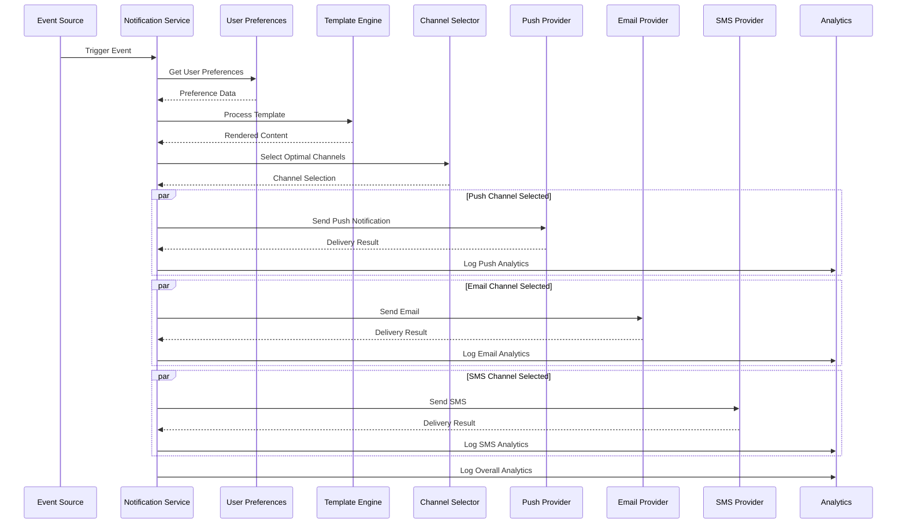
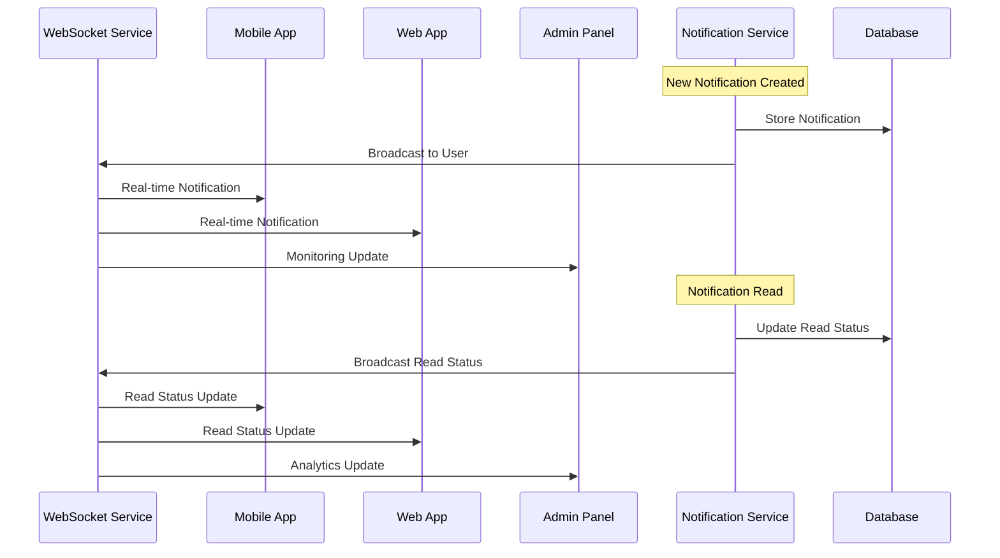

# Notification System Technical Specification - FINAL VERSION

## Executive Summary

This document provides the complete and final technical specification for the multi-channel notification system of the reverse marketplace platform, providing real-time alerts, push notifications, email communications, and in-app messages with intelligent delivery and personalization.

---

## 1. System Architecture

### 1.1 Core Design Principles

✅ **Multi-Channel Delivery**
- Push notifications (FCM/APNS) with intelligent fallback
- Email notifications with template-based personalization
- SMS notifications for urgent alerts
- In-app notifications with real-time updates

✅ **Intelligent Personalization**
- User preference-based channel selection
- Behavioral analysis for optimal timing
- Content adaptation based on user context
- Machine learning for relevance scoring

✅ **Real-Time Processing**
- WebSocket-based instant delivery
- Message status tracking and confirmation
- Cross-platform synchronization
- Offline queuing and sync

### 1.2 Platform Integration

| Platform | Primary Channels | Secondary Features | Use Case |
|----------|------------------|-------------------|-----------|
| **Buyer App** | Push, In-App | Email for receipts, SMS for urgent | Personal notifications |
| **Merchant App** | Push, In-App | Email for statements, SMS for alerts | Business notifications |
| **Admin Panel** | In-App, Email | Webhook for integrations | System notifications |

---

## 2. Database Schema Specification

### 2.1 Core Notification Tables

#### `notifications` Table
```sql
CREATE TABLE notifications (
    id UUID PRIMARY KEY DEFAULT gen_random_uuid(),
    user_id UUID NOT NULL REFERENCES users(id) ON DELETE CASCADE,
    type notification_type NOT NULL,
    title VARCHAR(255) NOT NULL,
    content TEXT NOT NULL,
    channel notification_channel NOT NULL DEFAULT 'IN_APP',
    priority notification_priority NOT NULL DEFAULT 'NORMAL',
    status notification_status NOT NULL DEFAULT 'PENDING',
    template_id UUID REFERENCES notification_templates(id) NULL,
    template_variables JSONB DEFAULT '{}',
    metadata JSONB DEFAULT '{}',
    scheduled_at TIMESTAMP WITH TIME ZONE NULL,
    sent_at TIMESTAMP WITH TIME ZONE NULL,
    delivered_at TIMESTAMP WITH TIME ZONE NULL,
    read_at TIMESTAMP WITH TIME ZONE NULL,
    expires_at TIMESTAMP WITH TIME ZONE NULL,
    created_at TIMESTAMP WITH TIME ZONE DEFAULT NOW(),
    updated_at TIMESTAMP WITH TIME ZONE DEFAULT NOW()
);

CREATE TYPE notification_type AS ENUM (
    'SYSTEM', 'REQUEST', 'BID', 'PAYMENT', 'CHAT', 'SUBSCRIPTION', 'SECURITY', 'MARKETING'
);
CREATE TYPE notification_channel AS ENUM ('IN_APP', 'PUSH', 'EMAIL', 'SMS', 'WEBHOOK');
CREATE TYPE notification_priority AS ENUM ('LOW', 'NORMAL', 'HIGH', 'URGENT');
CREATE TYPE notification_status AS ENUM ('PENDING', 'PROCESSING', 'SENT', 'DELIVERED', 'FAILED', 'EXPIRED', 'READ');

-- Performance indexes
CREATE INDEX idx_notifications_user_id ON notifications(user_id);
CREATE INDEX idx_notifications_type ON notifications(type);
CREATE INDEX idx_notifications_channel ON notifications(channel);
CREATE INDEX idx_notifications_status ON notifications(status);
CREATE INDEX idx_notifications_priority ON notifications(priority);
CREATE INDEX idx_notifications_created_at ON notifications(created_at);
CREATE INDEX idx_notifications_scheduled_at ON notifications(scheduled_at);
```

#### `notification_channels` Table
```sql
CREATE TABLE notification_channels (
    id UUID PRIMARY KEY DEFAULT gen_random_uuid(),
    user_id UUID NOT NULL REFERENCES users(id) ON DELETE CASCADE,
    channel_type notification_channel NOT NULL,
    is_enabled BOOLEAN DEFAULT TRUE,
    device_token VARCHAR(500) NULL, -- For push notifications
    email_address VARCHAR(255) NULL, -- For email notifications
    phone_number VARCHAR(20) NULL, -- For SMS notifications
    preferences JSONB DEFAULT '{}',
    last_used_at TIMESTAMP WITH TIME ZONE NULL,
    verified_at TIMESTAMP WITH TIME ZONE NULL,
    created_at TIMESTAMP WITH TIME ZONE DEFAULT NOW(),
    updated_at TIMESTAMP WITH TIME ZONE DEFAULT NOW(),
    UNIQUE(user_id, channel_type)
);

-- Indexes
CREATE INDEX idx_notification_channels_user_id ON notification_channels(user_id);
CREATE INDEX idx_notification_channels_type ON notification_channels(channel_type);
CREATE INDEX idx_notification_channels_enabled ON notification_channels(is_enabled);
```

#### `notification_templates` Table
```sql
CREATE TABLE notification_templates (
    id UUID PRIMARY KEY DEFAULT gen_random_uuid(),
    name VARCHAR(100) NOT NULL,
    type notification_type NOT NULL,
    channel notification_channel NOT NULL,
    subject_template VARCHAR(500) NULL,
    content_template TEXT NOT NULL,
    variables JSONB DEFAULT '{}',
    default_locale VARCHAR(10) DEFAULT 'en',
    is_active BOOLEAN DEFAULT TRUE,
    version INTEGER DEFAULT 1,
    created_by UUID REFERENCES users(id) NULL,
    created_at TIMESTAMP WITH TIME ZONE DEFAULT NOW(),
    updated_at TIMESTAMP WITH TIME ZONE DEFAULT NOW()
);

-- Indexes
CREATE INDEX idx_notification_templates_type ON notification_templates(type);
CREATE INDEX idx_notification_templates_channel ON notification_templates(channel);
CREATE INDEX idx_notification_templates_active ON notification_templates(is_active);
CREATE INDEX idx_notification_templates_version ON notification_templates(version);
```

### 2.2 Delivery Tracking Tables

#### `notification_deliveries` Table
```sql
CREATE TABLE notification_deliveries (
    id UUID PRIMARY KEY DEFAULT gen_random_uuid(),
    notification_id UUID NOT NULL REFERENCES notifications(id) ON DELETE CASCADE,
    channel_type notification_channel NOT NULL,
    provider VARCHAR(100) NOT NULL, -- FCM, APNS, SendGrid, Twilio
    recipient VARCHAR(500) NOT NULL,
    status delivery_status NOT NULL DEFAULT 'PENDING',
    attempt_count INTEGER DEFAULT 0,
    sent_at TIMESTAMP WITH TIME ZONE NULL,
    delivered_at TIMESTAMP WITH TIME ZONE NULL,
    error_message TEXT NULL,
    error_code VARCHAR(100) NULL,
    metadata JSONB DEFAULT '{}',
    created_at TIMESTAMP WITH TIME ZONE DEFAULT NOW()
);

CREATE TYPE delivery_status AS ENUM ('PENDING', 'PROCESSING', 'SENT', 'DELIVERED', 'FAILED', 'BOUNCED');

-- Indexes
CREATE INDEX idx_notification_deliveries_notification_id ON notification_deliveries(notification_id);
CREATE INDEX idx_notification_deliveries_channel ON notification_deliveries(channel_type);
CREATE INDEX idx_notification_deliveries_status ON notification_deliveries(status);
CREATE INDEX idx_notification_deliveries_provider ON notification_deliveries(provider);
```

#### `notification_reads` Table
```sql
CREATE TABLE notification_reads (
    id UUID PRIMARY KEY DEFAULT gen_random_uuid(),
    notification_id UUID NOT NULL REFERENCES notifications(id) ON DELETE CASCADE,
    user_id UUID NOT NULL REFERENCES users(id) ON DELETE CASCADE,
    read_at TIMESTAMP WITH TIME ZONE DEFAULT NOW(),
    device_fingerprint VARCHAR(255) NULL,
    ip_address INET NULL,
    user_agent TEXT NULL,
    created_at TIMESTAMP WITH TIME ZONE DEFAULT NOW(),
    UNIQUE(notification_id, user_id)
);

-- Indexes
CREATE INDEX idx_notification_reads_notification_id ON notification_reads(notification_id);
CREATE INDEX idx_notification_reads_user_id ON notification_reads(user_id);
CREATE INDEX idx_notification_reads_read_at ON notification_reads(read_at);
```

### 2.3 User Preference Tables

#### `notification_preferences` Table
```sql
CREATE TABLE notification_preferences (
    id UUID PRIMARY KEY DEFAULT gen_random_uuid(),
    user_id UUID NOT NULL REFERENCES users(id) ON DELETE CASCADE,
    notification_type notification_type NOT NULL,
    channel_type notification_channel NOT NULL,
    is_enabled BOOLEAN DEFAULT TRUE,
    quiet_hours_start TIME NULL,
    quiet_hours_end TIME NULL,
    min_priority notification_priority NULL,
    max_frequency_minutes INTEGER NULL,
    preferences JSONB DEFAULT '{}',
    created_at TIMESTAMP WITH TIME ZONE DEFAULT NOW(),
    updated_at TIMESTAMP WITH TIME ZONE DEFAULT NOW(),
    UNIQUE(user_id, notification_type, channel_type)
);

-- Indexes
CREATE INDEX idx_notification_preferences_user_id ON notification_preferences(user_id);
CREATE INDEX idx_notification_preferences_type ON notification_preferences(notification_type);
CREATE INDEX idx_notification_preferences_channel ON notification_preferences(channel_type);
CREATE INDEX idx_notification_preferences_enabled ON notification_preferences(is_enabled);
```

### 2.4 Analytics and Monitoring Tables

#### `notification_analytics` Table
```sql
CREATE TABLE notification_analytics (
    id UUID PRIMARY KEY DEFAULT gen_random_uuid(),
    notification_id UUID REFERENCES notifications(id) ON DELETE SET NULL,
    user_id UUID REFERENCES users(id) ON DELETE SET NULL,
    event_type analytics_event_type NOT NULL,
    channel_type notification_channel NOT NULL,
    provider VARCHAR(100) NULL,
    delivery_time_ms INTEGER NULL,
    success BOOLEAN NOT NULL,
    error_code VARCHAR(100) NULL,
    metadata JSONB DEFAULT '{}',
    created_at TIMESTAMP WITH TIME ZONE DEFAULT NOW()
);

CREATE TYPE analytics_event_type AS ENUM (
    'SENT', 'DELIVERED', 'READ', 'FAILED', 'BOUNCED', 'CLICKED', 'DISMISSED'
);

-- Indexes
CREATE INDEX idx_notification_analytics_notification_id ON notification_analytics(notification_id);
CREATE INDEX idx_notification_analytics_user_id ON notification_analytics(user_id);
CREATE INDEX idx_notification_analytics_event_type ON notification_analytics(event_type);
CREATE INDEX idx_notification_analytics_channel ON notification_analytics(channel_type);
CREATE INDEX idx_notification_analytics_created_at ON notification_analytics(created_at);
```

---

## 3. API Specifications

### 3.1 Notification Management Endpoints

#### POST `/notifications/send`
```typescript
interface SendNotificationRequest {
  userId: string;
  type: NotificationType;
  title: string;
  content: string;
  channels: NotificationChannel[];
  priority?: NotificationPriority;
  templateId?: string;
  templateVariables?: Record<string, any>;
  scheduledAt?: string;
  metadata?: Record<string, any>;
}

interface SendNotificationResponse {
  success: boolean;
  notificationId?: string;
  deliveryStatus?: DeliveryStatus;
  message?: string;
  errors?: ValidationError[];
}
```

#### GET `/notifications/{id}`
```typescript
interface GetNotificationResponse {
  success: boolean;
  notification?: {
    id: string;
    userId: string;
    type: NotificationType;
    title: string;
    content: string;
    channels: NotificationChannel[];
    priority: NotificationPriority;
    status: NotificationStatus;
    createdAt: string;
    updatedAt: string;
    readAt?: string;
    expiresAt?: string;
  };
  message?: string;
}
```

#### GET `/notifications`
```typescript
interface GetNotificationsRequest {
  filters?: {
    type?: NotificationType[];
    status?: NotificationStatus[];
    channels?: NotificationChannel[];
    dateRange?: {
      startDate: string;
      endDate: string;
    };
  };
  pagination?: {
    page: number;
    limit: number;
  };
}

interface GetNotificationsResponse {
  notifications: Notification[];
  pagination: {
    page: number;
    limit: number;
    total: number;
    totalPages: number;
  };
}
```

### 3.2 Preference Management Endpoints

#### GET `/notifications/preferences`
```typescript
interface GetPreferencesResponse {
  success: boolean;
  preferences: NotificationPreference[];
  message?: string;
}
```

#### PUT `/notifications/preferences`
```typescript
interface UpdatePreferencesRequest {
  preferences: Array<{
    notificationType: NotificationType;
    channel: NotificationChannel;
    isEnabled: boolean;
    quietHoursStart?: string;
    quietHoursEnd?: string;
    minPriority?: NotificationPriority;
    maxFrequencyMinutes?: number;
  }>;
}

interface UpdatePreferencesResponse {
  success: boolean;
  message?: string;
}
```

### 3.3 Template Management Endpoints

#### GET `/notifications/templates`
```typescript
interface GetTemplatesRequest {
  filters?: {
    type?: NotificationType[];
    channel?: NotificationChannel[];
    isActive?: boolean;
  };
}

interface GetTemplatesResponse {
  success: boolean;
  templates: NotificationTemplate[];
  message?: string;
}
```

#### POST `/notifications/templates`
```typescript
interface CreateTemplateRequest {
  name: string;
  type: NotificationType;
  channel: NotificationChannel;
  subjectTemplate?: string;
  contentTemplate: string;
  variables?: Record<string, string>;
  defaultLocale?: string;
}

interface CreateTemplateResponse {
  success: boolean;
  templateId?: string;
  message?: string;
}
```

---

## 4. Channel Selection Algorithm

### 4.1 Channel Selection Configuration
```yaml
channel_selection:
  priority_order:
    PUSH: "highest_engagement"
    IN_APP: "immediate_delivery"
    EMAIL: "detailed_content"
    SMS: "urgent_only"
  
  selection_criteria:
    user_preferences: 0.6 # 60% weight
    delivery_speed: 0.25 # 25% weight
    content_type: 0.15 # 15% weight
    time_of_day: 0.1 # 10% weight
  
  fallback_rules:
    push_failed: "try_email"
    email_failed: "try_sms"
    all_failed: "queue_retry"
    rate_limit_exceeded: "delay_delivery"
```

### 4.2 Personalization Engine
```yaml
personalization_engine:
  user_factors:
    engagement_history: 0.3
    time_zone_preference: 0.2
    device_type: 0.2
    interaction_patterns: 0.2
    location_context: 0.1
  
  content_adaptation:
    language_localization: true
    cultural_adaptation: true
    tone_adjustment: "professional/friendly"
    content_length_optimization: true
  
  learning_algorithm:
    reinforcement_learning: true
    a_b_testing_enabled: true
    performance_tracking: true
```

---

## 5. Notification Flows

### 5.1 Notification Generation and Delivery Flow


### 5.2 Real-Time Notification Updates Flow


---

## 6. Implementation Phases

### 6.1 Phase 1: Core Notification Backend (Weeks 1-2)
- [ ] Set up database tables and indexes
- [ ] Implement basic notification APIs
- [ ] Create template engine
- [ ] Set up basic channel providers
- [ ] Implement user preference management

### 6.2 Phase 2: Channel Integration (Weeks 2-3)
- [ ] Integrate FCM for Android notifications
- [ ] Integrate APNS for iOS notifications
- [ ] Set up email service provider
- [ ] Configure SMS gateway
- [ ] Implement channel failover logic

### 6.3 Phase 3: Real-Time Features (Weeks 3-4)
- [ ] Implement WebSocket infrastructure
- [ ] Create real-time notification delivery
- [ ] Build read receipt tracking
- [ ] Set up notification status broadcasting
- [ ] Implement offline queuing

### 6.4 Phase 4: Personalization Engine (Weeks 4-5)
- [ ] Implement user behavior analysis
- [ ] Create channel selection algorithm
- [ ] Build content adaptation system
- [ ] Set up A/B testing framework
- [ ] Implement machine learning for personalization

### 6.5 Phase 5: Advanced Features (Weeks 5-6)
- [ ] Implement geofencing notifications
- [ ] Create advanced analytics dashboard
- [ ] Build notification optimization tools
- [ ] Set up compliance monitoring
- [ ] Create admin management interface

---

## 7. Testing Requirements

### 7.1 Functionality Testing
- [ ] Test complete notification lifecycle
- [ ] Verify channel selection algorithm
- [ ] Test template rendering and personalization
- [ ] Validate user preference application
- [ ] Test real-time notification updates

### 7.2 Performance Testing
- [ ] Test notification delivery under high volume
- [ ] Verify real-time update performance
- [ ] Test concurrent notification processing
- [ ] Validate database query optimization
- [ ] Test WebSocket connection limits

### 7.3 Integration Testing
- [ ] Test all channel provider integrations
- [ ] Verify cross-platform synchronization
- [ ] Test template system integration
- [ ] Validate analytics integration
- [ ] Test third-party service integrations

---

## 8. Monitoring & Analytics

### 8.1 Key Metrics
- Notification delivery rates by channel
- User engagement and interaction rates
- Template performance metrics
- Channel selection effectiveness
- Real-time update latency

### 8.2 Performance Monitoring
- API response times for notification operations
- Database query performance
- WebSocket connection stability
- Channel provider performance
- Queue processing performance

### 8.3 Business Analytics
- User notification preferences analysis
- Channel effectiveness comparison
- Content performance analysis
- Time-based engagement patterns
- Notification ROI analysis

---

## 9. Security Considerations

### 9.1 Data Protection
- Encryption of sensitive notification content
- Secure user preference storage
- Access control for notification management
- Audit logging for all changes
- GDPR compliance for user data

### 9.2 Channel Security
- Secure API keys for channel providers
- Device token encryption and validation
- Rate limiting to prevent abuse
- Content filtering and validation
- Anti-spam measures

### 9.3 Privacy Controls
- User consent management
- Easy opt-out mechanisms
- Data minimization principles
- Privacy policy compliance
- Secure data retention policies

---

## 10. Conclusion

This final specification provides a complete, scalable, and intelligent notification system that:

✅ **Enables Multi-Channel Delivery** - Push, email, SMS, and in-app notifications with intelligent fallback
✅ **Provides Intelligent Personalization** - User preference-based delivery with behavioral analysis
✅ **Ensures Real-Time Updates** - WebSocket-based instant notifications with status tracking
✅ **Supports Advanced Analytics** - Comprehensive monitoring and business intelligence
✅ **Delivers Performance** - Optimized for high-volume marketplace usage

The system is ready for implementation with clear phases, testing strategies, and deployment guidelines. All security considerations have been addressed, and the architecture supports the specific needs of a reverse marketplace while maintaining privacy and performance standards.

---

## 11. Implementation Checklist

### 11.1 Pre-Implementation
- [ ] Review and approve notification channel configurations
- [ ] Select and configure channel providers
- [ ] Set up WebSocket infrastructure
- [ ] Prepare database migration scripts
- [ ] Configure monitoring and alerting

### 11.2 Implementation
- [ ] Implement all database schemas
- [ ] Develop notification APIs and WebSocket handlers
- [ ] Create template engine and personalization system
- [ ] Build channel integration and failover logic
- [ ] Implement analytics and monitoring

### 11.3 Post-Implementation
- [ ] Conduct comprehensive testing
- [ ] Perform load and stress testing
- [ ] Validate all notification flows
- [ ] Deploy to production environment
- [ ] Monitor and optimize performance

This specification serves as a complete technical foundation for implementing a robust, intelligent, and user-friendly notification system for the reverse marketplace platform.
