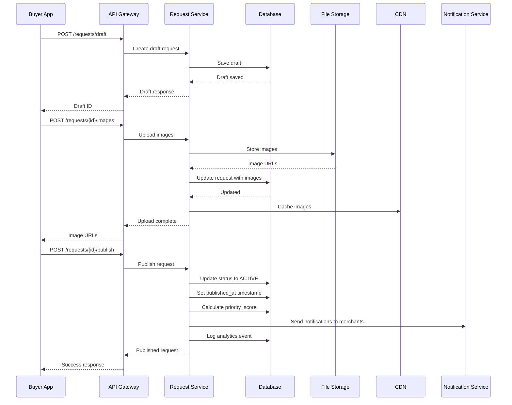
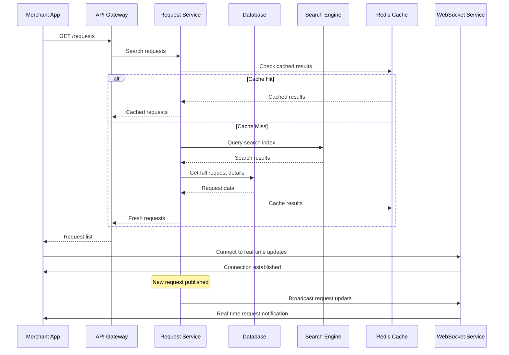

# Request Management System Technical Specification - FINAL VERSION

## Executive Summary

This document provides the complete and final technical specification for the request management system of the reverse marketplace platform, enabling buyers to create purchase requests and manage their lifecycle through various states from draft to completion.

---

## 1. System Architecture

### 1.1 Core Design Principles

✅ **Request Lifecycle Management**
- Complete state machine from draft to completion
- Real-time status updates across all platforms
- Automated expiry and cleanup mechanisms
- Comprehensive audit logging

✅ **Content Management**
- Rich media support with CDN delivery
- Content moderation and validation
- Geographic indexing and location-based features
- Advanced search and filtering capabilities

✅ **Marketplace Integration**
- Seamless integration with bidding system
- Real-time notifications for new requests
- Geographic matching and recommendations
- Performance analytics and insights

### 1.2 Platform Integration

| Platform | Primary Features | Secondary Features | Use Case |
|----------|------------------|-------------------|-----------|
| **Buyer App** | Request creation, management | Media upload, location services | Personal request management |
| **Merchant App** | Request discovery, analysis | Competition tracking, bidding tools | Business opportunity discovery |
| **Admin Panel** | Monitoring, moderation | Analytics, configuration | System oversight and control |

---

## 2. Database Schema Specification

### 2.1 Core Request Tables

#### `request_categories` Table
```sql
CREATE TABLE request_categories (
    id UUID PRIMARY KEY DEFAULT gen_random_uuid(),
    name VARCHAR(100) NOT NULL,
    description TEXT,
    parent_id UUID REFERENCES request_categories(id),
    icon_url VARCHAR(500) NULL,
    is_active BOOLEAN DEFAULT TRUE,
    sort_order INTEGER DEFAULT 0,
    created_at TIMESTAMP WITH TIME ZONE DEFAULT NOW(),
    updated_at TIMESTAMP WITH TIME ZONE DEFAULT NOW()
);

-- Indexes for category tree queries
CREATE INDEX idx_request_categories_parent_id ON request_categories(parent_id);
CREATE INDEX idx_request_categories_active ON request_categories(is_active);
CREATE INDEX idx_request_categories_sort ON request_categories(sort_order);
```

#### `requests` Table
```sql
CREATE TABLE requests (
    id UUID PRIMARY KEY DEFAULT gen_random_uuid(),
    buyer_id UUID NOT NULL REFERENCES users(id) ON DELETE CASCADE,
    category_id UUID NOT NULL REFERENCES request_categories(id),
    title VARCHAR(255) NOT NULL,
    description TEXT NOT NULL,
    budget_min DECIMAL(12, 2) NULL,
    budget_max DECIMAL(12, 2) NULL,
    location_lat DECIMAL(10, 8) NULL,
    location_lng DECIMAL(11, 8) NULL,
    location_address TEXT NULL,
    location_city VARCHAR(100) NULL,
    location_country VARCHAR(100) NULL,
    status request_status NOT NULL DEFAULT 'DRAFT',
    priority_score INTEGER DEFAULT 0,
    bid_count INTEGER DEFAULT 0,
    view_count INTEGER DEFAULT 0,
    expires_at TIMESTAMP WITH TIME ZONE NULL,
    published_at TIMESTAMP WITH TIME ZONE NULL,
    created_at TIMESTAMP WITH TIME ZONE DEFAULT NOW(),
    updated_at TIMESTAMP WITH TIME ZONE DEFAULT NOW()
);

CREATE TYPE request_status AS ENUM ('DRAFT', 'ACTIVE', 'HAS_BIDS', 'COMPLETED', 'CANCELLED', 'EXPIRED');

-- Performance indexes
CREATE INDEX idx_requests_buyer_id ON requests(buyer_id);
CREATE INDEX idx_requests_category_id ON requests(category_id);
CREATE INDEX idx_requests_status ON requests(status);
CREATE INDEX idx_requests_location ON requests(location_lat, location_lng);
CREATE INDEX idx_requests_expires_at ON requests(expires_at);
CREATE INDEX idx_requests_published_at ON requests(published_at);
CREATE INDEX idx_requests_priority_score ON requests(priority_score DESC);
-- Geospatial index for location queries
CREATE INDEX idx_requests_geospatial ON requests USING GIST(ST_Point(location_lng, location_lat));
```

#### `request_images` Table
```sql
CREATE TABLE request_images (
    id UUID PRIMARY KEY DEFAULT gen_random_uuid(),
    request_id UUID NOT NULL REFERENCES requests(id) ON DELETE CASCADE,
    image_url VARCHAR(500) NOT NULL,
    thumbnail_url VARCHAR(500) NULL,
    original_filename VARCHAR(255) NULL,
    file_size BIGINT NOT NULL,
    mime_type VARCHAR(100) NOT NULL,
    width INTEGER NULL,
    height INTEGER NULL,
    sort_order INTEGER DEFAULT 0,
    is_primary BOOLEAN DEFAULT FALSE,
    watermark_url VARCHAR(500) NULL,
    created_at TIMESTAMP WITH TIME ZONE DEFAULT NOW()
);

-- Indexes
CREATE INDEX idx_request_images_request_id ON request_images(request_id);
CREATE INDEX idx_request_images_sort_order ON request_images(sort_order);
CREATE INDEX idx_request_images_primary ON request_images(is_primary);
```

### 2.2 Request Management Tables

#### `request_drafts` Table
```sql
CREATE TABLE request_drafts (
    id UUID PRIMARY KEY DEFAULT gen_random_uuid(),
    buyer_id UUID NOT NULL REFERENCES users(id) ON DELETE CASCADE,
    category_id UUID REFERENCES request_categories(id),
    title VARCHAR(255) NULL,
    description TEXT NULL,
    budget_min DECIMAL(12, 2) NULL,
    budget_max DECIMAL(12, 2) NULL,
    location_lat DECIMAL(10, 8) NULL,
    location_lng DECIMAL(11, 8) NULL,
    location_address TEXT NULL,
    auto_save_data JSONB DEFAULT '{}',
    expires_at TIMESTAMP WITH TIME ZONE NOT NULL,
    created_at TIMESTAMP WITH TIME ZONE DEFAULT NOW(),
    updated_at TIMESTAMP WITH TIME ZONE DEFAULT NOW()
);

-- Indexes
CREATE INDEX idx_request_drafts_buyer_id ON request_drafts(buyer_id);
CREATE INDEX idx_request_drafts_expires_at ON request_drafts(expires_at);
```

#### `request_extensions` Table
```sql
CREATE TABLE request_extensions (
    id UUID PRIMARY KEY DEFAULT gen_random_uuid(),
    request_id UUID NOT NULL REFERENCES requests(id) ON DELETE CASCADE,
    original_expires_at TIMESTAMP WITH TIME ZONE NOT NULL,
    new_expires_at TIMESTAMP WITH TIME ZONE NOT NULL,
    extension_reason TEXT NULL,
    extended_by UUID REFERENCES users(id),
    created_at TIMESTAMP WITH TIME ZONE DEFAULT NOW()
);

-- Indexes
CREATE INDEX idx_request_extensions_request_id ON request_extensions(request_id);
```

### 2.3 Search and Discovery Tables

#### `request_search_index` Table
```sql
CREATE TABLE request_search_index (
    id UUID PRIMARY KEY DEFAULT gen_random_uuid(),
    request_id UUID NOT NULL REFERENCES requests(id) ON DELETE CASCADE,
    search_vector TSVECTOR,
    category_path TEXT,
    location_text TEXT,
    budget_range TEXT,
    created_at TIMESTAMP WITH TIME ZONE DEFAULT NOW()
);

-- Indexes for full-text search
CREATE INDEX idx_request_search_vector ON request_search_index USING GIN(search_vector);
CREATE INDEX idx_request_search_category ON request_search_index(category_path);
CREATE INDEX idx_request_search_location ON request_search_index(location_text);
```

#### `saved_searches` Table
```sql
CREATE TABLE saved_searches (
    id UUID PRIMARY KEY DEFAULT gen_random_uuid(),
    user_id UUID NOT NULL REFERENCES users(id) ON DELETE CASCADE,
    name VARCHAR(255) NOT NULL,
    search_criteria JSONB NOT NULL,
    is_active BOOLEAN DEFAULT TRUE,
    created_at TIMESTAMP WITH TIME ZONE DEFAULT NOW(),
    updated_at TIMESTAMP WITH TIME ZONE DEFAULT NOW()
);

-- Indexes
CREATE INDEX idx_saved_searches_user_id ON saved_searches(user_id);
CREATE INDEX idx_saved_searches_active ON saved_searches(is_active);
```

### 2.4 Analytics and Monitoring Tables

#### `request_analytics` Table
```sql
CREATE TABLE request_analytics (
    id UUID PRIMARY KEY DEFAULT gen_random_uuid(),
    request_id UUID NOT NULL REFERENCES requests(id) ON DELETE CASCADE,
    event_type analytics_event_type NOT NULL,
    user_id UUID REFERENCES users(id) ON DELETE SET NULL,
    metadata JSONB DEFAULT '{}',
    created_at TIMESTAMP WITH TIME ZONE DEFAULT NOW()
);

CREATE TYPE analytics_event_type AS ENUM (
    'VIEW', 'BID_PLACED', 'BID_WITHDRAWN', 'STATUS_CHANGE',
    'EXTENSION_REQUESTED', 'EXPIRED', 'CANCELLED', 'COMPLETED'
);

-- Indexes
CREATE INDEX idx_request_analytics_request_id ON request_analytics(request_id);
CREATE INDEX idx_request_analytics_event_type ON request_analytics(event_type);
CREATE INDEX idx_request_analytics_created_at ON request_analytics(created_at);
```

#### `request_views` Table
```sql
CREATE TABLE request_views (
    id UUID PRIMARY KEY DEFAULT gen_random_uuid(),
    request_id UUID NOT NULL REFERENCES requests(id) ON DELETE CASCADE,
    user_id UUID REFERENCES users(id) ON DELETE SET NULL,
    ip_address INET NULL,
    user_agent TEXT NULL,
    viewed_at TIMESTAMP WITH TIME ZONE DEFAULT NOW()
);

-- Indexes for analytics
CREATE INDEX idx_request_views_request_id ON request_views(request_id);
CREATE INDEX idx_request_views_user_id ON request_views(user_id);
CREATE INDEX idx_request_views_viewed_at ON request_views(viewed_at);
```

---

## 3. API Specifications

### 3.1 Request Management Endpoints

#### POST `/requests/draft`
```typescript
interface CreateDraftRequest {
  title?: string;
  description?: string;
  categoryId?: string;
  budgetMin?: number;
  budgetMax?: number;
  location?: {
    lat: number;
    lng: number;
    address?: string;
    city?: string;
    country?: string;
  };
  autoSaveData?: Record<string, any>;
}

interface CreateDraftResponse {
  success: boolean;
  draftId?: string;
  expiresAt?: string;
  message: string;
  validationErrors?: ValidationError[];
}
```

#### POST `/requests/{id}/publish`
```typescript
interface PublishRequestRequest {
  title: string;
  description: string;
  categoryId: string;
  budgetMin?: number;
  budgetMax?: number;
  location: {
    lat: number;
    lng: number;
    address?: string;
    city?: string;
    country?: string;
  };
  imageIds?: string[];
  expiresInDays?: number;
}

interface PublishRequestResponse {
  success: boolean;
  requestId?: string;
  publishedAt?: string;
  expiresAt?: string;
  message: string;
  validationErrors?: ValidationError[];
}
```

#### GET `/requests/{id}`
```typescript
interface GetRequestResponse {
  success: boolean;
  request?: {
    id: string;
    buyerId: string;
    categoryId: string;
    title: string;
    description: string;
    budget: {
      min?: number;
      max?: number;
    };
    location: {
      lat: number;
      lng: number;
      address?: string;
      city?: string;
      country?: string;
    };
    status: RequestStatus;
    images: RequestImage[];
    metadata: {
      viewCount: number;
      bidCount: number;
      priorityScore: number;
      createdAt: string;
      updatedAt: string;
      expiresAt?: string;
      publishedAt?: string;
    };
  };
  message?: string;
}
```

#### GET `/requests`
```typescript
interface SearchRequestsRequest {
  filters?: {
    categories?: string[];
    status?: RequestStatus[];
    location?: {
      lat: number;
      lng: number;
      radius: number; // in kilometers
    };
    budgetRange?: {
      min: number;
      max: number;
    };
    buyerId?: string;
    dateRange?: {
      startDate: string;
      endDate: string;
    };
  };
  pagination?: {
    page: number;
    limit: number;
  };
  sorting?: {
    field: 'priority_score' | 'created_at' | 'expires_at' | 'budget_max';
    order: 'asc' | 'desc';
  };
}

interface SearchRequestsResponse {
  requests: Request[];
  pagination: {
    page: number;
    limit: number;
    total: number;
    totalPages: number;
  };
  filters: {
    availableCategories: Category[];
    priceRange: {
      min: number;
      max: number;
    };
    locations: Location[];
  };
}
```

### 3.2 Media Management Endpoints

#### POST `/requests/{id}/images`
```typescript
interface UploadImageRequest {
  image: File;
  isPrimary?: boolean;
  sortOrder?: number;
}

interface UploadImageResponse {
  success: boolean;
  imageId?: string;
  imageUrl?: string;
  thumbnailUrl?: string;
  message: string;
  validationErrors?: ValidationError[];
}
```

#### DELETE `/requests/{id}/images/{imageId}`
```typescript
interface DeleteImageResponse {
  success: boolean;
  message: string;
}
```

### 3.3 Admin Management Endpoints

#### GET `/admin/requests`
```typescript
interface AdminSearchRequestsRequest {
  filters?: {
    status?: RequestStatus[];
    categories?: string[];
    buyers?: string[];
    dateRange?: {
      startDate: string;
      endDate: string;
    };
    flaggedOnly?: boolean;
  };
  pagination?: {
    page: number;
    limit: number;
  };
  analytics?: ('count' | 'value' | 'conversion_rate')[];
}

interface AdminSearchRequestsResponse {
  requests: AdminRequest[];
  pagination: {
    page: number;
    limit: number;
    total: number;
    totalPages: number;
  };
  analytics: {
    totalRequests: number;
    totalValue: number;
    conversionRate: number;
    categoryBreakdown: CategoryStats[];
    statusBreakdown: StatusStats[];
  };
}
```

---

## 4. Request Configuration

### 4.1 Request Expiry Settings
```yaml
request_expiry:
  default_duration_hours: 72 # 3 days default
  max_extension_hours: 48 # Maximum 2 days extension
  extension_fee: 5.00 # Fee for extension
  auto_expiry_check: every 15 minutes
  expiry_notification_hours: [24, 6, 1] # Notifications before expiry
  cleanup_expired_after_days: 30
```

### 4.2 Duplicate Detection Rules
```yaml
duplicate_detection:
  similarity_threshold: 0.85 # 85% similarity threshold
  time_window_hours: 24 # Check within last 24 hours
  same_user_check: true # Check same user requests
  location_radius_km: 10 # Geographic proximity
  category_matching: true # Same category required
  auto_merge: false # Require admin approval
  notification_on_duplicate: true
```

### 4.3 Content Moderation Rules
```yaml
content_moderation:
  auto_flag_keywords: ["illegal", "prohibited", "banned"]
  image_content_detection: true # AI-based image moderation
  manual_review_threshold: 0.7 # Confidence threshold for manual review
  banned_words: ["spam", "scam", "fraud"]
  appeal_process_days: 7 # Days to appeal moderation
  automated_approval_threshold: 0.9 # Auto-approve high confidence
```

---

## 5. Request Flows

### 5.1 Request Creation Flow


### 5.2 Request Discovery Flow


---

## 6. Implementation Phases

### 6.1 Phase 1: Core Request Backend (Week 1-2)
- [ ] Set up database tables and indexes
- [ ] Implement basic request CRUD operations
- [ ] Create request validation and business logic
- [ ] Set up category management system
- [ ] Implement basic search functionality

### 6.2 Phase 2: Media Management (Week 2-3)
- [ ] Implement image upload and processing
- [ ] Set up CDN integration
- [ ] Create image compression and optimization
- [ ] Implement watermarking system
- [ ] Add media validation and moderation

### 6.3 Phase 3: Advanced Features (Week 3-4)
- [ ] Implement geographic indexing and search
- [ ] Create location-based request filtering
- [ ] Add priority scoring algorithm
- [ ] Implement duplicate detection system
- [ ] Set up content moderation

### 6.4 Phase 4: Real-Time Features (Week 4-5)
- [ ] Implement WebSocket-based updates
- [ ] Create real-time notification system
- [ ] Add live request feeds
- [ ] Implement request analytics
- [ ] Set up performance monitoring

### 6.5 Phase 5: Admin Tools (Week 5-6)
- [ ] Create admin monitoring dashboard
- [ ] Implement request moderation tools
- [ ] Add bulk operations support
- [ ] Create analytics and reporting
- [ ] Set up configuration management

---

## 7. Testing Requirements

### 7.1 Functionality Testing
- [ ] Test complete request lifecycle from creation to completion
- [ ] Verify request state transitions and business rules
- [ ] Test image upload and media handling
- [ ] Validate search and filtering functionality
- [ ] Test location-based features

### 7.2 Performance Testing
- [ ] Test request creation performance under load
- [ ] Verify search performance with large datasets
- [ ] Test image upload and processing performance
- [ ] Validate real-time update performance
- [ ] Test database query optimization

### 7.3 Integration Testing
- [ ] Test request integration with bidding system
- [ ] Verify notification system integration
- [ ] Test cross-platform data synchronization
- [ ] Validate API integration across all clients
- [ ] Test third-party service integrations

---

## 8. Monitoring & Analytics

### 8.1 Key Metrics
- Request creation and completion rates
- Search performance and accuracy
- Image processing performance
- Geographic search effectiveness
- User engagement and conversion rates

### 8.2 Performance Monitoring
- API response times
- Database query performance
- Search index performance
- CDN delivery performance
- Real-time update latency

### 8.3 Business Analytics
- Request volume trends
- Category popularity analysis
- Geographic demand patterns
- User behavior insights
- Conversion funnel analysis

---

## 9. Security Considerations

### 9.1 Input Validation
- Sanitize all user inputs
- Validate file uploads
- Prevent SQL injection
- XSS protection
- Content security policies

### 9.2 Access Control
- Role-based request access
- Image privacy controls
- Location privacy options
- Rate limiting for uploads

### 9.3 Content Security
- Image content scanning
- Text content moderation
- Spam detection
- Fraud prevention
- Automated approval workflows

---

## 10. Conclusion

This final specification provides a complete, scalable, and secure request management system that:

✅ **Supports Complete Lifecycle** - From draft creation to completion
✅ **Enables Rich Content** - Media support with CDN delivery
✅ **Provides Real-Time Updates** - WebSocket-based notifications
✅ **Offers Advanced Search** - Geographic and full-text search capabilities
✅ **Ensures Quality** - Content moderation and validation
✅ **Delivers Performance** - Optimized for high-volume marketplace usage

The system is ready for implementation with clear phases, testing strategies, and deployment guidelines. All security considerations have been addressed, and the architecture supports the specific needs of a reverse marketplace while maintaining consistency across all user interfaces.

---

## 11. Implementation Checklist

### 11.1 Pre-Implementation
- [ ] Review and approve request configurations
- [ ] Select and configure CDN provider
- [ ] Set up search engine (Elasticsearch)
- [ ] Prepare database migration scripts
- [ ] Configure monitoring and alerting

### 11.2 Implementation
- [ ] Implement all database schemas
- [ ] Develop request management APIs
- [ ] Create media upload and processing
- [ ] Build search and filtering functionality
- [ ] Implement real-time features

### 11.3 Post-Implementation
- [ ] Conduct comprehensive testing
- [ ] Perform load and stress testing
- [ ] Validate all request flows
- [ ] Deploy to production environment
- [ ] Monitor and optimize performance

This specification serves as the complete technical foundation for implementing a robust, scalable, and user-friendly request management system for the reverse marketplace platform.
