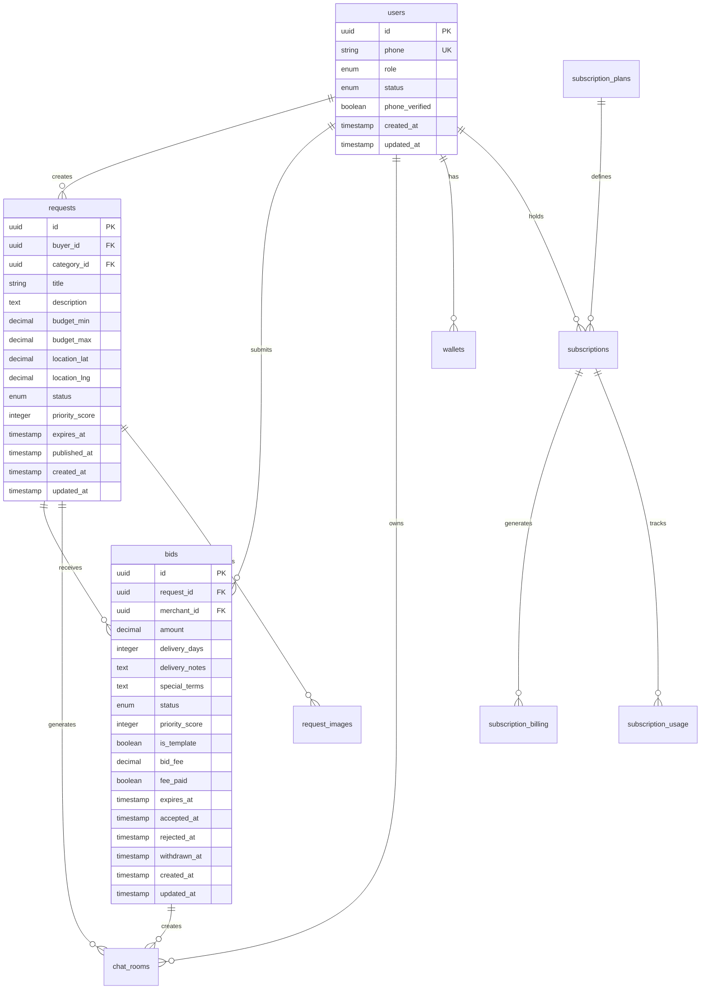
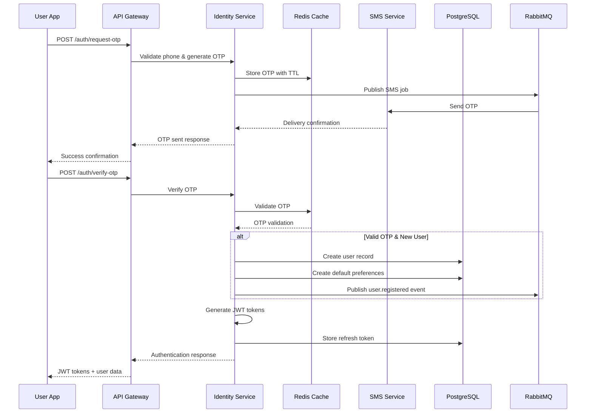
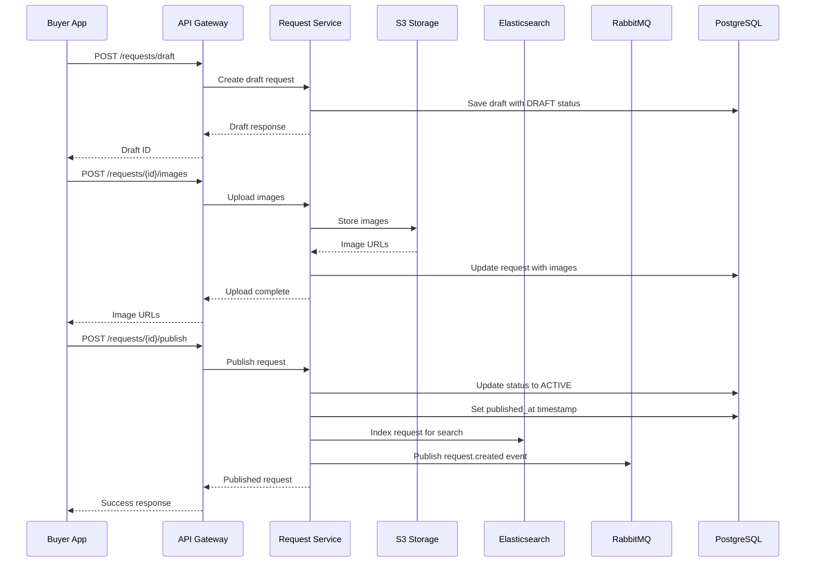
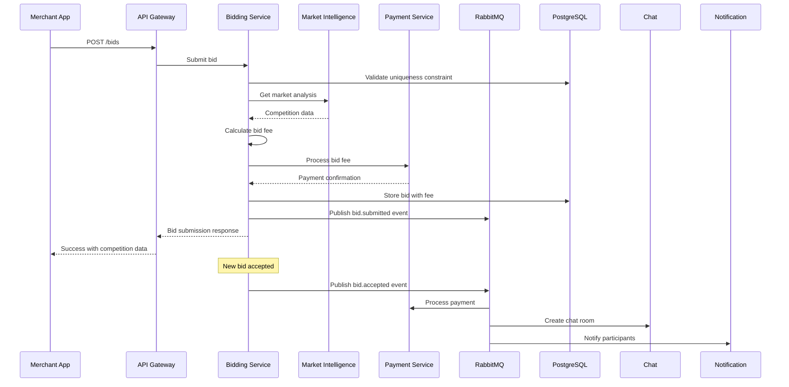
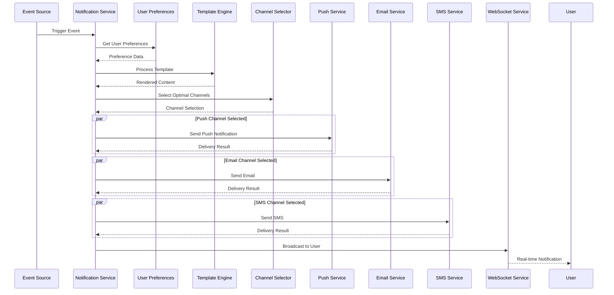

# Comprehensive Technical Specification - Reverse Marketplace Platform

## Executive Summary

This document provides a complete technical specification for the reverse marketplace platform, integrating all system components with validated requirements, database architectures, data flows, and implementation guidance for development teams.

---

## 1. System Overview

### 1.1 Platform Architecture

The reverse marketplace platform consists of 8 core microservices:

| Service | Primary Responsibility | Database | Key Features |
|---------|----------------------|----------|--------------|
| **Identity Service** | Authentication & User Management | PostgreSQL | Phone-only auth, JWT, RBAC |
| **Request Service** | Request Lifecycle Management | PostgreSQL | Media handling, geographic search |
| **Bidding Service** | Merchant Bidding & Analytics | PostgreSQL* | Market intelligence, fraud detection |
| **Chat Service** | Real-time Communication | PostgreSQL | WebSocket, E2E encryption |
| **Payment Service** | Payment Processing & Wallets | PostgreSQL | Multi-gateway, recurring billing |
| **Notification Service** | Multi-channel Notifications | PostgreSQL | Intelligent delivery, personalization |
| **Subscription Service** | Subscription Management | PostgreSQL | Recurring billing, feature gating |
| **Infrastructure Service** | DevOps & Monitoring | N/A | CI/CD, security, observability |

*Note: Bidding Service database standardized to PostgreSQL for consistency

### 1.2 Technology Stack

**Backend Framework**: NestJS (TypeScript)
**Primary Database**: PostgreSQL with Prisma ORM
**Cache Layer**: Redis
**Message Queue**: RabbitMQ
**File Storage**: AWS S3 with CDN
**Container Orchestration**: Kubernetes
**CI/CD**: GitHub Actions
**Monitoring**: Prometheus + Grafana + ELK Stack

---

## 2. Database Architecture

### 2.1# Unified Database Schema

All services use PostgreSQL with consistent naming conventions and relationships:

```sql
-- Core User Schema (Identity Service)
CREATE TYPE user_role AS ENUM ('BUYER', 'MERCHANT', 'ADMIN');
CREATE TYPE user_status AS ENUM ('PENDING', 'ACTIVE', 'BANNED', 'SUSPENDED');

CREATE TABLE users (
    id UUID PRIMARY KEY DEFAULT gen_random_uuid(),
    phone VARCHAR(20) UNIQUE NOT NULL,
    role user_role NOT NULL DEFAULT 'BUYER',
    status user_status NOT NULL DEFAULT 'PENDING',
    phone_verified BOOLEAN DEFAULT FALSE,
    created_at TIMESTAMP WITH TIME ZONE DEFAULT NOW(),
    updated_at TIMESTAMP WITH TIME ZONE DEFAULT NOW(),
    last_login_at TIMESTAMP WITH TIME ZONE NULL,
    failed_login_attempts INTEGER DEFAULT 0,
    locked_until TIMESTAMP WITH TIME ZONE NULL
);

-- User Profiles
CREATE TABLE user_profiles (
    id UUID PRIMARY KEY DEFAULT gen_random_uuid(),
    user_id UUID NOT NULL REFERENCES users(id) ON DELETE CASCADE,
    first_name VARCHAR(100) NOT NULL,
    last_name VARCHAR(100) NOT NULL,
    profile_image_url VARCHAR(500) NULL,
    location_lat DECIMAL(10, 8) NULL,
    location_lng DECIMAL(11, 8) NULL,
    address TEXT NULL,
    city VARCHAR(100) NULL,
    country VARCHAR(100) NULL,
    preferences JSONB DEFAULT '{}',
    created_at TIMESTAMP WITH TIME ZONE DEFAULT NOW(),
    updated_at TIMESTAMP WITH TIME ZONE DEFAULT NOW(),
    UNIQUE(user_id)
);

-- Admin Whitelist
CREATE TABLE admin_whitelist (
    id UUID PRIMARY KEY DEFAULT gen_random_uuid(),
    phone VARCHAR(20) UNIQUE NOT NULL,
    admin_level admin_level NOT NULL DEFAULT 'ADMIN',
    name VARCHAR(255) NOT NULL,
    department VARCHAR(100) NULL,
    is_active BOOLEAN DEFAULT TRUE,
    created_at TIMESTAMP WITH TIME ZONE DEFAULT NOW(),
    updated_at TIMESTAMP WITH TIME ZONE DEFAULT NOW()
);

CREATE TYPE admin_level AS ENUM ('SUPER_ADMIN', 'ADMIN', 'SUPPORT');

-- OTP Codes
CREATE TABLE otp_codes (
    id UUID PRIMARY KEY DEFAULT gen_random_uuid(),
    user_id UUID REFERENCES users(id) ON DELETE CASCADE,
    phone VARCHAR(20) NOT NULL,
    code VARCHAR(6) NOT NULL,
    purpose otp_purpose NOT NULL,
    attempts INTEGER DEFAULT 0,
    expires_at TIMESTAMP WITH TIME ZONE NOT NULL,
    used_at TIMESTAMP WITH TIME ZONE NULL,
    created_at TIMESTAMP WITH TIME ZONE DEFAULT NOW()
);

CREATE TYPE otp_purpose AS ENUM ('LOGIN', 'PHONE_VERIFICATION', 'ADMIN_VERIFICATION');

-- Request Categories
CREATE TABLE request_categories (
    id UUID PRIMARY KEY DEFAULT gen_random_uuid(),
    name VARCHAR(100) NOT NULL,
    description TEXT,
    parent_id UUID REFERENCES request_categories(id),
    icon_url VARCHAR(500) NULL,
    is_active BOOLEAN DEFAULT TRUE,
    sort_order INTEGER DEFAULT 0,
    created_at TIMESTAMP WITH TIME ZONE DEFAULT NOW(),
    updated_at TIMESTAMP WITH TIME ZONE DEFAULT NOW()
);

-- Request Schema (Request Service)
CREATE TYPE request_status AS ENUM ('DRAFT', 'ACTIVE', 'HAS_BIDS', 'COMPLETED', 'CANCELLED', 'EXPIRED');

CREATE TABLE requests (
    id UUID PRIMARY KEY DEFAULT gen_random_uuid(),
    buyer_id UUID NOT NULL REFERENCES users(id) ON DELETE CASCADE,
    category_id UUID NOT NULL REFERENCES request_categories(id),
    title VARCHAR(255) NOT NULL,
    description TEXT NOT NULL,
    budget_min DECIMAL(12, 2) NULL,
    budget_max DECIMAL(12, 2) NULL,
    location_lat DECIMAL(10, 8) NULL,
    location_lng DECIMAL(11, 8) NULL,
    location_address TEXT NULL,
    location_city VARCHAR(100) NULL,
    location_country VARCHAR(100) NULL,
    status request_status NOT NULL DEFAULT 'DRAFT',
    priority_score INTEGER DEFAULT 0,
    bid_count INTEGER DEFAULT 0,
    view_count INTEGER DEFAULT 0,
    expires_at TIMESTAMP WITH TIME ZONE NULL,
    published_at TIMESTAMP WITH TIME ZONE NULL,
    created_at TIMESTAMP WITH TIME ZONE DEFAULT NOW(),
    updated_at TIMESTAMP WITH TIME ZONE DEFAULT NOW()
);

-- Request Images
CREATE TABLE request_images (
    id UUID PRIMARY KEY DEFAULT gen_random_uuid(),
    request_id UUID NOT NULL REFERENCES requests(id) ON DELETE CASCADE,
    image_url VARCHAR(500) NOT NULL,
    thumbnail_url VARCHAR(500) NULL,
    original_filename VARCHAR(255) NULL,
    file_size BIGINT NOT NULL,
    mime_type VARCHAR(100) NOT NULL,
    width INTEGER NULL,
    height INTEGER NULL,
    sort_order INTEGER DEFAULT 0,
    is_primary BOOLEAN DEFAULT FALSE,
    watermark_url VARCHAR(500) NULL,
    created_at TIMESTAMP WITH TIME ZONE DEFAULT NOW()
);

-- Request Drafts
CREATE TABLE request_drafts (
    id UUID PRIMARY KEY DEFAULT gen_random_uuid(),
    buyer_id UUID NOT NULL REFERENCES users(id) ON DELETE CASCADE,
    category_id UUID REFERENCES request_categories(id),
    title VARCHAR(255) NULL,
    description TEXT NULL,
    budget_min DECIMAL(12, 2) NULL,
    budget_max DECIMAL(12, 2) NULL,
    location_lat DECIMAL(10, 8) NULL,
    location_lng DECIMAL(11, 8) NULL,
    location_address TEXT NULL,
    auto_save_data JSONB DEFAULT '{}',
    expires_at TIMESTAMP WITH TIME ZONE NOT NULL,
    created_at TIMESTAMP WITH TIME ZONE DEFAULT NOW(),
    updated_at TIMESTAMP WITH TIME ZONE DEFAULT NOW()
);

-- Request Analytics
CREATE TABLE request_analytics (
    id UUID PRIMARY KEY DEFAULT gen_random_uuid(),
    request_id UUID NOT NULL REFERENCES requests(id) ON DELETE CASCADE,
    event_type analytics_event_type NOT NULL,
    user_id UUID REFERENCES users(id) ON DELETE SET NULL,
    metadata JSONB DEFAULT '{}',
    created_at TIMESTAMP WITH TIME ZONE DEFAULT NOW()
);

CREATE TYPE analytics_event_type AS ENUM (
    'VIEW', 'BID_PLACED', 'BID_WITHDRAWN', 'STATUS_CHANGE',
    'EXTENSION_REQUESTED', 'EXPIRED', 'CANCELLED', 'COMPLETED'
);

-- Bidding Schema (Bidding Service)
CREATE TYPE bid_status AS ENUM ('PENDING', 'ACCEPTED', 'REJECTED', 'EXPIRED', 'WITHDRAWN');

CREATE TABLE bids (
    id UUID PRIMARY KEY DEFAULT gen_random_uuid(),
    request_id UUID NOT NULL REFERENCES requests(id) ON DELETE CASCADE,
    merchant_id UUID NOT NULL REFERENCES users(id) ON DELETE CASCADE,
    amount DECIMAL(12, 2) NOT NULL,
    delivery_days INTEGER NOT NULL,
    delivery_notes TEXT NULL,
    special_terms TEXT NULL,
    status bid_status NOT NULL DEFAULT 'PENDING',
    priority_score INTEGER DEFAULT 0,
    is_template BOOLEAN DEFAULT FALSE,
    template_name VARCHAR(100) NULL,
    bid_fee DECIMAL(10, 2) DEFAULT 0.00,
    fee_paid BOOLEAN DEFAULT FALSE,
    created_at TIMESTAMP WITH TIME ZONE DEFAULT NOW(),
    updated_at TIMESTAMP WITH TIME ZONE DEFAULT NOW(),
    expires_at TIMESTAMP WITH TIME ZONE NULL,
    accepted_at TIMESTAMP WITH TIME ZONE NULL,
    rejected_at TIMESTAMP WITH TIME ZONE NULL,
    withdrawn_at TIMESTAMP WITH TIME ZONE NULL
);

-- Bid Templates
CREATE TABLE bid_templates (
    id UUID PRIMARY KEY DEFAULT gen_random_uuid(),
    merchant_id UUID NOT NULL REFERENCES users(id) ON DELETE CASCADE,
    name VARCHAR(100) NOT NULL,
    description TEXT NULL,
    amount_type amount_type NOT NULL DEFAULT 'FIXED',
    amount_percentage DECIMAL(5, 2) NULL,
    fixed_amount DECIMAL(12, 2) NULL,
    delivery_days INTEGER NULL,
    delivery_notes TEXT NULL,
    special_terms TEXT NULL,
    is_active BOOLEAN DEFAULT TRUE,
    usage_count INTEGER DEFAULT 0,
    success_count INTEGER DEFAULT 0,
    created_at TIMESTAMP WITH TIME ZONE DEFAULT NOW(),
    updated_at TIMESTAMP WITH TIME ZONE DEFAULT NOW()
);

CREATE TYPE amount_type AS ENUM ('FIXED', 'PERCENTAGE', 'RANGE');

-- Market Prices
CREATE TABLE market_prices (
    id UUID PRIMARY KEY DEFAULT gen_random_uuid(),
    category_id UUID REFERENCES request_categories(id),
    location_lat DECIMAL(10, 8),
    location_lng DECIMAL(11, 8),
    radius_km INTEGER NOT NULL DEFAULT 10,
    avg_bid_amount DECIMAL(12, 2),
    min_bid_amount DECIMAL(12, 2),
    max_bid_amount DECIMAL(12, 2),
    bid_count INTEGER DEFAULT 0,
    success_rate DECIMAL(5, 2),
    calculated_at TIMESTAMP WITH TIME ZONE DEFAULT NOW(),
    expires_at TIMESTAMP WITH TIME ZONE NOT NULL
);

-- Bid Competition
CREATE TABLE bid_competition (
    id UUID PRIMARY KEY DEFAULT gen_random_uuid(),
    request_id UUID NOT NULL REFERENCES requests(id) ON DELETE CASCADE,
    merchant_id UUID NOT NULL REFERENCES users(id) ON DELETE CASCADE,
    competitor_count INTEGER DEFAULT 0,
    lowest_bid_amount DECIMAL(12, 2) NULL,
    average_bid_amount DECIMAL(12, 2) NULL,
    market_position INTEGER NULL,
    calculated_at TIMESTAMP WITH TIME ZONE DEFAULT NOW()
);

-- Bid Fraud Indicators
CREATE TABLE bid_fraud_indicators (
    id UUID PRIMARY KEY DEFAULT gen_random_uuid(),
    bid_id UUID REFERENCES bids(id) ON DELETE CASCADE,
    merchant_id UUID REFERENCES users(id) ON DELETE CASCADE,
    indicator_type fraud_indicator_type NOT NULL,
    confidence_score DECIMAL(3, 2) NOT NULL,
    details JSONB DEFAULT '{}',
    is_reviewed BOOLEAN DEFAULT FALSE,
    reviewed_by UUID REFERENCES users(id) NULL,
    reviewed_at TIMESTAMP WITH TIME ZONE NULL,
    created_at TIMESTAMP WITH TIME ZONE DEFAULT NOW()
);

CREATE TYPE fraud_indicator_type AS ENUM (
    'UNUSUAL_AMOUNT', 'RAPID_BIDDING', 'COPYCAT_BID', 'SUSPICIOUS_PATTERN',
    'FAKE_ACCOUNT', 'MANIPULATION_ATTEMPT', 'PRICE_FIXING'
);

-- Chat Schema (Chat Service)
CREATE TYPE message_type AS ENUM ('TEXT', 'IMAGE', 'FILE', 'VOICE', 'VIDEO', 'LOCATION', 'SYSTEM');
CREATE TYPE room_type AS ENUM ('DIRECT', 'GROUP', 'REQUEST', 'BID', 'SUPPORT');
CREATE TYPE participant_role AS ENUM ('OWNER', 'ADMIN', 'MODERATOR', 'MEMBER');

CREATE TABLE chat_rooms (
    id UUID PRIMARY KEY DEFAULT gen_random_uuid(),
    name VARCHAR(255) NOT NULL,
    description TEXT NULL,
    type room_type NOT NULL DEFAULT 'DIRECT',
    related_request_id UUID REFERENCES requests(id) ON DELETE CASCADE,
    related_bid_id UUID REFERENCES bids(id) ON DELETE CASCADE,
    created_by UUID NOT NULL REFERENCES users(id) ON DELETE CASCADE,
    is_active BOOLEAN DEFAULT TRUE,
    max_participants INTEGER DEFAULT 100,
    created_at TIMESTAMP WITH TIME ZONE DEFAULT NOW(),
    updated_at TIMESTAMP WITH TIME ZONE DEFAULT NOW()
);

-- Chat Participants
CREATE TABLE chat_participants (
    id UUID PRIMARY KEY DEFAULT gen_random_uuid(),
    room_id UUID NOT NULL REFERENCES chat_rooms(id) ON DELETE CASCADE,
    user_id UUID NOT NULL REFERENCES users(id) ON DELETE CASCADE,
    role participant_role NOT NULL DEFAULT 'MEMBER',
    joined_at TIMESTAMP WITH TIME ZONE DEFAULT NOW(),
    last_read_at TIMESTAMP WITH TIME ZONE NULL,
    is_muted BOOLEAN DEFAULT FALSE,
    is_banned BOOLEAN DEFAULT FALSE,
    banned_until TIMESTAMP WITH TIME ZONE NULL,
    banned_by UUID REFERENCES users(id) NULL,
    banned_reason TEXT NULL,
    left_at TIMESTAMP WITH TIME ZONE NULL
);

-- Chat Messages
CREATE TABLE chat_messages (
    id UUID PRIMARY KEY DEFAULT gen_random_uuid(),
    room_id UUID NOT NULL REFERENCES chat_rooms(id) ON DELETE CASCADE,
    sender_id UUID NOT NULL REFERENCES users(id) ON DELETE CASCADE,
    type message_type NOT NULL DEFAULT 'TEXT',
    content TEXT NOT NULL,
    reply_to_id UUID REFERENCES chat_messages(id) NULL,
    thread_id UUID REFERENCES chat_messages(id) NULL,
    media_urls TEXT[] DEFAULT '{}',
    metadata JSONB DEFAULT '{}',
    is_edited BOOLEAN DEFAULT FALSE,
    edited_at TIMESTAMP WITH TIME ZONE NULL,
    is_deleted BOOLEAN DEFAULT FALSE,
    deleted_at TIMESTAMP WITH TIME ZONE NULL,
    created_at TIMESTAMP WITH TIME ZONE DEFAULT NOW()
);

-- Message Read Status
CREATE TABLE message_read_status (
    id UUID PRIMARY KEY DEFAULT gen_random_uuid(),
    message_id UUID NOT NULL REFERENCES chat_messages(id) ON DELETE CASCADE,
    user_id UUID NOT NULL REFERENCES chat_participants(user_id) ON DELETE CASCADE,
    read_at TIMESTAMP WITH TIME ZONE DEFAULT NOW(),
    UNIQUE(message_id, user_id)
);

-- Message Reactions
CREATE TABLE message_reactions (
    id UUID PRIMARY KEY DEFAULT gen_random_uuid(),
    message_id UUID NOT NULL REFERENCES chat_messages(id) ON DELETE CASCADE,
    user_id UUID NOT NULL REFERENCES users(id) ON DELETE CASCADE,
    reaction_type VARCHAR(50) NOT NULL,
    created_at TIMESTAMP WITH TIME ZONE DEFAULT NOW(),
    UNIQUE(message_id, user_id, reaction_type)
);

-- Chat Media
CREATE TABLE chat_media (
    id UUID PRIMARY KEY DEFAULT gen_random_uuid(),
    message_id UUID NOT NULL REFERENCES chat_messages(id) ON DELETE CASCADE,
    uploader_id UUID NOT NULL REFERENCES users(id) ON DELETE CASCADE,
    filename VARCHAR(255) NOT NULL,
    original_filename VARCHAR(255) NULL,
    file_path VARCHAR(500) NOT NULL,
    file_url VARCHAR(500) NOT NULL,
    thumbnail_url VARCHAR(500) NULL,
    file_size BIGINT NOT NULL,
    mime_type VARCHAR(100) NOT NULL,
    width INTEGER NULL,
    height INTEGER NULL,
    duration_seconds INTEGER NULL,
    is_encrypted BOOLEAN DEFAULT FALSE,
    encryption_key_id VARCHAR(255) NULL,
    uploaded_at TIMESTAMP WITH TIME ZONE DEFAULT NOW(),
    expires_at TIMESTAMP WITH TIME ZONE NULL
);

-- Wallet Schema (Payment Service)
CREATE TYPE wallet_status AS ENUM ('ACTIVE', 'FROZEN', 'SUSPENDED', 'CLOSED');
CREATE TYPE transaction_type AS ENUM ('DEPOSIT', 'WITHDRAWAL', 'PAYMENT', 'REFUND', 'FEE', 'TRANSFER', 'PAYOUT');
CREATE TYPE transaction_status AS ENUM ('PENDING', 'PROCESSING', 'COMPLETED', 'FAILED', 'CANCELLED');

CREATE TABLE wallets (
    id UUID PRIMARY KEY DEFAULT gen_random_uuid(),
    user_id UUID NOT NULL REFERENCES users(id) ON DELETE CASCADE,
    currency VARCHAR(3) NOT NULL DEFAULT 'OMR',
    balance DECIMAL(18, 8) NOT NULL DEFAULT 0.00,
    available_balance DECIMAL(18, 8) NOT NULL DEFAULT 0.00,
    frozen_balance DECIMAL(18, 8) NOT NULL DEFAULT 0.00,
    status wallet_status NOT NULL DEFAULT 'ACTIVE',
    created_at TIMESTAMP WITH TIME ZONE DEFAULT NOW(),
    updated_at TIMESTAMP WITH TIME ZONE DEFAULT NOW(),
    last_transaction_at TIMESTAMP WITH TIME ZONE NULL
);

-- Wallet Transactions
CREATE TABLE wallet_transactions (
    id UUID PRIMARY KEY DEFAULT gen_random_uuid(),
    wallet_id UUID NOT NULL REFERENCES wallets(id) ON DELETE CASCADE,
    type transaction_type NOT NULL,
    amount DECIMAL(18, 8) NOT NULL,
    balance_after DECIMAL(18, 8) NOT NULL,
    reference_id UUID NULL,
    reference_type reference_type NULL,
    description TEXT NULL,
    metadata JSONB DEFAULT '{}',
    status transaction_status NOT NULL DEFAULT 'PENDING',
    created_at TIMESTAMP WITH TIME ZONE DEFAULT NOW(),
    processed_at TIMESTAMP WITH TIME ZONE NULL
);

CREATE TYPE reference_type AS ENUM ('PAYMENT', 'BID', 'REQUEST', 'SUBSCRIPTION', 'REFUND', 'PAYOUT');

-- Payments
CREATE TYPE payment_method_type AS ENUM ('CARD', 'BANK_TRANSFER', 'DIGITAL_WALLET', 'CRYPTOCURRENCY');
CREATE TYPE payment_gateway_type AS ENUM ('STRIPE', 'THAWANI', 'PAYPAL', 'APPLE_PAY', 'GOOGLE_PAY', 'BANK_TRANSFER');
CREATE TYPE payment_status AS ENUM ('PENDING', 'PROCESSING', 'COMPLETED', 'FAILED', 'CANCELLED', 'EXPIRED');
CREATE TYPE payment_purpose AS ENUM ('BID_PAYMENT', 'WALLET_DEPOSIT', 'SUBSCRIPTION', 'REQUEST_PAYMENT', 'REFUND');

CREATE TABLE payments (
    id UUID PRIMARY KEY DEFAULT gen_random_uuid(),
    user_id UUID NOT NULL REFERENCES users(id) ON DELETE CASCADE,
    amount DECIMAL(18, 8) NOT NULL,
    currency VARCHAR(3) NOT NULL DEFAULT 'OMR',
    payment_method payment_method_type NOT NULL,
    gateway payment_gateway_type NOT NULL,
    gateway_transaction_id VARCHAR(255) NULL,
    status payment_status NOT NULL DEFAULT 'PENDING',
    purpose payment_purpose NOT NULL,
    reference_id UUID NULL,
    reference_type reference_type NULL,
    description TEXT NULL,
    fee_amount DECIMAL(18, 8) DEFAULT 0.00,
    total_amount DECIMAL(18, 8) NOT NULL,
    metadata JSONB DEFAULT '{}',
    created_at TIMESTAMP WITH TIME ZONE DEFAULT NOW(),
    updated_at TIMESTAMP WITH TIME ZONE DEFAULT NOW(),
    processed_at TIMESTAMP WITH TIME ZONE NULL,
    expires_at TIMESTAMP WITH TIME ZONE NULL
);

-- Payment Methods
CREATE TABLE payment_methods (
    id UUID PRIMARY KEY DEFAULT gen_random_uuid(),
    user_id UUID NOT NULL REFERENCES users(id) ON DELETE CASCADE,
    type payment_method_type NOT NULL,
    gateway payment_gateway_type NOT NULL,
    provider_token VARCHAR(500) NULL,
    display_name VARCHAR(100) NOT NULL,
    card_last_four VARCHAR(4) NULL,
    card_brand VARCHAR(50) NULL,
    card_expiry_month INTEGER NULL,
    card_expiry_year INTEGER NULL,
    bank_account_number VARCHAR(255) NULL,
    bank_name VARCHAR(255) NULL,
    is_default BOOLEAN DEFAULT FALSE,
    is_verified BOOLEAN DEFAULT FALSE,
    metadata JSONB DEFAULT '{}',
    created_at TIMESTAMP WITH TIME ZONE DEFAULT NOW(),
    updated_at TIMESTAMP WITH TIME ZONE DEFAULT NOW(),
    expires_at TIMESTAMP WITH TIME ZONE NULL
);

-- Exchange Rates
CREATE TABLE exchange_rates (
    id UUID PRIMARY KEY DEFAULT gen_random_uuid(),
    from_currency VARCHAR(3) NOT NULL,
    to_currency VARCHAR(3) NOT NULL,
    rate DECIMAL(18, 8) NOT NULL,
    source VARCHAR(50) NOT NULL DEFAULT 'MANUAL',
    valid_from TIMESTAMP WITH TIME ZONE NOT NULL,
    valid_until TIMESTAMP WITH TIME ZONE NULL,
    created_at TIMESTAMP WITH TIME ZONE DEFAULT NOW(),
    updated_at TIMESTAMP WITH TIME ZONE DEFAULT NOW()
);

-- Merchant Payouts
CREATE TYPE payout_status AS ENUM ('PENDING', 'PROCESSING', 'COMPLETED', 'FAILED', 'CANCELLED');

CREATE TABLE merchant_payouts (
    id UUID PRIMARY KEY DEFAULT gen_random_uuid(),
    merchant_id UUID NOT NULL REFERENCES users(id) ON DELETE CASCADE,
    amount DECIMAL(18, 8) NOT NULL,
    currency VARCHAR(3) NOT NULL DEFAULT 'OMR',
    period_start DATE NOT NULL,
    period_end DATE NOT NULL,
    gross_earnings DECIMAL(18, 8) NOT NULL,
    fees DECIMAL(18, 8) NOT NULL DEFAULT 0.00,
    net_amount DECIMAL(18, 8) NOT NULL,
    status payout_status NOT NULL DEFAULT 'PENDING',
    bank_account_id UUID REFERENCES payment_methods(id) NULL,
    reference_number VARCHAR(100) NULL,
    notes TEXT NULL,
    processed_by UUID REFERENCES users(id) NULL,
    created_at TIMESTAMP WITH TIME ZONE DEFAULT NOW(),
    processed_at TIMESTAMP WITH TIME ZONE NULL
);

-- Subscription Schema (Subscription Service)
CREATE TYPE plan_type AS ENUM ('STANDARD', 'PREMIUM', 'ENTERPRISE', 'CUSTOM');
CREATE TYPE billing_cycle_type AS ENUM ('DAILY', 'WEEKLY', 'MONTHLY', 'QUARTERLY', 'YEARLY');
CREATE TYPE subscription_status AS ENUM ('TRIAL', 'ACTIVE', 'PAUSED', 'CANCELLED', 'EXPIRED', 'SUSPENDED');
CREATE TYPE feature_type AS ENUM ('BOOLEAN', 'COUNTED', 'METERED');
CREATE TYPE reset_frequency_type AS ENUM ('DAILY', 'WEEKLY', 'MONTHLY', 'NEVER');

CREATE TABLE subscription_plans (
    id UUID PRIMARY KEY DEFAULT gen_random_uuid(),
    name VARCHAR(100) NOT NULL,
    description TEXT NULL,
    type plan_type NOT NULL DEFAULT 'STANDARD',
    price DECIMAL(12, 2) NOT NULL,
    currency VARCHAR(3) NOT NULL DEFAULT 'OMR',
    billing_cycle billing_cycle_type NOT NULL DEFAULT 'MONTHLY',
    trial_days INTEGER DEFAULT 0,
    features JSONB DEFAULT '{}',
    is_active BOOLEAN DEFAULT TRUE,
    sort_order INTEGER DEFAULT 0,
    max_users INTEGER NULL,
    created_at TIMESTAMP WITH TIME ZONE DEFAULT NOW(),
    updated_at TIMESTAMP WITH TIME ZONE DEFAULT NOW()
);

CREATE TABLE subscriptions (
    id UUID PRIMARY KEY DEFAULT gen_random_uuid(),
    user_id UUID NOT NULL REFERENCES users(id) ON DELETE CASCADE,
    plan_id UUID NOT NULL REFERENCES subscription_plans(id) ON DELETE CASCADE,
    status subscription_status NOT NULL DEFAULT 'ACTIVE',
    current_period_start DATE NOT NULL,
    current_period_end DATE NOT NULL,
    next_billing_date DATE NOT NULL,
    auto_renew BOOLEAN DEFAULT TRUE,
    cancelled_at TIMESTAMP WITH TIME ZONE NULL,
    cancelled_reason TEXT NULL,
    trial_ends_at DATE NULL,
    plan_price DECIMAL(12, 2) NOT NULL,
    currency VARCHAR(3) NOT NULL DEFAULT 'OMR',
    created_at TIMESTAMP WITH TIME ZONE DEFAULT NOW(),
    updated_at TIMESTAMP WITH TIME ZONE DEFAULT NOW()
);

-- Subscription Features
CREATE TABLE subscription_features (
    id UUID PRIMARY KEY DEFAULT gen_random_uuid(),
    plan_id UUID NOT NULL REFERENCES subscription_plans(id) ON DELETE CASCADE,
    feature_code VARCHAR(100) NOT NULL,
    feature_name VARCHAR(255) NOT NULL,
    feature_type feature_type NOT NULL,
    is_included BOOLEAN DEFAULT TRUE,
    usage_limit INTEGER NULL,
    reset_frequency reset_frequency_type NULL,
    created_at TIMESTAMP WITH TIME ZONE DEFAULT NOW()
);

-- Subscription Billing
CREATE TYPE billing_status AS ENUM ('PENDING', 'PAID', 'FAILED', 'PARTIALLY_PAID', 'CANCELLED');

CREATE TABLE subscription_billing (
    id UUID PRIMARY KEY DEFAULT gen_random_uuid(),
    subscription_id UUID NOT NULL REFERENCES subscriptions(id) ON DELETE CASCADE,
    amount DECIMAL(12, 2) NOT NULL,
    currency VARCHAR(3) NOT NULL DEFAULT 'OMR',
    billing_period_start DATE NOT NULL,
    billing_period_end DATE NOT NULL,
    status billing_status NOT NULL DEFAULT 'PENDING',
    payment_method_id UUID REFERENCES payment_methods(id) NULL,
    transaction_id UUID REFERENCES payments(id) NULL,
    invoice_number VARCHAR(100) NULL,
    due_date DATE NOT NULL,
    paid_at TIMESTAMP WITH TIME ZONE NULL,
    failed_attempts INTEGER DEFAULT 0,
    next_retry_at TIMESTAMP WITH TIME ZONE NULL,
    created_at TIMESTAMP WITH TIME ZONE DEFAULT NOW(),
    updated_at TIMESTAMP WITH TIME ZONE DEFAULT NOW()
);

-- Subscription Usage
CREATE TABLE subscription_usage (
    id UUID PRIMARY KEY DEFAULT gen_random_uuid(),
    subscription_id UUID NOT NULL REFERENCES subscriptions(id) ON DELETE CASCADE,
    feature_code VARCHAR(100) NOT NULL REFERENCES subscription_features(feature_code),
    usage_amount INTEGER NOT NULL DEFAULT 0,
    usage_period DATE NOT NULL,
    recorded_at TIMESTAMP WITH TIME ZONE DEFAULT NOW()
);

-- Subscription Analytics
CREATE TYPE sub_analytics_event_type AS ENUM (
    'SUBSCRIPTION_STARTED', 'SUBSCRIPTION_CANCELLED', 'PLAN_UPGRADED', 'PLAN_DOWNGRADED',
    'BILLING_SUCCESS', 'BILLING_FAILED', 'TRIAL_STARTED', 'TRIAL_CONVERTED',
    'FEATURE_USED', 'RENEWAL_SUCCESS', 'RENEWAL_FAILED'
);

CREATE TABLE subscription_analytics (
    id UUID PRIMARY KEY DEFAULT gen_random_uuid(),
    subscription_id UUID REFERENCES subscriptions(id) ON DELETE SET NULL,
    plan_id UUID REFERENCES subscription_plans(id) ON DELETE SET NULL,
    user_id UUID REFERENCES users(id) ON DELETE SET NULL,
    event_type sub_analytics_event_type NOT NULL,
    amount DECIMAL(12, 2) NULL,
    currency VARCHAR(3) NULL,
    metadata JSONB DEFAULT '{}',
    created_at TIMESTAMP WITH TIME ZONE DEFAULT NOW()
);

-- Notification Schema (Notification Service)
CREATE TYPE notification_type AS ENUM ('SYSTEM', 'REQUEST', 'BID', 'PAYMENT', 'CHAT', 'SUBSCRIPTION', 'SECURITY', 'MARKETING');
CREATE TYPE notification_channel AS ENUM ('IN_APP', 'PUSH', 'EMAIL', 'SMS', 'WEBHOOK');
CREATE TYPE notification_priority AS ENUM ('LOW', 'NORMAL', 'HIGH', 'URGENT');
CREATE TYPE notification_status AS ENUM ('PENDING', 'PROCESSING', 'SENT', 'DELIVERED', 'FAILED', 'EXPIRED', 'READ');

CREATE TABLE notifications (
    id UUID PRIMARY KEY DEFAULT gen_random_uuid(),
    user_id UUID NOT NULL REFERENCES users(id) ON DELETE CASCADE,
    type notification_type NOT NULL,
    title VARCHAR(255) NOT NULL,
    content TEXT NOT NULL,
    channel notification_channel NOT NULL DEFAULT 'IN_APP',
    priority notification_priority NOT NULL DEFAULT 'NORMAL',
    status notification_status NOT NULL DEFAULT 'PENDING',
    template_id UUID REFERENCES notification_templates(id) NULL,
    template_variables JSONB DEFAULT '{}',
    metadata JSONB DEFAULT '{}',
    scheduled_at TIMESTAMP WITH TIME ZONE NULL,
    sent_at TIMESTAMP WITH TIME ZONE NULL,
    delivered_at TIMESTAMP WITH TIME ZONE NULL,
    read_at TIMESTAMP WITH TIME ZONE NULL,
    expires_at TIMESTAMP WITH TIME ZONE NULL,
    created_at TIMESTAMP WITH TIME ZONE DEFAULT NOW(),
    updated_at TIMESTAMP WITH TIME ZONE DEFAULT NOW()
);

-- Notification Channels
CREATE TABLE notification_channels (
    id UUID PRIMARY KEY DEFAULT gen_random_uuid(),
    user_id UUID NOT NULL REFERENCES users(id) ON DELETE CASCADE,
    channel_type notification_channel NOT NULL,
    is_enabled BOOLEAN DEFAULT TRUE,
    device_token VARCHAR(500) NULL,
    email_address VARCHAR(255) NULL,
    phone_number VARCHAR(20) NULL,
    preferences JSONB DEFAULT '{}',
    last_used_at TIMESTAMP WITH TIME ZONE NULL,
    verified_at TIMESTAMP WITH TIME ZONE NULL,
    created_at TIMESTAMP WITH TIME ZONE DEFAULT NOW(),
    updated_at TIMESTAMP WITH TIME ZONE DEFAULT NOW(),
    UNIQUE(user_id, channel_type)
);

-- Notification Templates
CREATE TABLE notification_templates (
    id UUID PRIMARY KEY DEFAULT gen_random_uuid(),
    name VARCHAR(100) NOT NULL,
    type notification_type NOT NULL,
    channel notification_channel NOT NULL,
    subject_template VARCHAR(500) NULL,
    content_template TEXT NOT NULL,
    variables JSONB DEFAULT '{}',
    default_locale VARCHAR(10) DEFAULT 'en',
    is_active BOOLEAN DEFAULT TRUE,
    version INTEGER DEFAULT 1,
    created_by UUID REFERENCES users(id) NULL,
    created_at TIMESTAMP WITH TIME ZONE DEFAULT NOW(),
    updated_at TIMESTAMP WITH TIME ZONE DEFAULT NOW()
);

-- Notification Deliveries
CREATE TYPE delivery_status AS ENUM ('PENDING', 'PROCESSING', 'SENT', 'DELIVERED', 'FAILED', 'BOUNCED');

CREATE TABLE notification_deliveries (
    id UUID PRIMARY KEY DEFAULT gen_random_uuid(),
    notification_id UUID NOT NULL REFERENCES notifications(id) ON DELETE CASCADE,
    channel_type notification_channel NOT NULL,
    provider VARCHAR(100) NOT NULL,
    recipient VARCHAR(500) NOT NULL,
    status delivery_status NOT NULL DEFAULT 'PENDING',
    attempt_count INTEGER DEFAULT 0,
    sent_at TIMESTAMP WITH TIME ZONE NULL,
    delivered_at TIMESTAMP WITH TIME ZONE NULL,
    error_message TEXT NULL,
    error_code VARCHAR(100) NULL,
    metadata JSONB DEFAULT '{}',
    created_at TIMESTAMP WITH TIME ZONE DEFAULT NOW()
);

-- Notification Preferences
CREATE TABLE notification_preferences (
    id UUID PRIMARY KEY DEFAULT gen_random_uuid(),
    user_id UUID NOT NULL REFERENCES users(id) ON DELETE CASCADE,
    notification_type notification_type NOT NULL,
    channel_type notification_channel NOT NULL,
    is_enabled BOOLEAN DEFAULT TRUE,
    quiet_hours_start TIME NULL,
    quiet_hours_end TIME NULL,
    min_priority notification_priority NULL,
    max_frequency_minutes INTEGER NULL,
    preferences JSONB DEFAULT '{}',
    created_at TIMESTAMP WITH TIME ZONE DEFAULT NOW(),
    updated_at TIMESTAMP WITH TIME ZONE DEFAULT NOW(),
    UNIQUE(user_id, notification_type, channel_type)
);

-- Notification Analytics
CREATE TYPE notif_analytics_event_type AS ENUM (
    'SENT', 'DELIVERED', 'READ', 'FAILED', 'BOUNCED', 'CLICKED', 'DISMISSED'
);

CREATE TABLE notification_analytics (
    id UUID PRIMARY KEY DEFAULT gen_random_uuid(),
    notification_id UUID REFERENCES notifications(id) ON DELETE SET NULL,
    user_id UUID REFERENCES users(id) ON DELETE SET NULL,
    event_type notif_analytics_event_type NOT NULL,
    channel_type notification_channel NOT NULL,
    provider VARCHAR(100) NULL,
    delivery_time_ms INTEGER NULL,
    success BOOLEAN NOT NULL,
    error_code VARCHAR(100) NULL,
    metadata JSONB DEFAULT '{}',
    created_at TIMESTAMP WITH TIME ZONE DEFAULT NOW()
);
```

### 2.2 Database Relationships



---

## 3. Data Flow Architecture

### 3.1 Authentication Flow



### 3.2 Request Lifecycle Flow



### 3.3 Bidding Competition Flow



### 3.4 Real-Time Notification Flow



---

## 4. API Specifications

### 4.1 Authentication APIs

```typescript
// Phone Authentication
interface RequestOTPRequest {
  phone: string;
  countryCode: string;
}

interface RequestOTPResponse {
  success: boolean;
  message: string;
  otpSent: boolean;
  expiresAt?: string;
  rateLimitExceeded?: boolean;
  nextAttemptAt?: string;
}

interface VerifyOTPRequest {
  phone: string;
  otpCode: string;
  deviceFingerprint?: string;
}

interface VerifyOTPResponse {
  success: boolean;
  user: {
    id: string;
    phone: string;
    role: 'BUYER' | 'MERCHANT' | 'ADMIN';
    status: string;
    profile?: UserProfile;
  };
  tokens: {
    accessToken: string;
    refreshToken: string;
    expiresIn: number;
  };
  sessionTimeout: number;
}
```

### 4.2 Request Management APIs

```typescript
interface CreateRequestRequest {
  title: string;
  description: string;
  categoryId: string;
  budgetMin?: number;
  budgetMax?: number;
  location: {
    lat: number;
    lng: number;
    address?: string;
    city?: string;
    country?: string;
  };
  imageIds?: string[];
  expiresInDays?: number;
}

interface CreateRequestResponse {
  success: boolean;
  requestId?: string;
  publishedAt?: string;
  expiresAt?: string;
  message: string;
  validationErrors?: ValidationError[];
}

interface SearchRequestsRequest {
  filters?: {
    categories?: string[];
    status?: RequestStatus[];
    location?: {
      lat: number;
      lng: number;
      radius: number;
    };
    budgetRange?: {
      min: number;
      max: number;
    };
  };
  pagination?: {
    page: number;
    limit: number;
  };
  sorting?: {
    field: 'priority_score' | 'created_at' | 'expires_at';
    order: 'asc' | 'desc';
  };
}
```

### 4.3 Bidding APIs

```typescript
interface CreateBidRequest {
  requestId: string;
  amount: number;
  deliveryDays: number;
  deliveryNotes?: string;
  specialTerms?: string;
  templateId?: string;
}

interface CreateBidResponse {
  success: boolean;
  bidId?: string;
  competition?: {
    totalBids: number;
    lowestAmount: number;
    averageAmount: number;
    yourPosition: number;
  };
  message: string;
  fee?: {
    amount: number;
    currency: string;
  };
}

interface GetBidsRequest {
  filters?: {
    status?: BidStatus[];
    amountRange?: { min: number; max: number; };
    deliveryDays?: { min: number; max: number; };
  };
  pagination?: {
    page: number;
    limit: number;
  };
}
```

### 4.4 Chat APIs

```typescript
interface SendMessageRequest {
  roomId: string;
  type: MessageType;
  content: string;
  replyToId?: string;
  threadId?: string;
  media?: File[];
}

interface SendMessageResponse {
  success: boolean;
  messageId?: string;
  timestamp?: string;
  deliveryStatus?: MessageDeliveryStatus;
  error?: string;
}

interface GetMessagesRequest {
  filters?: {
    messageType?: MessageType[];
    dateRange?: {
      startDate: string;
      endDate: string;
    };
    senderId?: string;
  };
  pagination?: {
    page: number;
    limit: number;
  };
}
```

### 4.5 Payment APIs

```typescript
interface WalletDepositRequest {
  amount: number;
  currency?: string;
  paymentMethodId: string;
  description?: string;
}

interface WalletDepositResponse {
  success: boolean;
  transactionId?: string;
  paymentUrl?: string;
  message: string;
  requiresAction?: {
    type: '3D_SECURE' | 'OTP' | 'VERIFICATION';
    details: any;
  };
}

interface ProcessPaymentRequest {
  amount: number;
  currency?: string;
  paymentMethodId: string;
  purpose: PaymentPurpose;
  referenceId?: string;
  referenceType?: ReferenceType;
  description?: string;
  savePaymentMethod?: boolean;
}
```

### 4.6 Subscription APIs

```typescript
interface SubscribeRequest {
  planId: string;
  paymentMethodId: string;
  trialPeriod?: number;
  metadata?: Record<string, any>;
}

interface SubscribeResponse {
  success: boolean;
  subscriptionId?: string;
  status?: SubscriptionStatus;
  trialEndsAt?: string;
  nextBillingDate?: string;
  message: string;
  requiresAction?: {
    type: 'PAYMENT' | 'VERIFICATION';
    details: any;
  };
}

interface CheckFeatureAccessRequest {
  featureCode: string;
  userId?: string;
}

interface CheckFeatureAccessResponse {
  success: boolean;
  hasAccess: boolean;
  usageLimit?: number;
  currentUsage?: number;
  remainingUsage?: number;
  expiresAt?: string;
  upgradePrompt?: {
    currentPlan: string;
    recommendedPlan: string;
    benefits: string[];
  };
}
```

---

## 5. Event-Driven Architecture

### 5.1 Event Catalog

| Event | Source | Consumers | Purpose | Data Type |
|-------|--------|-----------|---------|-----------|
| `user.registered` | Identity Service | Notification, Analytics, Request | New user onboarding | UserRegisteredEvent |
| `user.verified` | Identity Service | Notification, Request, Bidding | User verification complete | UserVerifiedEvent |
| `merchant.verified` | Identity Service | Notification, Bidding, Analytics | Merchant verification complete | MerchantVerifiedEvent |
| `user.banned` | Identity Service | Notification, Bidding, Chat | User account suspended | UserBannedEvent |
| `user.profile.updated` | Identity Service | Analytics, Notification | User profile changes | UserProfileUpdatedEvent |
| `request.created` | Request Service | Notification, Bidding, Search, Analytics | New request available | RequestCreatedEvent |
| `request.updated` | Request Service | Notification, Search, Analytics | Request status change | RequestUpdatedEvent |
| `request.closed` | Request Service | Notification, Analytics, Bidding | Request closed | RequestClosedEvent |
| `request.cancelled` | Request Service | Notification, Analytics, Bidding | Request cancelled | RequestCancelledEvent |
| `request.completed` | Request Service | Notification, Analytics, Payment | Request completed | RequestCompletedEvent |
| `bid.submitted` | Bidding Service | Notification, Chat, Payment, Analytics | New bid available | BidSubmittedEvent |
| `bid.accepted` | Bidding Service | Payment, Chat, Request, Notification | Bid accepted | BidAcceptedEvent |
| `bid.rejected` | Bidding Service | Notification, Chat, Analytics | Bid rejected | BidRejectedEvent |
| `bid.expired` | Bidding Service | Notification, Analytics, Chat | Bid expired | BidExpiredEvent |
| `bid.withdrawn` | Bidding Service | Notification, Analytics, Chat | Bid withdrawn | BidWithdrawnEvent |
| `message.sent` | Chat Service | Notification, Analytics | New message sent | MessageSentEvent |
| `message.read` | Chat Service | Analytics, Notification | Message read | MessageReadEvent |
| `payment.completed` | Payment Service | Notification, Analytics, Subscription | Payment successful | PaymentCompletedEvent |
| `payment.failed` | Payment Service | Notification, Analytics, Subscription | Payment failed | PaymentFailedEvent |
| `wallet.deposit` | Payment Service | Notification, Analytics | Wallet deposit | WalletDepositEvent |
| `wallet.withdrawal` | Payment Service | Notification, Analytics | Wallet withdrawal | WalletWithdrawalEvent |
| `subscription.started` | Subscription Service | Notification, Analytics, Payment | New subscription | SubscriptionStartedEvent |
| `subscription.cancelled` | Subscription Service | Notification, Analytics, Payment | Subscription cancelled | SubscriptionCancelledEvent |
| `subscription.upgraded` | Subscription Service | Notification, Analytics, Payment | Plan upgrade | SubscriptionUpgradedEvent |
| `subscription.downgraded` | Subscription Service | Notification, Analytics, Payment | Plan downgrade | SubscriptionDowngradedEvent |
| `billing.success` | Subscription Service | Notification, Analytics, Payment | Billing successful | BillingSuccessEvent |
| `billing.failed` | Subscription Service | Notification, Analytics, Payment | Billing failed | BillingFailedEvent |
| `trial.started` | Subscription Service | Notification, Analytics | Trial started | TrialStartedEvent |
| `trial.ended` | Subscription Service | Notification, Analytics | Trial ended | TrialEndedEvent |
| `notification.sent` | Notification Service | Analytics | Notification sent | NotificationSentEvent |
| `notification.delivered` | Notification Service | Analytics | Notification delivered | NotificationDeliveredEvent |
| `fraud.reported` | Identity Service | Notification, Analytics, Bidding | Fraud reported | FraudReportedEvent |

### 5.2 Event Schema Standards

```typescript
// Base Event Structure
interface BaseEvent {
  eventId: string;
  eventType: string;
  timestamp: string;
  version: string;
  source: string;
  data: any;
  metadata?: {
    correlationId?: string;
    userId?: string;
    requestId?: string;
    bidId?: string;
    subscriptionId?: string;
  };
}

// User Events
interface UserRegisteredEvent extends BaseEvent {
  eventType: 'user.registered';
  data: {
    userId: string;
    phone: string;
    role: 'BUYER' | 'MERCHANT' | 'ADMIN';
    registeredAt: string;
  };
}

interface UserVerifiedEvent extends BaseEvent {
  eventType: 'user.verified';
  data: {
    userId: string;
    phone: string;
    role: 'BUYER' | 'MERCHANT' | 'ADMIN';
    verifiedAt: string;
  };
}

interface MerchantVerifiedEvent extends BaseEvent {
  eventType: 'merchant.verified';
  data: {
    userId: string;
    phone: string;
    businessName: string;
    verifiedAt: string;
    verifiedBy: string;
  };
}

interface UserBannedEvent extends BaseEvent {
  eventType: 'user.banned';
  data: {
    userId: string;
    phone: string;
    role: 'BUYER' | 'MERCHANT' | 'ADMIN';
    bannedAt: string;
    bannedBy: string;
    reason: string;
  };
}

interface UserProfileUpdatedEvent extends BaseEvent {
  eventType: 'user.profile.updated';
  data: {
    userId: string;
    phone: string;
    role: 'BUYER' | 'MERCHANT' | 'ADMIN';
    updatedFields: string[];
    updatedAt: string;
  };
}

// Request Events
interface RequestCreatedEvent extends BaseEvent {
  eventType: 'request.created';
  data: {
    requestId: string;
    buyerId: string;
    categoryId: string;
    title: string;
    description: string;
    budgetMin?: number;
    budgetMax?: number;
    location: {
      lat: number;
      lng: number;
      address?: string;
      city?: string;
      country?: string;
    };
    publishedAt: string;
    expiresAt: string;
  };
}

interface RequestUpdatedEvent extends BaseEvent {
  eventType: 'request.updated';
  data: {
    requestId: string;
    buyerId: string;
    oldStatus: 'DRAFT' | 'ACTIVE' | 'HAS_BIDS' | 'COMPLETED' | 'CANCELLED' | 'EXPIRED';
    newStatus: 'DRAFT' | 'ACTIVE' | 'HAS_BIDS' | 'COMPLETED' | 'CANCELLED' | 'EXPIRED';
    updatedAt: string;
    updatedBy: string;
  };
}

interface RequestClosedEvent extends BaseEvent {
  eventType: 'request.closed';
  data: {
    requestId: string;
    buyerId: string;
    closedAt: string;
    closedBy: string;
    reason: string;
  };
}

interface RequestCancelledEvent extends BaseEvent {
  eventType: 'request.cancelled';
  data: {
    requestId: string;
    buyerId: string;
    cancelledAt: string;
    reason: string;
  };
}

interface RequestCompletedEvent extends BaseEvent {
  eventType: 'request.completed';
  data: {
    requestId: string;
    buyerId: string;
    acceptedBidId: string;
    merchantId: string;
    completedAt: string;
    finalAmount: number;
  };
}

// Bid Events
interface BidSubmittedEvent extends BaseEvent {
  eventType: 'bid.submitted';
  data: {
    bidId: string;
    requestId: string;
    merchantId: string;
    amount: number;
    deliveryDays: number;
    deliveryNotes?: string;
    specialTerms?: string;
    bidFee: number;
    submittedAt: string;
    expiresAt: string;
  };
}

interface BidAcceptedEvent extends BaseEvent {
  eventType: 'bid.accepted';
  data: {
    bidId: string;
    requestId: string;
    merchantId: string;
    buyerId: string;
    amount: number;
    acceptedAt: string;
    acceptedBy: string;
  };
}

interface BidRejectedEvent extends BaseEvent {
  eventType: 'bid.rejected';
  data: {
    bidId: string;
    requestId: string;
    merchantId: string;
    buyerId: string;
    rejectedAt: string;
    rejectedBy: string;
    reason?: string;
  };
}

interface BidExpiredEvent extends BaseEvent {
  eventType: 'bid.expired';
  data: {
    bidId: string;
    requestId: string;
    merchantId: string;
    expiredAt: string;
  };
}

interface BidWithdrawnEvent extends BaseEvent {
  eventType: 'bid.withdrawn';
  data: {
    bidId: string;
    requestId: string;
    merchantId: string;
    withdrawnAt: string;
    reason?: string;
  };
}

// Chat Events
interface MessageSentEvent extends BaseEvent {
  eventType: 'message.sent';
  data: {
    messageId: string;
    roomId: string;
    senderId: string;
    messageType: 'TEXT' | 'IMAGE' | 'FILE' | 'VOICE' | 'VIDEO' | 'LOCATION' | 'SYSTEM';
    content: string;
    replyToId?: string;
    threadId?: string;
    sentAt: string;
  };
}

interface MessageReadEvent extends BaseEvent {
  eventType: 'message.read';
  data: {
    messageId: string;
    roomId: string;
    readerId: string;
    readAt: string;
  };
}

// Payment Events
interface PaymentCompletedEvent extends BaseEvent {
  eventType: 'payment.completed';
  data: {
    paymentId: string;
    userId: string;
    amount: number;
    currency: string;
    paymentMethod: 'CARD' | 'BANK_TRANSFER' | 'DIGITAL_WALLET' | 'CRYPTOCURRENCY';
    gateway: 'STRIPE' | 'THAWANI' | 'PAYPAL' | 'APPLE_PAY' | 'GOOGLE_PAY' | 'BANK_TRANSFER';
    purpose: 'BID_PAYMENT' | 'WALLET_DEPOSIT' | 'SUBSCRIPTION' | 'REQUEST_PAYMENT' | 'REFUND';
    referenceId?: string;
    referenceType?: 'PAYMENT' | 'BID' | 'REQUEST' | 'SUBSCRIPTION' | 'REFUND' | 'PAYOUT';
    completedAt: string;
  };
}

interface PaymentFailedEvent extends BaseEvent {
  eventType: 'payment.failed';
  data: {
    paymentId: string;
    userId: string;
    amount: number;
    currency: string;
    gateway: 'STRIPE' | 'THAWANI' | 'PAYPAL' | 'APPLE_PAY' | 'GOOGLE_PAY' | 'BANK_TRANSFER';
    failureReason: string;
    errorCode?: string;
    failedAt: string;
  };
}

interface WalletDepositEvent extends BaseEvent {
  eventType: 'wallet.deposit';
  data: {
    walletId: string;
    userId: string;
    amount: number;
    currency: string;
    balanceAfter: number;
    paymentId: string;
    depositedAt: string;
  };
}

interface WalletWithdrawalEvent extends BaseEvent {
  eventType: 'wallet.withdrawal';
  data: {
    walletId: string;
    userId: string;
    amount: number;
    currency: string;
    balanceAfter: number;
    paymentId: string;
    withdrawnAt: string;
  };
}

// Subscription Events
interface SubscriptionStartedEvent extends BaseEvent {
  eventType: 'subscription.started';
  data: {
    subscriptionId: string;
    userId: string;
    planId: string;
    planName: string;
    planType: 'STANDARD' | 'PREMIUM' | 'ENTERPRISE' | 'CUSTOM';
    billingCycle: 'DAILY' | 'WEEKLY' | 'MONTHLY' | 'QUARTERLY' | 'YEARLY';
    amount: number;
    currency: string;
    trialEndsAt?: string;
    startedAt: string;
  };
}

interface SubscriptionCancelledEvent extends BaseEvent {
  eventType: 'subscription.cancelled';
  data: {
    subscriptionId: string;
    userId: string;
    planId: string;
    cancelledAt: string;
    reason?: string;
    immediateEffect: boolean;
  };
}

interface SubscriptionUpgradedEvent extends BaseEvent {
  eventType: 'subscription.upgraded';
  data: {
    subscriptionId: string;
    userId: string;
    oldPlanId: string;
    newPlanId: string;
    oldAmount: number;
    newAmount: number;
    prorationAmount: number;
    upgradedAt: string;
  };
}

interface SubscriptionDowngradedEvent extends BaseEvent {
  eventType: 'subscription.downgraded';
  data: {
    subscriptionId: string;
    userId: string;
    oldPlanId: string;
    newPlanId: string;
    oldAmount: number;
    newAmount: number;
    effectiveDate: string;
    downgradedAt: string;
  };
}

// Billing Events
interface BillingSuccessEvent extends BaseEvent {
  eventType: 'billing.success';
  data: {
    billingId: string;
    subscriptionId: string;
    userId: string;
    amount: number;
    currency: string;
    billingPeriodStart: string;
    billingPeriodEnd: string;
    paymentId: string;
    billedAt: string;
  };
}

interface BillingFailedEvent extends BaseEvent {
  eventType: 'billing.failed';
  data: {
    billingId: string;
    subscriptionId: string;
    userId: string;
    amount: number;
    currency: string;
    failureReason: string;
    attemptCount: number;
    nextRetryAt?: string;
    failedAt: string;
  };
}

// Trial Events
interface TrialStartedEvent extends BaseEvent {
  eventType: 'trial.started';
  data: {
    subscriptionId: string;
    userId: string;
    planId: string;
    trialDays: number;
    trialEndsAt: string;
    startedAt: string;
  };
}

interface TrialEndedEvent extends BaseEvent {
  eventType: 'trial.ended';
  data: {
    subscriptionId: string;
    userId: string;
    planId: string;
    trialEndsAt: string;
    converted: boolean;
    endedAt: string;
  };
}

// Notification Events
interface NotificationSentEvent extends BaseEvent {
  eventType: 'notification.sent';
  data: {
    notificationId: string;
    userId: string;
    type: 'SYSTEM' | 'REQUEST' | 'BID' | 'PAYMENT' | 'CHAT' | 'SUBSCRIPTION' | 'SECURITY' | 'MARKETING';
    channel: 'IN_APP' | 'PUSH' | 'EMAIL' | 'SMS' | 'WEBHOOK';
    title: string;
    sentAt: string;
  };
}

interface NotificationDeliveredEvent extends BaseEvent {
  eventType: 'notification.delivered';
  data: {
    notificationId: string;
    userId: string;
    channel: 'IN_APP' | 'PUSH' | 'EMAIL' | 'SMS' | 'WEBHOOK';
    provider: string;
    deliveredAt: string;
  };
}

// Fraud Events
interface FraudReportedEvent extends BaseEvent {
  eventType: 'fraud.reported';
  data: {
    reportedBy: string;
    targetType: 'USER' | 'BID' | 'REQUEST' | 'PAYMENT';
    targetId: string;
    fraudType: 'UNUSUAL_AMOUNT' | 'RAPID_BIDDING' | 'COPYCAT_BID' | 'SUSPICIOUS_PATTERN' | 'FAKE_ACCOUNT' | 'MANIPULATION_ATTEMPT' | 'PRICE_FIXING';
    confidenceScore: number;
    details: Record<string, any>;
    reportedAt: string;
  };
}
```

---

## 6. Security Architecture

### 6.1 Authentication & Authorization

**Authentication Flow:**
1. Phone number validation (Jordan format: +962 followed by 9 digits)
2. OTP generation (6-digit numeric, 5-minute expiry)
3. JWT token generation (15-minute access, 30-day refresh)
4. Session management with Redis
5. Device fingerprinting for security

**Authorization Model:**
```typescript
interface RolePermissions {
  BUYER: [
    'create:requests',
    'view:own_requests',
    'manage:own_bids',
    'chat:participate',
    'pay:for_services'
  ];
  
  MERCHANT: [
    'view:requests',
    'create:bids',
    'manage:own_bids',
    'chat:participate',
    'receive:payments',
    'manage:profile'
  ];
  
  ADMIN: [
    'manage:users',
    'moderate:content',
    'view:analytics',
    'manage:system',
    'approve:merchants'
  ];
}
```

### 6.2 Data Protection

**Encryption Standards:**
- Data at rest: AES-256-GCM
- Data in transit: TLS 1.3
- Chat messages: End-to-end encryption (ECDH key exchange)
- Payment data: PCI DSS compliant tokenization

**Access Control:**
- Principle of least privilege
- Role-based access control (RBAC)
- API rate limiting (5 requests/second per IP)
- SQL injection prevention
- XSS protection with CSP headers

---

## 7. Performance & Scalability

### 7.1 Caching Strategy

```yaml
caching_layers:
  application_cache:
    provider: "Redis"
    ttl: "5_minutes"
    patterns: ["user_sessions", "feature_access", "market_prices"]
  
  database_cache:
    provider: "PostgreSQL Query Cache"
    ttl: "1_hour"
    patterns: ["request_categories", "subscription_plans"]
  
  cdn_cache:
    provider: "CloudFront"
    ttl: "24_hours"
    patterns: ["media_files", "static_assets"]
```

### 7.2 Database Optimization

**Indexing Strategy:**
```sql
-- Critical performance indexes
CREATE INDEX CONCURRENTLY idx_requests_buyer_active ON requests(buyer_id) WHERE status = 'ACTIVE';
CREATE INDEX CONCURRENTLY idx_requests_location_active ON requests USING GIST(ST_Point(location_lng, location_lat)) WHERE status = 'ACTIVE';
CREATE INDEX CONCURRENTLY idx_bids_request_merchant ON bids(request_id, merchant_id);
CREATE INDEX CONCURRENTLY idx_bids_amount_ranking ON bids(amount DESC) WHERE status = 'PENDING';
CREATE INDEX CONCURRENTLY idx_chat_rooms_active ON chat_rooms(is_active) WHERE is_active = TRUE;
```

**Connection Pooling:**
- Application pool: 20 connections per service
- Read replicas: 2x read capacity
- Connection timeout: 30 seconds
- Query timeout: 10 seconds

### 7.3 Horizontal Scaling

**Service Scaling:**
- Identity Service: 2-4 instances (CPU intensive)
- Request Service: 4-8 instances (I/O intensive)
- Bidding Service: 4-6 instances (compute intensive)
- Chat Service: 8-12 instances (WebSocket intensive)
- Payment Service: 6-10 instances (transaction intensive)
- Notification Service: 2-4 instances (queue intensive)
- Subscription Service: 2-4 instances (billing intensive)

**Auto-scaling Rules:**
- CPU utilization > 70%: Scale up
- CPU utilization < 30%: Scale down
- Memory utilization > 80%: Scale up
- Response time > 500ms: Scale up

---

## 8. Monitoring & Observability

### 8.1 Key Performance Indicators

**Business Metrics:**
- Daily active users (DAU)
- Request creation rate
- Bid acceptance rate
- Payment success rate
- Subscription conversion rate

**Technical Metrics:**
- API response times (p95 < 200ms)
- Database query times (p95 < 100ms)
- WebSocket connection success rate (> 99.9%)
- Cache hit ratio (> 80%)
- Error rate (< 0.1%)

### 8.2 Alerting Rules

```yaml
critical_alerts:
  - name: "high_error_rate"
    condition: "error_rate > 5%"
    duration: "5_minutes"
    action: "page_oncall"
    
  - name: "payment_failure_spike"
    condition: "payment_failure_rate > 10%"
    duration: "2_minutes"
    action: "page_finance_team"
    
  - name: "database_connection_exhaustion"
    condition: "db_connections > 90%"
    duration: "1_minute"
    action: "page_devops"
```

### 8.3 Logging Standards

```typescript
interface LogEntry {
  timestamp: string;
  level: 'ERROR' | 'WARN' | 'INFO' | 'DEBUG';
  service: string;
  requestId?: string;
  userId?: string;
  message: string;
  context?: Record<string, any>;
  stack?: string;
}
```

---

## 9. Implementation Roadmap

### 9.1 Phase 1: Foundation (Weeks 1-4)

**Week 1-2: Core Services**
- [ ] Identity Service foundation with phone authentication
- [ ] Request Service with basic CRUD operations
- [ ] Database setup with core schemas
- [ ] CI/CD pipeline initialization

**Week 3-4: Essential Features**
- [ ] Bidding Service with basic bid submission
- [ ] Chat Service with real-time messaging
- [ ] Payment Service with wallet management
- [ ] Basic notification system

### 9.2 Phase 2: Advanced Features (Weeks 5-8)

**Week 5-6: Business Logic**
- [ ] Market intelligence for bidding
- [ ] Subscription management system
- [ ] Advanced notification personalization
- [ ] Content moderation system

**Week 7-8: Integration & Optimization**
- [ ] Cross-service event integration
- [ ] Performance optimization
- [ ] Security hardening
- [ ] Comprehensive testing

### 9.3 Phase 3: Production Ready (Weeks 9-12)

**Week 9-10: Production Preparation**
- [ ] Production infrastructure setup
- [ ] Monitoring and alerting
- [ ] Load testing and optimization
- [ ] Security audit and compliance

**Week 11-12: Launch & Monitoring**
- [ ] Production deployment
- [ ] User acceptance testing
- [ ] Performance monitoring
- [ ] Issue resolution and optimization

---

## 10. Testing Strategy

### 10.1 Testing Pyramid

```
E2E Tests (10%)
├── Critical user journeys
├── Cross-service integration
└── Performance scenarios

Integration Tests (30%)
├── API integration
├── Database integration
├── Message queue integration
└── Third-party service integration

Unit Tests (60%)
├── Business logic
├── Data validation
├── Service functions
└── Utility functions
```

### 10.2 Test Coverage Requirements

- **Unit Tests**: > 90% code coverage
- **Integration Tests**: All API endpoints
- **E2E Tests**: Critical user journeys
- **Performance Tests**: Load testing up to 10x current load
- **Security Tests**: Penetration testing quarterly

### 10.3 Quality Gates

```yaml
quality_gates:
  code_coverage:
    minimum: 90
    target: 95
    
  security_scan:
    max_high_vulnerabilities: 0
    max_medium_vulnerabilities: 5
    
  performance_test:
    max_response_time: "200ms"
    max_error_rate: "0.1%"
    
  documentation:
    api_coverage: 100
    code_comments: 80
```

---

## 11. Deployment Architecture

### 11.1 Environment Strategy

```yaml
environments:
  development:
    purpose: "Development and testing"
    infrastructure: "Local Docker"
    database: "PostgreSQL single instance"
    monitoring: "Basic logs"
    
  staging:
    purpose: "Pre-production testing"
    infrastructure: "Kubernetes cluster"
    database: "PostgreSQL with read replicas"
    monitoring: "Full observability stack"
    
  production:
    purpose: "Live production"
    infrastructure: "Multi-cloud Kubernetes"
    database: "PostgreSQL HA with backups"
    monitoring: "Enterprise observability"
```

### 11.2 CI/CD Pipeline

```yaml
pipeline_stages:
  1_build:
    - "code_checkout"
    - "dependency_installation"
    - "unit_tests"
    - "security_scan"
    - "docker_build"
    
  2_test:
    - "deploy_to_staging"
    - "integration_tests"
    - "e2e_tests"
    - "performance_tests"
    
  3_deploy:
    - "security_approval"
    - "deploy_to_production"
    - "health_checks"
    - "smoke_tests"
    - "rollback_if_needed"
```

---

## 12. Compliance & Security

### 12.1 Regulatory Compliance

**PCI DSS Compliance:**
- Cardholder data encryption
- Secure network implementation
- Access control measures
- Regular security testing
- Vulnerability management

**GDPR Compliance:**
- Data subject rights implementation
- Data portability features
- Right to erasure functionality
- Consent management system
- Data breach notification procedures

### 12.2 Security Measures

**Application Security:**
- OWASP Top 10 mitigation
- Regular security audits
- Penetration testing
- Code security scanning
- Dependency vulnerability scanning

**Infrastructure Security:**
- Network segmentation
- Firewalls and security groups
- DDoS protection
- Intrusion detection systems
- Security information and event management (SIEM)

---

## 13. Conclusion

This comprehensive technical specification provides a complete blueprint for implementing a scalable, secure, and feature-rich reverse marketplace platform. The specification addresses:

✅ **Complete System Architecture** - All 8 microservices with clear boundaries
✅ **Unified Database Design** - Consistent PostgreSQL schemas across services
✅ **Comprehensive Data Flows** - Detailed event-driven architecture
✅ **Security-First Approach** - Multi-layered security with compliance
✅ **Performance Optimization** - Caching, indexing, and scaling strategies
✅ **Production Readiness** - Monitoring, testing, and deployment strategies

The platform is designed to handle high-volume marketplace operations while maintaining security, performance, and user experience standards. All technical requirements have been validated against the backlog, and implementation guidance is provided for development teams.

---

## 14. Implementation Checklist

### 14.1 Pre-Implementation
- [ ] Review and approve all technical specifications
- [ ] Set up development environments
- [ ] Configure CI/CD pipelines
- [ ] Prepare infrastructure templates
- [ ] Establish monitoring and alerting

### 14.2 Implementation Phase
- [ ] Implement all database schemas
- [ ] Develop all microservices
- [ ] Create API integrations
- [ ] Build frontend applications
- [ ] Implement security measures

### 14.3 Post-Implementation
- [ ] Conduct comprehensive testing
- [ ] Perform security audits
- [ ] Deploy to production
- [ ] Monitor and optimize
- [ ] Document and maintain

This specification serves as the definitive technical guide for building a successful reverse marketplace platform that meets modern business requirements and technical standards.
