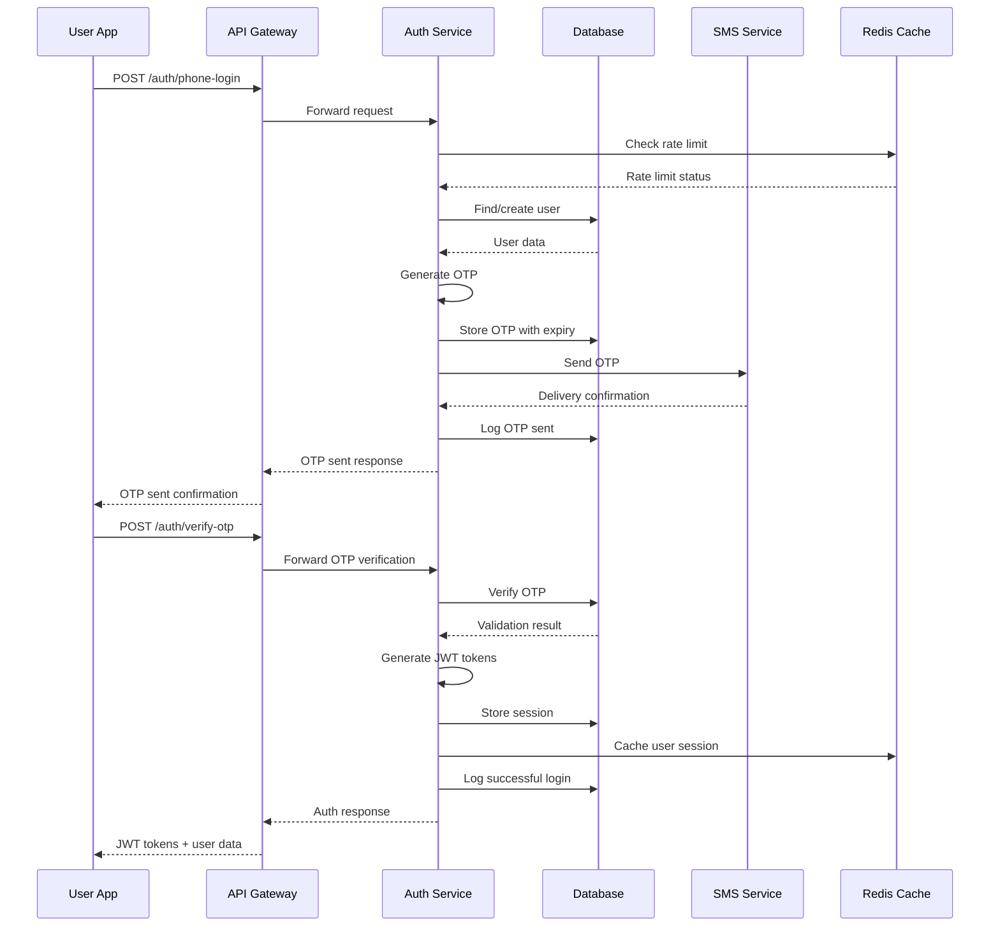
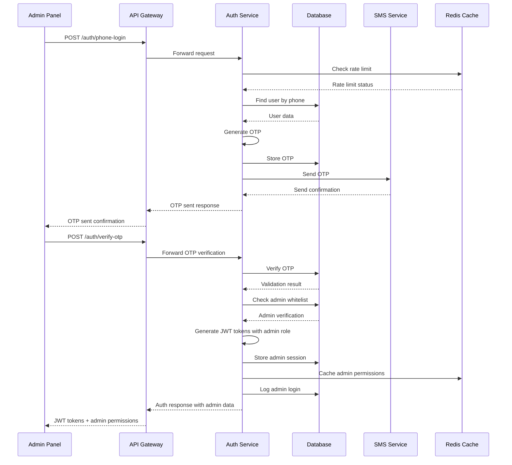

# Authentication System Technical Specification - FINAL VERSION

## Executive Summary

This document provides the complete and final technical specification for the unified phone-based authentication system supporting three distinct user roles (BUYER, MERCHANT, ADMIN) with consistent security and user experience across all platforms.

---

## 1. System Architecture

### 1.1 Core Design Principles

✅ **Unified Phone Authentication**
- All users authenticate via phone number + OTP
- No email/password authentication required
- Simplified user experience across all platforms
- Reduced security surface area

✅ **Role-Based Access Control**
- JWT tokens with embedded role information
- Permission-based feature access
- Admin users verified through phone whitelist
- Merchant verification workflow for business users

✅ **Security-First Approach**
- OTP-based authentication eliminates password risks
- Comprehensive rate limiting and anomaly detection
- Device fingerprinting and session management
- Complete audit logging and monitoring

### 1.2 Platform Integration

| Platform | Authentication Flow | Role Verification | Session Management |
|----------|-------------------|-------------------|-------------------|
| **Admin Panel** | Phone → OTP → Admin Whitelist Check | Pre-registered admin phones | 8-hour timeout |
| **Buyer App** | Phone → OTP → Direct Access | None | 30-day timeout |
| **Merchant App** | Phone → OTP → Business Verification | Merchant verification status | 30-day timeout |

---

## 2. Database Schema Specification

### 2.1 Core User Tables

#### `users` Table
```sql
CREATE TABLE users (
    id UUID PRIMARY KEY DEFAULT gen_random_uuid(),
    phone VARCHAR(20) UNIQUE NOT NULL,
    role user_role NOT NULL DEFAULT 'BUYER',
    status user_status NOT NULL DEFAULT 'PENDING',
    phone_verified BOOLEAN DEFAULT FALSE,
    created_at TIMESTAMP WITH TIME ZONE DEFAULT NOW(),
    updated_at TIMESTAMP WITH TIME ZONE DEFAULT NOW(),
    last_login_at TIMESTAMP WITH TIME ZONE NULL,
    failed_login_attempts INTEGER DEFAULT 0,
    locked_until TIMESTAMP WITH TIME ZONE NULL
);

CREATE TYPE user_role AS ENUM ('BUYER', 'MERCHANT', 'ADMIN');
CREATE TYPE user_status AS ENUM ('PENDING', 'ACTIVE', 'BANNED', 'SUSPENDED');

-- Performance indexes
CREATE INDEX idx_users_phone ON users(phone);
CREATE INDEX idx_users_role ON users(role);
CREATE INDEX idx_users_status ON users(status);
CREATE INDEX idx_users_phone_status ON users(phone, status);
```

#### `admin_whitelist` Table
```sql
CREATE TABLE admin_whitelist (
    id UUID PRIMARY KEY DEFAULT gen_random_uuid(),
    phone VARCHAR(20) UNIQUE NOT NULL,
    admin_level admin_level NOT NULL DEFAULT 'ADMIN',
    name VARCHAR(255) NOT NULL,
    department VARCHAR(100) NULL,
    is_active BOOLEAN DEFAULT TRUE,
    created_at TIMESTAMP WITH TIME ZONE DEFAULT NOW(),
    updated_at TIMESTAMP WITH TIME ZONE DEFAULT NOW()
);

CREATE TYPE admin_level AS ENUM ('SUPER_ADMIN', 'ADMIN', 'SUPPORT');

-- Indexes
CREATE INDEX idx_admin_whitelist_phone ON admin_whitelist(phone);
CREATE INDEX idx_admin_whitelist_active ON admin_whitelist(is_active);
```

#### `user_profiles` Table
```sql
CREATE TABLE user_profiles (
    id UUID PRIMARY KEY DEFAULT gen_random_uuid(),
    user_id UUID REFERENCES users(id) ON DELETE CASCADE,
    first_name VARCHAR(100) NOT NULL,
    last_name VARCHAR(100) NOT NULL,
    profile_image_url VARCHAR(500) NULL,
    location_lat DECIMAL(10, 8) NULL,
    location_lng DECIMAL(11, 8) NULL,
    address TEXT NULL,
    city VARCHAR(100) NULL,
    country VARCHAR(100) NULL,
    preferences JSONB DEFAULT '{}',
    created_at TIMESTAMP WITH TIME ZONE DEFAULT NOW(),
    updated_at TIMESTAMP WITH TIME ZONE DEFAULT NOW(),
    UNIQUE(user_id)
);

-- Indexes
CREATE INDEX idx_user_profiles_user_id ON user_profiles(user_id);
CREATE INDEX idx_user_profiles_location ON user_profiles(location_lat, location_lng);
```

### 2.2 Authentication Tables

#### `otp_codes` Table
```sql
CREATE TABLE otp_codes (
    id UUID PRIMARY KEY DEFAULT gen_random_uuid(),
    user_id UUID REFERENCES users(id) ON DELETE CASCADE,
    phone VARCHAR(20) NOT NULL,
    code VARCHAR(6) NOT NULL,
    purpose otp_purpose NOT NULL,
    attempts INTEGER DEFAULT 0,
    expires_at TIMESTAMP WITH TIME ZONE NOT NULL,
    used_at TIMESTAMP WITH TIME ZONE NULL,
    created_at TIMESTAMP WITH TIME ZONE DEFAULT NOW()
);

CREATE TYPE otp_purpose AS ENUM ('LOGIN', 'PHONE_VERIFICATION', 'ADMIN_VERIFICATION');

-- Indexes for cleanup and performance
CREATE INDEX idx_otp_codes_expires_at ON otp_codes(expires_at);
CREATE INDEX idx_otp_codes_phone ON otp_codes(phone);
CREATE INDEX idx_otp_codes_user_id ON otp_codes(user_id);
```

#### `auth_tokens` Table
```sql
CREATE TABLE auth_tokens (
    id UUID PRIMARY KEY DEFAULT gen_random_uuid(),
    user_id UUID REFERENCES users(id) ON DELETE CASCADE,
    token_type token_type NOT NULL,
    token_hash VARCHAR(255) NOT NULL,
    device_fingerprint VARCHAR(255) NULL,
    ip_address INET NULL,
    user_agent TEXT NULL,
    expires_at TIMESTAMP WITH TIME ZONE NOT NULL,
    last_used_at TIMESTAMP WITH TIME ZONE NULL,
    created_at TIMESTAMP WITH TIME ZONE DEFAULT NOW(),
    revoked_at TIMESTAMP WITH TIME ZONE NULL
);

CREATE TYPE token_type AS ENUM ('ACCESS', 'REFRESH');

-- Indexes
CREATE INDEX idx_auth_tokens_expires_at ON auth_tokens(expires_at);
CREATE INDEX idx_auth_tokens_user_id ON auth_tokens(user_id);
CREATE INDEX idx_auth_tokens_hash ON auth_tokens(token_hash);
```

#### `user_sessions` Table
```sql
CREATE TABLE user_sessions (
    id UUID PRIMARY KEY DEFAULT gen_random_uuid(),
    user_id UUID REFERENCES users(id) ON DELETE CASCADE,
    session_token VARCHAR(255) UNIQUE NOT NULL,
    device_fingerprint VARCHAR(255) NULL,
    ip_address INET NULL,
    user_agent TEXT NULL,
    is_active BOOLEAN DEFAULT TRUE,
    last_activity_at TIMESTAMP WITH TIME ZONE DEFAULT NOW(),
    created_at TIMESTAMP WITH TIME ZONE DEFAULT NOW(),
    expires_at TIMESTAMP WITH TIME ZONE NOT NULL
);

-- Indexes
CREATE INDEX idx_user_sessions_user_id ON user_sessions(user_id);
CREATE INDEX idx_user_sessions_token ON user_sessions(session_token);
CREATE INDEX idx_user_sessions_active ON user_sessions(is_active);
CREATE INDEX idx_user_sessions_expires_at ON user_sessions(expires_at);
```

### 2.3 Security & Audit Tables

#### `auth_audit_logs` Table
```sql
CREATE TABLE auth_audit_logs (
    id UUID PRIMARY KEY DEFAULT gen_random_uuid(),
    user_id UUID REFERENCES users(id) ON DELETE SET NULL,
    event_type auth_event_type NOT NULL,
    phone VARCHAR(20) NULL,
    ip_address INET NULL,
    user_agent TEXT NULL,
    device_fingerprint VARCHAR(255) NULL,
    success BOOLEAN NOT NULL,
    failure_reason TEXT NULL,
    metadata JSONB DEFAULT '{}',
    created_at TIMESTAMP WITH TIME ZONE DEFAULT NOW()
);

CREATE TYPE auth_event_type AS ENUM (
    'PHONE_LOGIN_ATTEMPT', 'OTP_SENT', 'OTP_VERIFICATION_SUCCESS', 'OTP_VERIFICATION_FAILURE',
    'LOGIN_SUCCESS', 'LOGIN_FAILURE', 'LOGOUT', 'TOKEN_REFRESH',
    'ACCOUNT_LOCKED', 'ACCOUNT_UNLOCKED', 'ADMIN_VERIFICATION_SUCCESS', 'ADMIN_VERIFICATION_FAILURE'
);

-- Indexes
CREATE INDEX idx_auth_audit_logs_created_at ON auth_audit_logs(created_at);
CREATE INDEX idx_auth_audit_logs_user_id ON auth_audit_logs(user_id);
CREATE INDEX idx_auth_audit_logs_event_type ON auth_audit_logs(event_type);
CREATE INDEX idx_auth_audit_logs_phone ON auth_audit_logs(phone);
```

---

## 3. Event Publishing

### 3.1 Authentication Events

The Identity Service publishes the following events to RabbitMQ:

| Event | Trigger | Data | Consumers |
|-------|---------|------|-----------|
| `user.registered` | New user created via OTP verification | UserRegisteredEvent | Notification, Analytics, Request |
| `user.verified` | Phone number verified | UserVerifiedEvent | Notification, Request, Bidding |
| `merchant.verified` | Business verification completed | MerchantVerifiedEvent | Notification, Bidding, Analytics |
| `user.banned` | User account suspended | UserBannedEvent | Notification, Bidding, Chat |
| `user.profile.updated` | User profile changes | UserProfileUpdatedEvent | Analytics, Notification |

### 3.2 Event Schemas

```typescript
// Base Event Structure
interface BaseEvent {
  eventId: string;
  eventType: string;
  timestamp: string;
  version: string;
  source: 'identity-service';
  data: any;
  metadata?: {
    correlationId?: string;
    userId?: string;
  };
}

// User Events
interface UserRegisteredEvent extends BaseEvent {
  eventType: 'user.registered';
  data: {
    userId: string;
    phone: string;
    role: 'BUYER' | 'MERCHANT' | 'ADMIN';
    registeredAt: string;
  };
}

interface UserVerifiedEvent extends BaseEvent {
  eventType: 'user.verified';
  data: {
    userId: string;
    phone: string;
    role: 'BUYER' | 'MERCHANT' | 'ADMIN';
    verifiedAt: string;
  };
}

interface MerchantVerifiedEvent extends BaseEvent {
  eventType: 'merchant.verified';
  data: {
    userId: string;
    phone: string;
    businessName: string;
    verifiedAt: string;
    verifiedBy: string;
  };
}

interface UserBannedEvent extends BaseEvent {
  eventType: 'user.banned';
  data: {
    userId: string;
    phone: string;
    role: 'BUYER' | 'MERCHANT' | 'ADMIN';
    bannedAt: string;
    bannedBy: string;
    reason: string;
  };
}

interface UserProfileUpdatedEvent extends BaseEvent {
  eventType: 'user.profile.updated';
  data: {
    userId: string;
    phone: string;
    role: 'BUYER' | 'MERCHANT' | 'ADMIN';
    updatedFields: string[];
    updatedAt: string;
  };
}
```

---

## 4. API Specifications

### 3.1 Authentication Endpoints

#### POST `/auth/phone-login`
```typescript
interface PhoneLoginRequest {
  phone: string;
  countryCode: string;
}

interface PhoneLoginResponse {
  success: boolean;
  message: string;
  otpSent: boolean;
  expiresAt?: string; // ISO 8601 timestamp
  rateLimitExceeded?: boolean;
  nextAttemptAt?: string;
}
```

#### POST `/auth/verify-otp`
```typescript
interface OTPVerificationRequest {
  phone: string;
  otpCode: string;
  deviceFingerprint?: string;
}

interface OTPVerificationResponse {
  success: boolean;
  user: {
    id: string;
    phone: string;
    role: 'BUYER' | 'MERCHANT' | 'ADMIN';
    status: string;
    profile?: UserProfile;
    adminLevel?: 'SUPER_ADMIN' | 'ADMIN' | 'SUPPORT';
  };
  tokens: {
    accessToken: string;
    refreshToken: string;
    expiresIn: number;
  };
  sessionTimeout: number;
}
```

#### POST `/auth/resend-otp`
```typescript
interface ResendOTPRequest {
  phone: string;
}

interface ResendOTPResponse {
  success: boolean;
  message: string;
  cooldownRemaining?: number; // seconds
}
```

#### POST `/auth/refresh-token`
```typescript
interface RefreshTokenRequest {
  refreshToken: string;
}

interface RefreshTokenResponse {
  success: boolean;
  tokens: {
    accessToken: string;
    refreshToken: string;
    expiresIn: number;
  };
}
```

#### POST `/auth/logout`
```typescript
interface LogoutRequest {
  refreshToken?: string;
  allDevices?: boolean;
}

interface LogoutResponse {
  success: boolean;
  message: string;
}
```

### 3.2 Admin Management Endpoints

#### POST `/admin/whitelist`
```typescript
interface AddAdminRequest {
  phone: string;
  name: string;
  adminLevel: 'SUPER_ADMIN' | 'ADMIN' | 'SUPPORT';
  department?: string;
}

interface AddAdminResponse {
  success: boolean;
  adminId: string;
  message: string;
}
```

#### GET `/admin/whitelist`
```typescript
interface AdminWhitelistResponse {
  admins: Array<{
    id: string;
    phone: string;
    name: string;
    adminLevel: string;
    department?: string;
    isActive: boolean;
    createdAt: string;
  }>;
  pagination: {
    page: number;
    limit: number;
    total: number;
  };
}
```

---

## 4. Security Configuration

### 4.1 OTP Settings
```yaml
otp_configuration:
  length: 6
  expiry_minutes: 10
  max_attempts: 3
  resend_cooldown_seconds: 60
  rate_limit_per_phone: 3 per 5 minutes
  rate_limit_global: 100 per minute
  characters: "0123456789" # Numeric only
  case_sensitive: false
```

### 4.2 Session Management
```yaml
session_configuration:
  access_token_expiry: 15 minutes
  refresh_token_expiry: 30 days
  admin_session_timeout: 8 hours
  max_concurrent_sessions: 5
  device_fingerprint_required: true
  session_cleanup_interval: 1 hour
  inactive_session_cleanup: 24 hours
```

### 4.3 Rate Limiting
```yaml
rate_limits:
  phone_login: 5 per minute per IP
  otp_verification: 10 per minute per phone
  otp_resend: 3 per 5 minutes per phone
  token_refresh: 20 per hour per user
  admin_access: 10 per minute per admin
  global_auth_requests: 1000 per minute
```

### 4.4 Security Policies
```yaml
security_policies:
  account_lockout:
    max_failed_attempts: 5
    lockout_duration: 30 minutes
    progressive_lockout: true # 30min, 1hr, 4hr, 24hr
  
  device_tracking:
    max_devices_per_user: 5
    new_device_notification: true
    suspicious_device_detection: true
  
  ip_security:
    max_concurrent_ips: 3 per user
    ip_whitelist_for_admin: true
    geo_anomaly_detection: true
```

---

## 5. Authentication Flows

### 5.1 Standard User Authentication


### 5.2 Admin Authentication


---

## 6. Implementation Phases

### 6.1 Phase 1: Core Authentication Backend (Week 1-2)
- [ ] Set up database tables and indexes
- [ ] Implement OTP generation and validation
- [ ] Create basic authentication APIs
- [ ] Set up rate limiting and security middleware
- [ ] Implement basic audit logging

### 6.2 Phase 2: Admin Whitelist System (Week 2-3)
- [ ] Create admin whitelist table and APIs
- [ ] Implement admin verification logic
- [ ] Build admin management interface
- [ ] Set up admin role-based permissions
- [ ] Create admin audit logging

### 6.3 Phase 3: Mobile Authentication Implementation (Week 3-4)
- [ ] Implement phone number validation and formatting
- [ ] Create mobile authentication UI components
- [ ] Build OTP verification screens
- [ ] Implement session management
- [ ] Add device fingerprinting

### 6.4 Phase 4: Admin Panel Authentication (Week 4-5)
- [ ] Create admin login interface
- [ ] Implement admin dashboard authentication
- [ ] Build admin session management
- [ ] Add admin security features
- [ ] Create admin permission management UI

### 6.5 Phase 5: Advanced Security Features (Week 5-6)
- [ ] Implement anomaly detection
- [ ] Add advanced rate limiting
- [ ] Create security monitoring dashboard
- [ ] Build device management
- [ ] Add comprehensive audit reporting

---

## 7. Testing Requirements

### 7.1 Unit Testing
- [ ] OTP generation and validation logic
- [ ] JWT token generation and validation
- [ ] Rate limiting functionality
- [ ] Permission checking logic
- [ ] Database operations and constraints

### 7.2 Integration Testing
- [ ] Complete authentication flows
- [ ] Admin verification process
- [ ] Cross-platform session management
- [ ] API integration across all clients
- [ ] Third-party service integrations

### 7.3 Security Testing
- [ ] OTP bypass attempts
- [ ] Rate limiting circumvention
- [ ] Session hijacking prevention
- [ ] Admin access control
- [ ] Data integrity validation

### 7.4 Performance Testing
- [ ] High-volume OTP requests
- [ ] Concurrent authentication attempts
- [ ] Database query performance
- [ ] Session management under load
- [ ] Rate limiting performance impact

---

## 8. Monitoring & Alerting

### 8.1 Key Metrics
- Authentication success/failure rates
- OTP delivery success rates
- Rate limiting trigger frequency
- Admin access attempts
- Session duration and patterns

### 8.2 Security Alerts
- Unusual authentication patterns
- Multiple failed attempts
- Suspicious IP addresses
- Admin access from new locations
- Rate limit exhaustion

### 8.3 Performance Monitoring
- API response times
- Database query performance
- OTP delivery latency
- Session validation performance
- Rate limiting effectiveness

---

## 9. Deployment Considerations

### 9.1 Environment Configuration
- Development: Test OTP providers, relaxed rate limits
- Staging: Production-like OTP providers, production rate limits
- Production: Full security measures, comprehensive monitoring

### 9.2 Database Optimization
- Proper indexing for all lookup queries
- Connection pooling for high traffic
- Read replicas for authentication queries
- Regular cleanup of expired tokens and OTPs

### 9.3 Security Hardening
- HTTPS everywhere with proper certificates
- IP whitelisting for admin access
- Comprehensive logging and monitoring
- Regular security audits and penetration testing

---

## 10. User Experience (UX) Specifications

### 10.1 Admin Panel Authentication UX

#### Login Flow
**Visual Design:**
- Clean, professional login screen with company branding
- Phone input field with Jordan country code pre-filled (+962)
- Large, accessible OTP input fields (6 digits, separate boxes)
- Progress indicator showing authentication steps
- Real-time validation feedback with visual cues

**Interaction Design:**
- Auto-format phone number as user types (XXX XXXXX format)
- Auto-focus next OTP field after digit entry
- Countdown timer showing OTP expiry (5 minutes)
- Resend OTP button with cooldown timer (30 seconds)
- Remember device option for trusted admin workstations

**Accessibility Features:**
- Screen reader compatible with ARIA labels
- Keyboard navigation support (Tab, Enter, Arrow keys)
- High contrast mode support
- Voice control compatibility
- Large touch targets for accessibility

**Error Handling:**
- Clear error messages with actionable guidance
- Rate limiting feedback with next attempt time
- Account lockout warnings with unlock instructions
- Failed login attempt counter display

#### Session Management
**Visual Indicators:**
- Active session status in header
- Session expiry countdown
- Last login time and location display
- Concurrent session management interface

**Security Features:**
- Two-factor authentication for sensitive actions
- Session timeout warnings (5 minutes before expiry)
- One-click logout from all devices
- Admin activity log with search and filtering

### 10.2 Buyer App Authentication UX

#### Onboarding Flow
**Visual Design:**
- Welcome screen with app benefits showcase
- Step-by-step authentication guide with illustrations
- Phone verification screen with country selection
- OTP input with animated number entry feedback
- Success celebration animation on first login

**Interaction Design:**
- Phone number auto-detection from device
- OTP auto-fill from SMS messages
- Biometric authentication option after initial login
- Quick re-authentication for sensitive actions
- Social login alternatives (if enabled)

**Personalization:**
- Welcome message with user's name
- Personalized dashboard based on user history
- Quick access to recent requests and bids
- Onboarding checklist for new users

**Trust & Security:**
- Security badges and certifications display
- Privacy policy and terms highlights
- Data protection information
- Account security tips and best practices

#### Profile Management
**Visual Design:**
- Profile picture upload with crop tool
- Personal information form with validation
- Notification preferences with toggle switches
- Security settings with visual indicators

**User-Friendly Features:**
- Auto-save draft functionality
- Field validation with real-time feedback
- Progress indicators for profile completion
- Quick edit mode for frequent updates

### 10.3 Merchant App Authentication UX

#### Professional Onboarding
**Visual Design:**
- Business-focused welcome screen
- Company branding customization options
- Professional verification process interface
- Dashboard setup wizard with progress tracking

**Interaction Design:**
- Business information collection with smart defaults
- Document upload with drag-and-drop interface
- Verification status tracking with timeline
- Quick setup templates for common business types

**Trust Building:**
- Verification badges display
- Trust score visualization
- Customer review highlights
- Business profile completion meter

#### Advanced Authentication
**Security Features:**
- Multi-factor authentication options
- Team member management with role-based access
- Device management and authorization
- Audit log with detailed activity tracking

**Business Tools:**
- Quick switch between personal and business accounts
- Team invitation and management interface
- Permission management with visual hierarchy
- Business settings with category organization

### 10.4 Cross-Platform Consistency

#### Design System
**Visual Consistency:**
- Unified color palette across all platforms
- Consistent typography and spacing
- Standardized button styles and interactions
- Cohesive iconography and imagery

**Interaction Patterns:**
- Consistent gesture support (swipe, tap, long press)
- Unified loading states and progress indicators
- Standardized error and success message displays
- Common navigation patterns and layouts

#### Responsive Design
**Mobile Optimization:**
- Touch-optimized interface elements
- Thumb-friendly button sizes (minimum 44px)
- Gesture-based navigation and interactions
- Adaptive layouts for different screen sizes

**Desktop Experience:**
- Keyboard shortcuts for power users
- Mouse hover states and tooltips
- Window resizing and multi-window support
- High DPI display optimization

### 10.5 Performance & Accessibility

#### Performance Optimization
**Loading Performance:**
- Instant app launch with cached authentication
- Progressive loading of authentication components
- Optimized image and asset delivery
- Background sync for offline functionality

**Network Optimization:**
- Offline authentication with cached credentials
- Data compression for reduced bandwidth usage
- Intelligent retry mechanisms for failed requests
- Graceful degradation on poor connections

#### Accessibility Standards
**WCAG 2.1 AA Compliance:**
- Semantic HTML structure for screen readers
- Color contrast ratios meeting WCAG standards
- Keyboard accessibility for all features
- Focus management and visible focus indicators

**Inclusive Design:**
- Multi-language support with RTL compatibility
- Font size adjustment without layout breakage
- Voice control and dictation support
- Cognitive accessibility with clear language

### 10.6 User Feedback & Analytics

#### User Experience Metrics
**Key Performance Indicators:**
- Authentication completion rate
- Average time to successful login
- OTP entry accuracy rate
- Support ticket reduction rate

**User Satisfaction:**
- Post-authentication satisfaction surveys
- User experience rating system
- Feature usage analytics
- Drop-off point analysis

#### Continuous Improvement
**A/B Testing:**
- Authentication flow variations
- UI element placement optimization
- Copy and messaging effectiveness
- Visual design improvements

**User Feedback Integration:**
- In-app feedback collection tools
- User interview and testing programs
- Community feedback integration
- Rapid iteration based on user insights

---

## 11. Conclusion

This final specification provides a complete, secure, and scalable phone-based authentication system that:

✅ **Simplifies User Experience** - Single authentication method across all platforms
✅ **Enhances Security** - Eliminates password-related vulnerabilities
✅ **Maintains Flexibility** - Supports all user roles with appropriate access controls
✅ **Ensures Scalability** - Designed for high-volume marketplace usage
✅ **Provides Visibility** - Comprehensive audit logging and monitoring

The system is ready for implementation with clear phases, testing strategies, and deployment guidelines. All security considerations have been addressed, and the architecture supports the specific needs of a reverse marketplace while maintaining consistency across all user interfaces.

---

## 11. Implementation Checklist

### 11.1 Pre-Implementation
- [ ] Review and approve security configurations
- [ ] Select and configure SMS provider
- [ ] Set up development and staging environments
- [ ] Prepare database migration scripts
- [ ] Configure monitoring and alerting

### 11.2 Implementation
- [ ] Implement all database schemas
- [ ] Develop authentication APIs
- [ ] Create mobile authentication UI
- [ ] Build admin authentication interface
- [ ] Implement security features

### 11.3 Post-Implementation
- [ ] Conduct comprehensive security testing
- [ ] Perform load testing
- [ ] Validate all authentication flows
- [ ] Deploy to production environment
- [ ] Monitor and optimize performance

This specification serves as the complete technical foundation for implementing a robust, secure, and user-friendly authentication system for the reverse marketplace platform.

---

## 12. Admin Panel Technical Specification

### 12.1 Admin Panel Architecture Overview

The admin panel serves as the central management interface for the reverse marketplace, providing comprehensive user management, system monitoring, and administrative controls. Built on the authentication foundation specified in sections 1-11, the admin panel leverages role-based access control and secure session management.

#### 12.1.1 Core Design Principles

✅ **Role-Based Administration**
- Three-tier admin hierarchy (SUPER_ADMIN, ADMIN, SUPPORT)
- Granular permission system for feature access
- Audit trail for all administrative actions
- Secure device and session management

✅ **Comprehensive User Management**
- Real-time user monitoring and management
- Advanced filtering and search capabilities
- Bulk operations for efficient administration
- User lifecycle management (registration → suspension → deletion)

✅ **System Monitoring & Analytics**
- Real-time dashboard with key metrics
- Performance monitoring and alerting
- Security incident tracking and response
- Business intelligence and reporting

### 12.2 Admin Panel Database Schema Extensions

#### 12.2.1 Admin Activity Logs Table
```sql
CREATE TABLE admin_activity_logs (
    id UUID PRIMARY KEY DEFAULT gen_random_uuid(),
    admin_id UUID REFERENCES users(id) ON DELETE SET NULL,
    action_type admin_action_type NOT NULL,
    target_type VARCHAR(50) NOT NULL,
    target_id UUID NULL,
    target_phone VARCHAR(20) NULL,
    action_details JSONB DEFAULT '{}',
    ip_address INET NULL,
    user_agent TEXT NULL,
    success BOOLEAN NOT NULL,
    failure_reason TEXT NULL,
    created_at TIMESTAMP WITH TIME ZONE DEFAULT NOW()
);

CREATE TYPE admin_action_type AS ENUM (
    'USER_VIEW', 'USER_EDIT', 'USER_SUSPEND', 'USER_BAN', 'USER_DELETE',
    'USER_BULK_ACTION', 'ADMIN_ADD', 'ADMIN_EDIT', 'ADMIN_REMOVE',
    'SYSTEM_CONFIG_CHANGE', 'EXPORT_DATA', 'IMPORT_DATA', 'SECURITY_ALERT',
    'SESSION_TERMINATE', 'PASSWORD_RESET', 'VERIFICATION_OVERRIDE'
);

-- Indexes
CREATE INDEX idx_admin_activity_logs_admin_id ON admin_activity_logs(admin_id);
CREATE INDEX idx_admin_activity_logs_action_type ON admin_activity_logs(action_type);
CREATE INDEX idx_admin_activity_logs_created_at ON admin_activity_logs(created_at);
CREATE INDEX idx_admin_activity_logs_target ON admin_activity_logs(target_type, target_id);
```

#### 12.2.2 System Configuration Table
```sql
CREATE TABLE system_configurations (
    id UUID PRIMARY KEY DEFAULT gen_random_uuid(),
    config_key VARCHAR(100) UNIQUE NOT NULL,
    config_value JSONB NOT NULL,
    config_type VARCHAR(50) NOT NULL,
    description TEXT NULL,
    is_sensitive BOOLEAN DEFAULT FALSE,
    updated_by UUID REFERENCES users(id) ON DELETE SET NULL,
    created_at TIMESTAMP WITH TIME ZONE DEFAULT NOW(),
    updated_at TIMESTAMP WITH TIME ZONE DEFAULT NOW()
);

-- Indexes
CREATE INDEX idx_system_configurations_key ON system_configurations(config_key);
CREATE INDEX idx_system_configurations_type ON system_configurations(config_type);
```

#### 12.2.3 User Notes Table
```sql
CREATE TABLE user_notes (
    id UUID PRIMARY KEY DEFAULT gen_random_uuid(),
    user_id UUID REFERENCES users(id) ON DELETE CASCADE,
    admin_id UUID REFERENCES users(id) ON DELETE SET NULL,
    note_type note_type NOT NULL,
    note_content TEXT NOT NULL,
    is_internal BOOLEAN DEFAULT TRUE,
    is_visible_to_user BOOLEAN DEFAULT FALSE,
    created_at TIMESTAMP WITH TIME ZONE DEFAULT NOW(),
    updated_at TIMESTAMP WITH TIME ZONE DEFAULT NOW()
);

CREATE TYPE note_type AS ENUM ('GENERAL', 'SUPPORT', 'SECURITY', 'VERIFICATION', 'WARNING');

-- Indexes
CREATE INDEX idx_user_notes_user_id ON user_notes(user_id);
CREATE INDEX idx_user_notes_admin_id ON user_notes(admin_id);
CREATE INDEX idx_user_notes_type ON user_notes(note_type);
```

### 12.3 Admin Panel API Specifications

#### 12.3.1 User Management Endpoints

##### GET `/admin/users`
```typescript
interface GetUsersRequest {
  page?: number;
  limit?: number;
  search?: string;
  role?: 'BUYER' | 'MERCHANT' | 'ADMIN' | 'ALL';
  status?: 'PENDING' | 'ACTIVE' | 'BANNED' | 'SUSPENDED' | 'ALL';
  registrationDateFrom?: string;
  registrationDateTo?: string;
  lastLoginFrom?: string;
  lastLoginTo?: string;
  sortBy?: 'createdAt' | 'lastLoginAt' | 'phone' | 'name';
  sortOrder?: 'asc' | 'desc';
}

interface GetUsersResponse {
  success: boolean;
  users: Array<{
    id: string;
    phone: string;
    role: string;
    status: string;
    phoneVerified: boolean;
    createdAt: string;
    lastLoginAt: string | null;
    failedLoginAttempts: number;
    lockedUntil: string | null;
    profile?: {
      firstName: string;
      lastName: string;
      email?: string;
      city?: string;
      country?: string;
    };
    adminInfo?: {
      adminLevel: string;
      department?: string;
      isActive: boolean;
    };
    merchantInfo?: {
      businessName?: string;
      verificationStatus?: string;
      verificationDate?: string;
    };
  }>;
  pagination: {
    page: number;
    limit: number;
    total: number;
    totalPages: number;
  };
  filters: {
    appliedFilters: Record<string, any>;
    availableFilters: Array<{
      key: string;
      label: string;
      type: 'select' | 'date' | 'text';
      options?: Array<{ value: string; label: string }>;
    }>;
  };
}
```

##### POST `/admin/users/{userId}/suspend`
```typescript
interface SuspendUserRequest {
  reason: string;
  duration?: number; // in hours, null for indefinite
  notifyUser?: boolean;
  internalNote?: string;
}

interface SuspendUserResponse {
  success: boolean;
  message: string;
  user: {
    id: string;
    status: string;
    suspendedUntil: string | null;
  };
}
```

##### POST `/admin/users/{userId}/ban`
```typescript
interface BanUserRequest {
  reason: string;
  permanent: boolean;
  notifyUser?: boolean;
  internalNote?: string;
  deleteData?: boolean; // option to delete user data
}

interface BanUserResponse {
  success: boolean;
  message: string;
  user: {
    id: string;
    status: string;
    bannedAt: string;
  };
}
```

##### POST `/admin/users/bulk-action`
```typescript
interface BulkActionRequest {
  userIds: string[];
  action: 'SUSPEND' | 'BAN' | 'DELETE' | 'VERIFY' | 'SEND_NOTIFICATION';
  actionData: {
    reason?: string;
    duration?: number;
    notifyUsers?: boolean;
    internalNote?: string;
    message?: string;
  };
}

interface BulkActionResponse {
  success: boolean;
  processed: number;
  successful: Array<{
    userId: string;
    success: boolean;
    message?: string;
  }>;
  failed: Array<{
    userId: string;
    error: string;
  }>;
  summary: {
    totalProcessed: number;
    successCount: number;
    failureCount: number;
  };
}
```

#### 12.3.2 Admin Management Endpoints

##### GET `/admin/admins`
```typescript
interface GetAdminsResponse {
  success: boolean;
  admins: Array<{
    id: string;
    phone: string;
    name: string;
    adminLevel: string;
    department?: string;
    isActive: boolean;
    lastLoginAt: string | null;
    createdAt: string;
    permissions: Array<{
      resource: string;
      actions: string[];
    }>;
  }>;
}
```

##### POST `/admin/admins/{adminId}/permissions`
```typescript
interface UpdatePermissionsRequest {
  permissions: Array<{
    resource: string;
    actions: string[];
  }>;
}

interface UpdatePermissionsResponse {
  success: boolean;
  message: string;
  updatedPermissions: Array<{
    resource: string;
    actions: string[];
  }>;
}
```

#### 12.3.3 System Monitoring Endpoints

##### GET `/admin/dashboard/metrics`
```typescript
interface DashboardMetricsResponse {
  success: boolean;
  metrics: {
    users: {
      total: number;
      active: number;
      newToday: number;
      newThisWeek: number;
      byRole: Record<string, number>;
      byStatus: Record<string, number>;
    };
    authentication: {
      loginAttemptsToday: number;
      successfulLoginsToday: number;
      failedLoginsToday: number;
      otpSentToday: number;
      averageLoginTime: number;
    };
    security: {
      suspiciousActivities: number;
      blockedIPs: number;
      lockedAccounts: number;
      activeAdminSessions: number;
    };
    system: {
      uptime: number;
      apiResponseTime: number;
      databaseConnections: number;
      errorRate: number;
    };
  };
  trends: {
    userRegistrations: Array<{
      date: string;
      count: number;
    }>;
    loginActivity: Array<{
      date: string;
      successful: number;
      failed: number;
    }>;
    securityEvents: Array<{
      date: string;
      events: number;
    }>;
  };
}
```

##### GET `/admin/security/alerts`
```typescript
interface SecurityAlertsResponse {
  success: boolean;
  alerts: Array<{
    id: string;
    type: 'SUSPICIOUS_LOGIN' | 'RATE_LIMIT_EXCEEDED' | 'ACCOUNT_LOCKOUT' | 'ADMIN_ACCESS_ANOMALY';
    severity: 'LOW' | 'MEDIUM' | 'HIGH' | 'CRITICAL';
    title: string;
    description: string;
    userId?: string;
    phone?: string;
    ipAddress?: string;
    occurredAt: string;
    status: 'NEW' | 'INVESTIGATING' | 'RESOLVED' | 'FALSE_POSITIVE';
    actions: Array<{
      action: string;
      label: string;
      requiresConfirmation: boolean;
    }>;
  }>;
  summary: {
    total: number;
    bySeverity: Record<string, number>;
    byStatus: Record<string, number>;
  };
}
```

### 12.4 Admin Panel User Interface Specifications

#### 12.4.1 Dashboard Layout

**Main Dashboard Components:**
- **Header**: Admin profile, session status, quick actions, notifications
- **Sidebar Navigation**: Main menu with role-based visibility
- **Metrics Overview**: Key performance indicators with real-time updates
- **Activity Feed**: Recent system events and admin actions
- **Quick Actions**: Common tasks with one-click access

**Navigation Structure:**
```
Dashboard
├── Overview
├── Users
│   ├── All Users
│   ├── Buyer Management
│   ├── Merchant Management
│   └── Admin Management
├── Security
│   ├── Security Alerts
│   ├── Audit Logs
│   ├── Session Management
│   └── Access Control
├── System
│   ├── Configuration
│   ├── Monitoring
│   ├── Reports
│   └── Maintenance
├── Analytics
│   ├── User Analytics
│   ├── Business Metrics
│   ├── Performance Reports
│   └── Custom Reports
└── Settings
    ├── Admin Settings
    ├── System Preferences
    └── Export/Import
```

#### 12.4.2 User Management Interface

**User List View:**
- Advanced filtering system with saved filter presets
- Sortable columns with custom sorting options
- Bulk selection with action toolbar
- Real-time search with highlighting
- Export functionality (CSV, Excel, PDF)

**User Detail View:**
- **Profile Section**: Basic user information with edit capabilities
- **Authentication History**: Login attempts, devices, sessions
- **Activity Timeline**: User actions with chronological display
- **Notes Section**: Internal admin notes with categorization
- **Quick Actions**: Suspend, ban, verify, reset, notify

**User Actions Panel:**
```typescript
interface UserActions {
  account: {
    suspend: { duration: number; reason: string };
    ban: { permanent: boolean; reason: string };
    delete: { confirm: boolean; dataDeletion: boolean };
  };
  verification: {
    verifyPhone: { method: 'AUTO' | 'MANUAL' };
    verifyMerchant: { documents: string[]; notes: string };
    overrideSuspension: { reason: string };
  };
  communication: {
    sendNotification: { message: string; channels: string[] };
    addNote: { content: string; type: string; visibility: string };
  };
  security: {
    resetPassword: { method: 'EMAIL' | 'SMS' };
    terminateSessions: { allDevices: boolean };
    requireReauth: { reason: string };
  };
}
```

#### 12.4.3 Security Management Interface

**Security Dashboard:**
- Real-time threat monitoring map
- Alert severity classification system
- Automated vs manual threat response
- Security incident timeline
- Threat intelligence integration

**Audit Log Viewer:**
- Advanced filtering by event type, user, date range
- Log export with compliance formatting
- Anomaly detection highlighting
- Forensic investigation tools
- Chain of custody documentation

**Session Management:**
- Active session monitoring with geolocation
- Remote session termination capabilities
- Device fingerprinting visualization
- Suspicious session detection
- Access pattern analysis

### 12.5 Admin Panel Security Features

#### 12.5.1 Enhanced Authentication

**Multi-Factor Authentication:**
- OTP via SMS (primary)
- Email verification (secondary)
- Time-based one-time passwords (TOTP)
- Hardware security key support (YubiKey)
- Biometric authentication (fingerprint, face ID)

**Session Security:**
- Device fingerprinting validation
- IP address whitelisting
- Geolocation verification
- Session timeout with grace period
- Concurrent session limits

**Access Control:**
- Role-based permission matrix
- Feature-level access control
- Time-based access restrictions
- IP-based access restrictions
- Emergency access procedures

#### 12.5.2 Audit & Compliance

**Comprehensive Logging:**
- All admin actions with full context
- Data access and modification logs
- System configuration changes
- Security events and responses
- User data exports and imports

**Compliance Features:**
- GDPR compliance tools
- Data retention policies
- Right to deletion implementation
- Data portability exports
- Privacy impact assessments

**Security Monitoring:**
- Real-time threat detection
- Automated alerting system
- Incident response workflows
- Security score dashboard
- Vulnerability scanning integration

### 12.6 Admin Panel Performance Specifications

#### 12.6.1 Performance Requirements

**Response Time Targets:**
- Dashboard load: < 2 seconds
- User list load: < 1 second
- Search results: < 500ms
- Bulk operations: < 30 seconds
- Report generation: < 60 seconds

**Scalability Requirements:**
- Support 100+ concurrent admin users
- Handle 1M+ user records
- Process 10K+ operations/hour
- Maintain < 100ms API response time
- 99.9% uptime availability

#### 12.6.2 Caching Strategy

**Multi-Level Caching:**
- Browser-level caching for static assets
- CDN caching for global distribution
- Application-level caching for frequent data
- Database query result caching
- Session-based caching for user preferences

**Cache Invalidation:**
- Real-time cache updates
- Version-based cache busting
- Event-driven cache invalidation
- Scheduled cache refresh
- Manual cache clearing options

### 12.7 Admin Panel Implementation Roadmap

#### 12.7.1 Phase 1: Core Admin Interface (Week 1-2)
- [ ] Basic admin authentication integration
- [ ] Dashboard layout and navigation
- [ ] User list with basic filtering
- [ ] Simple user detail view
- [ ] Basic audit log viewer

#### 12.7.2 Phase 2: Advanced User Management (Week 2-3)
- [ ] Advanced filtering and search
- [ ] Bulk user operations
- [ ] User suspension and banning
- [ ] Admin management interface
- [ ] User notes system

#### 12.7.3 Phase 3: Security & Monitoring (Week 3-4)
- [ ] Security dashboard and alerts
- [ ] Session management interface
- [ ] Advanced audit logging
- [ ] Threat detection integration
- [ ] Compliance features

#### 12.7.4 Phase 4: Analytics & Reporting (Week 4-5)
- [ ] Real-time metrics dashboard
- [ ] Custom report builder
- [ ] Data export functionality
- [ ] Business intelligence tools
- [ ] Performance monitoring

#### 12.7.5 Phase 5: Advanced Features (Week 5-6)
- [ ] Multi-factor authentication
- [ ] Advanced permission system
- [ ] Automated workflows
- [ ] API management interface
- [ ] System configuration tools

### 12.8 Admin Panel Testing Strategy

#### 12.8.1 Functional Testing
- User management workflows
- Admin permission validation
- Security feature verification
- Data accuracy validation
- Cross-browser compatibility

#### 12.8.2 Security Testing
- Penetration testing
- Access control validation
- Data protection verification
- Session security testing
- Compliance audit testing

#### 12.8.3 Performance Testing
- Load testing with concurrent users
- Stress testing with large datasets
- Database performance optimization
- Caching effectiveness testing
- Scalability validation

### 12.9 Conclusion

The admin panel specification provides a comprehensive, secure, and scalable management interface that extends the authentication system foundation with powerful administrative capabilities. The system ensures:

✅ **Complete User Control** - Comprehensive user lifecycle management
✅ **Enhanced Security** - Multi-layered security with audit trails
✅ **Real-time Monitoring** - Live dashboard with actionable insights
✅ **Scalable Architecture** - Built for enterprise-scale operations
✅ **Compliance Ready** - GDPR and regulatory compliance features

This admin panel specification, combined with the authentication system foundation, creates a complete administrative ecosystem for the reverse marketplace platform.
