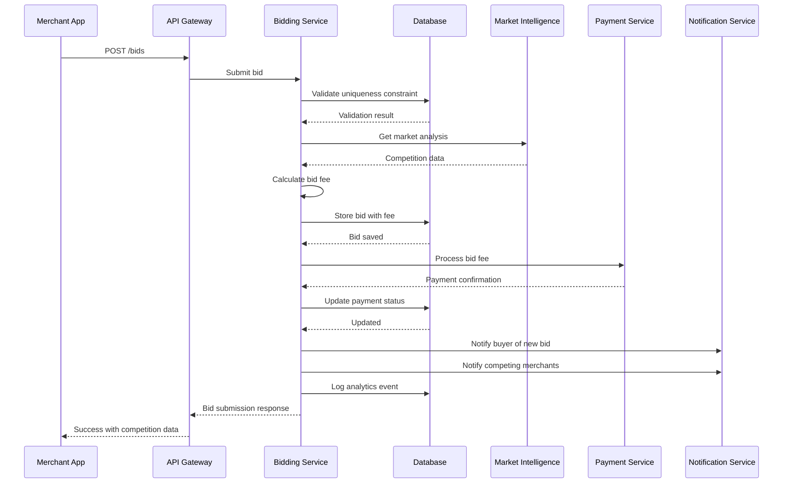
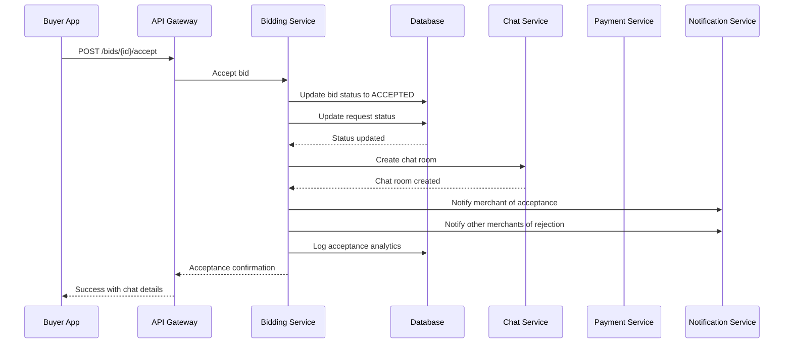
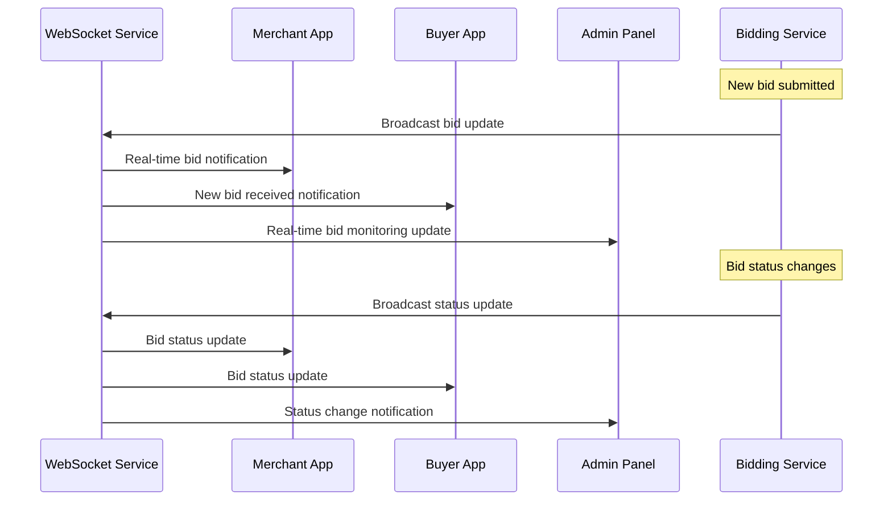

# Bidding System Technical Specification - FINAL VERSION

## Executive Summary

This document provides the complete and final technical specification for the bidding system of the reverse marketplace platform, enabling merchants to submit competitive bids on buyer requests with real-time tracking, validation, and deal conversion functionality.

---

## 1. System Architecture

### 1.1 Core Design Principles

✅ **Competitive Bidding Engine**
- Real-time bid tracking and ranking
- Market intelligence and pricing recommendations
- Fraud detection and prevention mechanisms
- Comprehensive bid analytics and insights

✅ **Merchant-Centric Features**
- Quick bid templates and automation
- Competitive analysis and market data
- Performance tracking and optimization tools
- Business intelligence and ROI calculation

✅ **Buyer-Friendly Experience**
- Easy bid comparison and evaluation
- Merchant reputation integration
- Transparent bid history and communication
- Streamlined acceptance and negotiation

### 1.2 Platform Integration

| Platform | Primary Features | Secondary Features | Use Case |
|----------|------------------|-------------------|-----------|
| **Merchant App** | Bid submission, templates | Market analysis, competition tracking | Active bidding |
| **Buyer App** | Bid viewing, comparison | Merchant evaluation, bid acceptance | Decision making |
| **Admin Panel** | Monitoring, moderation | Analytics, fraud detection | Oversight and control |

---

## 2. Database Schema Specification

### 2.1 Core Bidding Tables

#### `bids` Table
```sql
CREATE TABLE bids (
    id UUID PRIMARY KEY DEFAULT gen_random_uuid(),
    request_id UUID NOT NULL REFERENCES requests(id) ON DELETE CASCADE,
    merchant_id UUID NOT NULL REFERENCES users(id) ON DELETE CASCADE,
    amount DECIMAL(12, 2) NOT NULL,
    delivery_days INTEGER NOT NULL,
    delivery_notes TEXT NULL,
    special_terms TEXT NULL,
    status bid_status NOT NULL DEFAULT 'PENDING',
    priority_score INTEGER DEFAULT 0,
    is_template BOOLEAN DEFAULT FALSE,
    template_name VARCHAR(100) NULL,
    bid_fee DECIMAL(10, 2) DEFAULT 0.00,
    fee_paid BOOLEAN DEFAULT FALSE,
    created_at TIMESTAMP WITH TIME ZONE DEFAULT NOW(),
    updated_at TIMESTAMP WITH TIME ZONE DEFAULT NOW(),
    expires_at TIMESTAMP WITH TIME ZONE NULL,
    accepted_at TIMESTAMP WITH TIME ZONE NULL,
    rejected_at TIMESTAMP WITH TIME ZONE NULL,
    withdrawn_at TIMESTAMP WITH TIME ZONE NULL
);

CREATE TYPE bid_status AS ENUM ('PENDING', 'ACCEPTED', 'REJECTED', 'EXPIRED', 'WITHDRAWN');

-- Performance indexes
CREATE INDEX idx_bids_request_id ON bids(request_id);
CREATE INDEX idx_bids_merchant_id ON bids(merchant_id);
CREATE INDEX idx_bids_status ON bids(status);
CREATE INDEX idx_bids_amount ON bids(amount);
CREATE INDEX idx_bids_created_at ON bids(created_at);
CREATE INDEX idx_bids_priority_score ON bids(priority_score DESC);
CREATE UNIQUE INDEX idx_bids_unique_request_merchant ON bids(request_id, merchant_id);
```

#### `bid_templates` Table
```sql
CREATE TABLE bid_templates (
    id UUID PRIMARY KEY DEFAULT gen_random_uuid(),
    merchant_id UUID NOT NULL REFERENCES users(id) ON DELETE CASCADE,
    name VARCHAR(100) NOT NULL,
    description TEXT NULL,
    amount_type amount_type NOT NULL DEFAULT 'FIXED',
    amount_percentage DECIMAL(5, 2) NULL,
    fixed_amount DECIMAL(12, 2) NULL,
    delivery_days INTEGER NULL,
    delivery_notes TEXT NULL,
    special_terms TEXT NULL,
    is_active BOOLEAN DEFAULT TRUE,
    usage_count INTEGER DEFAULT 0,
    success_count INTEGER DEFAULT 0,
    created_at TIMESTAMP WITH TIME ZONE DEFAULT NOW(),
    updated_at TIMESTAMP WITH TIME ZONE DEFAULT NOW()
);

CREATE TYPE amount_type AS ENUM ('FIXED', 'PERCENTAGE', 'RANGE');

-- Indexes
CREATE INDEX idx_bid_templates_merchant_id ON bid_templates(merchant_id);
CREATE INDEX idx_bid_templates_active ON bid_templates(is_active);
CREATE INDEX idx_bid_templates_success_rate ON bid_templates(success_count, usage_count);
```

#### `bid_analytics` Table
```sql
CREATE TABLE bid_analytics (
    id UUID PRIMARY KEY DEFAULT gen_random_uuid(),
    bid_id UUID REFERENCES bids(id) ON DELETE CASCADE,
    merchant_id UUID REFERENCES users(id) ON DELETE SET NULL,
    request_id UUID REFERENCES requests(id) ON DELETE SET NULL,
    event_type analytics_event_type NOT NULL,
    metadata JSONB DEFAULT '{}',
    created_at TIMESTAMP WITH TIME ZONE DEFAULT NOW()
);

CREATE TYPE analytics_event_type AS ENUM (
    'VIEWED', 'SUBMITTED', 'ACCEPTED', 'REJECTED', 'EXPIRED', 'WITHDRAWN',
    'COMPETITION_VIEWED', 'PRICE_COMPARED', 'TEMPLATE_USED'
);

-- Indexes
CREATE INDEX idx_bid_analytics_bid_id ON bid_analytics(bid_id);
CREATE INDEX idx_bid_analytics_merchant_id ON bid_analytics(merchant_id);
CREATE INDEX idx_bid_analytics_event_type ON bid_analytics(event_type);
CREATE INDEX idx_bid_analytics_created_at ON bid_analytics(created_at);
```

### 2.2 Market Intelligence Tables

#### `market_prices` Table
```sql
CREATE TABLE market_prices (
    id UUID PRIMARY KEY DEFAULT gen_random_uuid(),
    category_id UUID REFERENCES request_categories(id),
    location_lat DECIMAL(10, 8),
    location_lng DECIMAL(11, 8),
    radius_km INTEGER NOT NULL DEFAULT 10,
    avg_bid_amount DECIMAL(12, 2),
    min_bid_amount DECIMAL(12, 2),
    max_bid_amount DECIMAL(12, 2),
    bid_count INTEGER DEFAULT 0,
    success_rate DECIMAL(5, 2),
    calculated_at TIMESTAMP WITH TIME ZONE DEFAULT NOW(),
    expires_at TIMESTAMP WITH TIME ZONE NOT NULL
);

-- Indexes
CREATE INDEX idx_market_prices_category_location ON market_prices(category_id, location_lat, location_lng);
CREATE INDEX idx_market_prices_expires_at ON market_prices(expires_at);
```

#### `bid_competition` Table
```sql
CREATE TABLE bid_competition (
    id UUID PRIMARY KEY DEFAULT gen_random_uuid(),
    request_id UUID NOT NULL REFERENCES requests(id) ON DELETE CASCADE,
    merchant_id UUID NOT NULL REFERENCES users(id) ON DELETE CASCADE,
    competitor_count INTEGER DEFAULT 0,
    lowest_bid_amount DECIMAL(12, 2) NULL,
    average_bid_amount DECIMAL(12, 2) NULL,
    market_position INTEGER NULL, -- 1=lowest, 2=second lowest, etc.
    calculated_at TIMESTAMP WITH TIME ZONE DEFAULT NOW()
);

-- Indexes
CREATE INDEX idx_bid_competition_request_id ON bid_competition(request_id);
CREATE INDEX idx_bid_competition_merchant_id ON bid_competition(merchant_id);
```

### 2.3 Fraud Detection Tables

#### `bid_fraud_indicators` Table
```sql
CREATE TABLE bid_fraud_indicators (
    id UUID PRIMARY KEY DEFAULT gen_random_uuid(),
    bid_id UUID REFERENCES bids(id) ON DELETE CASCADE,
    merchant_id UUID REFERENCES users(id) ON DELETE CASCADE,
    indicator_type fraud_indicator_type NOT NULL,
    confidence_score DECIMAL(3, 2) NOT NULL,
    details JSONB DEFAULT '{}',
    is_reviewed BOOLEAN DEFAULT FALSE,
    reviewed_by UUID REFERENCES users(id) NULL,
    reviewed_at TIMESTAMP WITH TIME ZONE NULL,
    created_at TIMESTAMP WITH TIME ZONE DEFAULT NOW()
);

CREATE TYPE fraud_indicator_type AS ENUM (
    'UNUSUAL_AMOUNT', 'RAPID_BIDDING', 'COPYCAT_BID', 'SUSPICIOUS_PATTERN',
    'FAKE_ACCOUNT', 'MANIPULATION_ATTEMPT', 'PRICE_FIXING'
);

-- Indexes
CREATE INDEX idx_bid_fraud_indicators_bid_id ON bid_fraud_indicators(bid_id);
CREATE INDEX idx_bid_fraud_indicators_merchant_id ON bid_fraud_indicators(merchant_id);
CREATE INDEX idx_bid_fraud_indicators_type ON bid_fraud_indicators(indicator_type);
```

---

## 3. Event Publishing

### 3.1 Bidding Events

The Bidding Service publishes the following events to RabbitMQ:

| Event | Trigger | Data | Consumers |
|-------|---------|------|-----------|
| `bid.submitted` | New bid created | BidSubmittedEvent | Notification, Chat, Payment, Analytics |
| `bid.accepted` | Bid accepted by buyer | BidAcceptedEvent | Payment, Chat, Request, Notification |
| `bid.rejected` | Bid rejected by buyer | BidRejectedEvent | Notification, Chat, Analytics |
| `bid.expired` | Bid expired without action | BidExpiredEvent | Notification, Analytics, Chat |
| `bid.withdrawn` | Bid withdrawn by merchant | BidWithdrawnEvent | Notification, Analytics, Chat |

### 3.2 Event Schemas

```typescript
// Base Event Structure
interface BaseEvent {
  eventId: string;
  eventType: string;
  timestamp: string;
  version: string;
  source: 'bidding-service';
  data: any;
  metadata?: {
    correlationId?: string;
    userId?: string;
    requestId?: string;
    bidId?: string;
  };
}

// Bid Events
interface BidSubmittedEvent extends BaseEvent {
  eventType: 'bid.submitted';
  data: {
    bidId: string;
    requestId: string;
    merchantId: string;
    amount: number;
    deliveryDays: number;
    deliveryNotes?: string;
    specialTerms?: string;
    bidFee: number;
    submittedAt: string;
    expiresAt: string;
  };
}

interface BidAcceptedEvent extends BaseEvent {
  eventType: 'bid.accepted';
  data: {
    bidId: string;
    requestId: string;
    merchantId: string;
    buyerId: string;
    amount: number;
    acceptedAt: string;
    acceptedBy: string;
  };
}

interface BidRejectedEvent extends BaseEvent {
  eventType: 'bid.rejected';
  data: {
    bidId: string;
    requestId: string;
    merchantId: string;
    buyerId: string;
    rejectedAt: string;
    rejectedBy: string;
    reason?: string;
  };
}

interface BidExpiredEvent extends BaseEvent {
  eventType: 'bid.expired';
  data: {
    bidId: string;
    requestId: string;
    merchantId: string;
    expiredAt: string;
  };
}

interface BidWithdrawnEvent extends BaseEvent {
  eventType: 'bid.withdrawn';
  data: {
    bidId: string;
    requestId: string;
    merchantId: string;
    withdrawnAt: string;
    reason?: string;
  };
}
```

---

## 4. API Specifications

### 3.1 Bid Management Endpoints

#### POST `/bids`
```typescript
interface CreateBidRequest {
  requestId: string;
  amount: number;
  deliveryDays: number;
  deliveryNotes?: string;
  specialTerms?: string;
  templateId?: string;
}

interface CreateBidResponse {
  success: boolean;
  bidId?: string;
  competition?: {
    totalBids: number;
    lowestAmount: number;
    averageAmount: number;
    yourPosition: number;
  };
  message: string;
  fee?: {
    amount: number;
    currency: string;
  };
}
```

#### GET `/bids/{id}`
```typescript
interface GetBidResponse {
  success: boolean;
  bid?: {
    id: string;
    requestId: string;
    merchantId: string;
    amount: number;
    deliveryDays: number;
    deliveryNotes?: string;
    specialTerms?: string;
    status: BidStatus;
    createdAt: string;
    updatedAt: string;
    expiresAt?: string;
  };
  message?: string;
}
```

#### GET `/requests/{id}/bids`
```typescript
interface GetBidsRequest {
  filters?: {
    status?: BidStatus[];
    amountRange?: { min: number; max: number; };
    deliveryDays?: { min: number; max: number; };
  };
  pagination?: {
    page: number;
    limit: number;
  };
  sorting?: {
    field: 'amount' | 'deliveryDays' | 'createdAt';
    order: 'asc' | 'desc';
  };
}

interface GetBidsResponse {
  bids: Bid[];
  pagination: {
    page: number;
    limit: number;
    total: number;
    totalPages: number;
  };
  marketAnalysis?: {
    averageAmount: number;
    lowestAmount: number;
    bidCount: number;
  };
}
```

#### PUT `/bids/{id}`
```typescript
interface UpdateBidRequest {
  amount: number;
  deliveryDays: number;
  deliveryNotes?: string;
  specialTerms?: string;
}

interface UpdateBidResponse {
  success: boolean;
  bid?: Bid;
  message: string;
  fee?: {
    amount: number;
    currency: string;
  };
}
```

#### DELETE `/bids/{id}`
```typescript
interface WithdrawBidResponse {
  success: boolean;
  message: string;
  refund?: {
    amount: number;
    currency: string;
  };
}
```

### 3.2 Bid Template Endpoints

#### POST `/bid-templates`
```typescript
interface CreateTemplateRequest {
  name: string;
  description?: string;
  amountType: 'FIXED' | 'PERCENTAGE' | 'RANGE';
  amountPercentage?: number;
  fixedAmount?: number;
  deliveryDays?: number;
  deliveryNotes?: string;
  specialTerms?: string;
}

interface CreateTemplateResponse {
  success: boolean;
  templateId?: string;
  message: string;
}
```

#### GET `/bid-templates`
```typescript
interface GetTemplatesResponse {
  success: boolean;
  templates: BidTemplate[];
  message?: string;
}
```

### 3.3 Market Intelligence Endpoints

#### GET `/bids/market-analysis`
```typescript
interface MarketAnalysisRequest {
  categoryId?: string;
  location?: {
    lat: number;
    lng: number;
    radius: number; // in kilometers
  };
  dateRange?: {
    startDate: string;
    endDate: string;
  };
}

interface MarketAnalysisResponse {
  success: boolean;
  analysis: {
    averageAmount: number;
    minAmount: number;
    maxAmount: number;
    successRate: number;
    competitionLevel: 'LOW' | 'MEDIUM' | 'HIGH';
    priceRecommendation: {
      min: number;
      optimal: number;
      max: number;
    };
    marketTrends: {
      direction: 'INCREASING' | 'DECREASING' | 'STABLE';
      changePercent: number;
    };
  };
}
```

### 3.4 Admin Management Endpoints

#### GET `/admin/bids`
```typescript
interface AdminBidSearchRequest {
  filters?: {
    status?: BidStatus[];
    merchants?: string[];
    dateRange?: { startDate: string; endDate: string; };
    amountRange?: { min: number; max: number; };
    fraudIndicators?: boolean;
  };
  analytics?: ('count' | 'value' | 'success_rate' | 'fraud_rate')[];
  pagination?: {
    page: number;
    limit: number;
  };
}

interface AdminBidSearchResponse {
  bids: AdminBid[];
  pagination: {
    page: number;
    limit: number;
    total: number;
    totalPages: number;
  };
  analytics: {
    totalBids: number;
    totalValue: number;
    successRate: number;
    fraudIndicators: number;
    topMerchants: MerchantStats[];
    categoryBreakdown: CategoryStats[];
  };
  fraudAlerts: FraudAlert[];
}
```

---

## 4. Bid Fee Configuration

### 4.1 Fee Structure
```yaml
bid_fee_structure:
  calculation_method: "percentage" # or "fixed" or "tiered"
  percentage_rate: 2.5 # 2.5% of bid amount
  minimum_fee: 1.00 # Minimum $1.00
  maximum_fee: 50.00 # Maximum $50.00
  merchant_tier_discounts:
    basic: 0 # No discount
    pro: 0.5 # 0.5% discount
    enterprise: 1.0 # 1.0% discount
  fee_exemptions:
    - first_5_bids_free: true
    - high_rating_merchant_discount: true
  fee_payment_method: "wallet_balance" # Deduct from merchant wallet
```

### 4.2 Bid Ranking Algorithm
```yaml
bid_ranking_algorithm:
  factors:
    amount: 0.3 # 30% weight
    delivery_time: 0.2 # 20% weight
    merchant_rating: 0.25 # 25% weight
    success_rate: 0.15 # 15% weight
    response_time: 0.1 # 10% weight
  tie_breaking:
    - "earliest_submission"
    - "merchant_rating"
    - "lower_fee_paid"
  scoring_frequency: "real_time"
  score_update_interval: 300 # seconds
```

---

## 5. Bidding Flows

### 5.1 Bid Submission Flow


### 5.2 Bid Acceptance Flow


### 5.3 Real-Time Bid Updates Flow


---

## 6. Implementation Phases

### 6.1 Phase 1: Core Bidding Backend (Week 1-2)
- [ ] Set up database tables and indexes
- [ ] Implement basic bid CRUD operations
- [ ] Create bid validation and business logic
- [ ] Set up bid uniqueness constraints
- [ ] Implement basic analytics logging

### 6.2 Phase 2: Market Intelligence (Week 2-3)
- [ ] Implement market price calculation algorithms
- [ ] Create competition analysis system
- [ ] Build bid ranking and scoring
- [ ] Set up market data aggregation
- [ ] Create pricing recommendation engine

### 6.3 Phase 3: Template System (Week 3-4)
- [ ] Create bid template management
- [ ] Implement template personalization
- [ ] Build template performance tracking
- [ ] Set up template usage analytics
- [ ] Create template optimization suggestions

### 6.4 Phase 4: Fraud Detection (Week 4-5)
- [ ] Implement fraud detection algorithms
- [ ] Create suspicious pattern detection
- [ ] Build fraud scoring system
- [ ] Set up fraud alerting
- [ ] Create fraud review workflows

### 6.5 Phase 5: Real-Time Features (Week 5-6)
- [ ] Implement WebSocket-based bid updates
- [ ] Create real-time notifications
- [ ] Build live bid tracking
- [ ] Set up bid status broadcasting
- [ ] Create real-time analytics

---

## 7. Testing Requirements

### 7.1 Functionality Testing
- [ ] Test complete bid lifecycle from submission to acceptance
- [ ] Verify bid validation rules and business logic
- [ ] Test concurrent bid submission and updates
- [ ] Validate bid uniqueness constraints
- [ ] Test bid fee calculation accuracy

### 7.2 Performance Testing
- [ ] Test bid submission performance under load
- [ ] Verify real-time bid update performance
- [ ] Test bid search and filtering performance
- [ ] Validate bid processing throughput
- [ ] Test database query optimization

### 7.3 Security Testing
- [ ] Test bid manipulation prevention
- [ ] Verify bid fraud detection effectiveness
- [ ] Test bid authorization and access control
- [ ] Validate bid data integrity
- [ ] Test bid replay attack prevention

---

## 8. Monitoring & Analytics

### 8.1 Key Metrics
- Bid submission and acceptance rates
- Bid success rates by merchant
- Average bid amounts and competition levels
- Fraud detection effectiveness
- Market price accuracy

### 8.2 Performance Monitoring
- API response times for bid operations
- Real-time update latency
- Database query performance
- WebSocket connection stability
- Market intelligence calculation performance

### 8.3 Business Analytics
- Merchant performance metrics
- Category-specific bidding patterns
- Geographic bidding trends
- Seasonal bid variations
- ROI and profitability analysis

---

## 9. Security Considerations

### 9.1 Bid Validation
- Amount range validation
- Delivery time validation
- Merchant eligibility checks
- Rate limiting per merchant
- Duplicate bid prevention

### 9.2 Fraud Prevention
- Unusual pattern detection
- Bid manipulation prevention
- Fake account detection
- Price fixing detection
- Automated suspicious activity monitoring

### 9.3 Data Integrity
- Atomic bid operations
- Consistent state management
- Audit logging for all changes
- Data backup and recovery
- Real-time data synchronization

---

## 10. User Experience (UX) Specifications

### 10.1 Admin Panel Bidding UX

#### Bidding Oversight Dashboard
**Visual Design:**
- Comprehensive dashboard with real-time bidding metrics
- Interactive charts showing bid trends and success rates
- Heat map of bidding activity by category and location
- Fraud alert system with severity indicators
- Merchant performance leaderboard with rankings

**Interaction Design:**
- Draggable and resizable dashboard widgets
- Real-time data refresh with live updates
- Advanced filtering and search capabilities
- Export functionality for reports (CSV, PDF)
- Quick action buttons for common admin tasks

**Monitoring Tools:**
- Live bid submission stream with filtering
- Suspicious activity detection with visual alerts
- Bid comparison tools for fraud analysis
- Merchant behavior analytics with pattern recognition
- Automated moderation queue with priority sorting

#### Merchant Management
**Visual Interface:**
- Merchant profile cards with performance metrics
- Verification status badges with progress indicators
- Reputation score visualization with trend analysis
- Earnings dashboard with interactive charts
- Performance comparison tools

**Administrative Actions:**
- Bulk merchant operations with selection tools
- Suspension and ban workflows with reason tracking
- Verification process management with document review
- Communication tools for merchant outreach
- Performance review scheduling with calendar integration

### 10.2 Buyer App Bidding UX

#### Bid Discovery & Comparison
**Visual Design:**
- Card-based bid display with merchant information
- Interactive comparison tools for side-by-side evaluation
- Visual indicators for bid quality and merchant reputation
- Price comparison charts with market benchmarks
- Merchant rating displays with review highlights

**Interaction Design:**
- Swipe gestures for quick bid navigation
- Pull-to-refresh for real-time bid updates
- Tap-to-expand for detailed bid information
- Long-press for quick action menus
- Pinch-to-zoom for image and document viewing

**Decision Support:**
- Bid recommendation engine with scoring system
- Merchant trust indicators with verification badges
- Price analysis with market comparison
- Delivery time visualization with calendar integration
- Quick chat buttons for merchant communication

#### Bid Evaluation Tools
**Visual Analytics:**
- Interactive charts showing bid distribution
- Price range visualization with quartile analysis
- Merchant performance comparison graphs
- Delivery time analysis with probability indicators
- Success rate predictions based on historical data

**Smart Features:**
- AI-powered bid ranking with personalized scoring
- Automatic shortlisting based on buyer preferences
- Price negotiation suggestions with market insights
- Merchant background checks with risk assessment
- One-click acceptance with confirmation flow

### 10.3 Merchant App Bidding UX

#### Bid Creation & Management
**Visual Design:**
- Intuitive bid creation wizard with step-by-step guidance
- Template library with visual previews
- Real-time bid preview with formatting tools
- Competition analysis dashboard with visual indicators
- Performance metrics with interactive charts

**Interaction Design:**
- Drag-and-drop file upload for bid attachments
- Voice-to-text for bid descriptions
- Smart suggestions for pricing based on market data
- Quick template application with one-tap functionality
- Batch bid creation for similar requests

**Productivity Tools:**
- Bid automation with rule-based triggers
- Market intelligence integration with pricing insights
- Competitor analysis with real-time updates
- Performance tracking with goal setting
- Time-saving shortcuts for frequent actions

#### Market Intelligence Dashboard
**Visual Analytics:**
- Interactive market trend charts with category filters
- Geographic demand heat maps with location insights
- Competition analysis with market share visualization
- Pricing recommendations with confidence intervals
- Opportunity identification with alert system

**Strategic Tools:**
- Bid optimization suggestions with A/B testing
- Market entry timing recommendations
- Portfolio management with risk assessment
- Revenue forecasting with scenario planning
- Competitive positioning analysis

#### Performance Management
**Visual Indicators:**
- Success rate tracking with trend analysis
- Earnings dashboard with breakdown by category
- Customer satisfaction metrics with review highlights
- Response time analytics with benchmarking
- Growth indicators with milestone tracking

**Improvement Features:**
- Performance comparison with top merchants
- Skill gap analysis with training recommendations
- Customer feedback integration with action items
- Automated performance reports with insights
- Goal setting with progress tracking

### 10.4 Cross-Platform Bidding Experience

#### Responsive Design
**Mobile Optimization:**
- Touch-optimized bid creation interface
- Gesture-based navigation for quick actions
- Adaptive layouts for different screen sizes
- Offline mode for bid drafting and review
- Push notifications for bid status updates

**Desktop Experience:**
- Multi-window support for comparing bids
- Keyboard shortcuts for power users
- Advanced filtering with complex criteria
- Bulk operations for efficiency
- Detailed analytics with drill-down capabilities

#### Real-Time Features
**Live Updates:**
- Real-time bid status changes with visual indicators
- Live competition tracking with position updates
- Instant notifications for bid activities
- Real-time chat integration with typing indicators
- Live market data updates with price changes

**Collaboration Tools:**
- Team bidding with role-based permissions
- Shared bid templates with version control
- Internal notes and comments system
- Approval workflows for high-value bids
- Performance sharing with team analytics

### 10.5 Accessibility & Inclusivity

#### Accessibility Standards
**WCAG 2.1 AA Compliance:**
- Screen reader compatibility for bid information
- Keyboard navigation for all bidding functions
- High contrast mode for better visibility
- Voice control support for hands-free operation
- Adjustable text sizes without layout breakage

**Inclusive Design:**
- Multi-language support for bid descriptions
- Currency conversion with real-time rates
- Cultural sensitivity in bid presentation
- Cognitive accessibility with clear language
- Motor accessibility with large touch targets

#### Personalization Options
**User Preferences:**
- Customizable dashboard layouts
- Personalized bid recommendations
- Adaptive color schemes and themes
- Notification preference management
- Language and regional settings

**Accessibility Features:**
- Text-to-speech for bid descriptions
- Voice commands for bid creation
- Screen magnification for detailed review
- Alternative input methods for mobility
- Cognitive assistance for complex decisions

### 10.6 Performance & Optimization

#### Loading Performance
**Speed Optimization:**
- Instant bid loading with progressive enhancement
- Smart caching for frequently accessed data
- Predictive loading for likely user actions
- Background sync for offline functionality
- Optimized image delivery with WebP format

**Network Efficiency:**
- Data compression for reduced bandwidth usage
- Intelligent retry mechanisms for failed requests
- Offline mode with bid queue management
- Graceful degradation on poor connections
- Background updates for real-time data

#### User Experience Metrics
**Key Performance Indicators:**
- Bid creation completion rate
- Average time to bid submission
- Bid acceptance rate optimization
- User satisfaction with bidding process
- Support ticket reduction rate

**Continuous Improvement:**
- A/B testing for bid interface optimization
- User behavior analysis for UX improvements
- Performance monitoring with real-time alerts
- User feedback integration with rapid iteration
- Machine learning for personalized experiences

---

## 11. Conclusion

This final specification provides a complete, scalable, and secure bidding system that:

✅ **Enables Competitive Bidding** - Real-time bid tracking and ranking
✅ **Provides Market Intelligence** - Pricing recommendations and competition analysis
✅ **Ensures Fair Competition** - Fraud detection and prevention mechanisms
✅ **Supports Merchant Success** - Templates, analytics, and optimization tools
✅ **Delivers Performance** - Optimized for high-volume marketplace usage

The system is ready for implementation with clear phases, testing strategies, and deployment guidelines. All security considerations have been addressed, and the architecture supports the specific needs of a competitive reverse marketplace while maintaining transparency and fairness.

---

## 11. Implementation Checklist

### 11.1 Pre-Implementation
- [ ] Review and approve bid fee structure
- [ ] Define market intelligence algorithms
- [ ] Set up fraud detection rules
- [ ] Prepare database migration scripts
- [ ] Configure monitoring and alerting

### 11.2 Implementation
- [ ] Implement all database schemas
- [ ] Develop bidding APIs
- [ ] Create market intelligence system
- [ ] Build fraud detection mechanisms
- [ ] Implement real-time features

### 11.3 Post-Implementation
- [ ] Conduct comprehensive testing
- [ ] Perform load and stress testing
- [ ] Validate all bidding flows
- [ ] Deploy to production environment
- [ ] Monitor and optimize performance

This specification serves as the complete technical foundation for implementing a robust, scalable, and competitive bidding system for the reverse marketplace platform.
