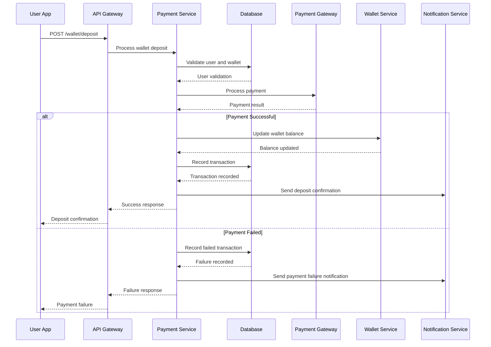
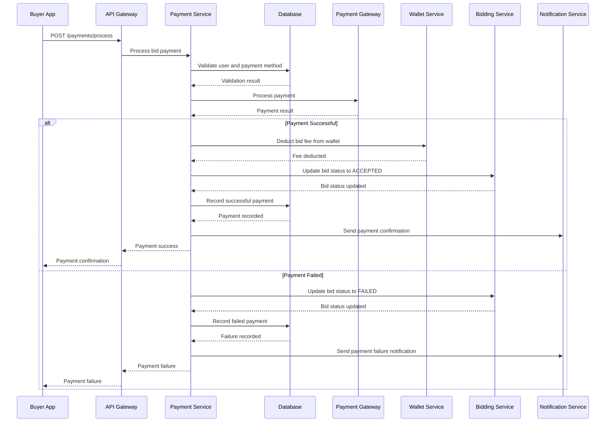
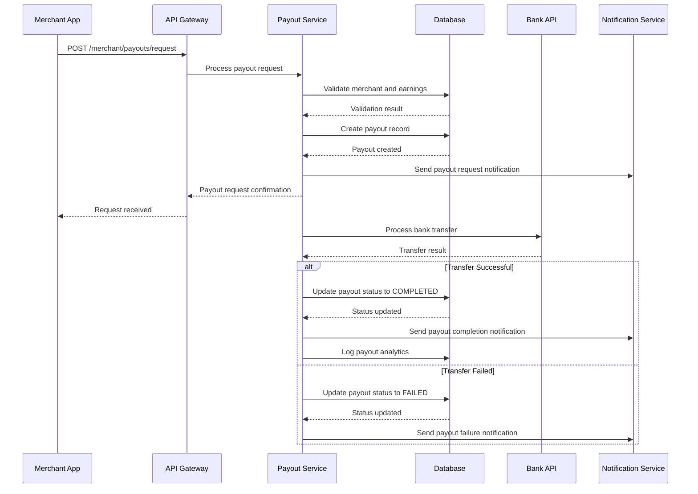

# Payment & Wallet System Technical Specification - FINAL VERSION

## Executive Summary

This document provides the complete and final technical specification for the comprehensive payment and wallet system of the reverse marketplace platform, handling wallet management, payment processing, transaction tracking, and revenue collection with support for multiple payment gateways and currencies.

---

## 1. System Architecture

### 1.1 Core Design Principles

✅ **Unified Wallet Management**
- Multi-currency wallet support with real-time balance tracking
- Secure transaction processing with complete audit trails
- Automated fee deduction and revenue collection
- Comprehensive payment method management

✅ **Multi-Gateway Payment Processing**
- Multiple payment gateway integration with failover
- Tokenization and secure payment data handling
- Recurring payment processing for subscriptions
- Comprehensive fraud detection and prevention

✅ **Financial Compliance**
- PCI DSS compliance for payment processing
- AML and KYC verification procedures
- Complete audit trails and regulatory reporting
- Data encryption and secure storage

### 1.2 Platform Integration

| Platform | Primary Features | Secondary Features | Use Case |
|----------|------------------|-------------------|-----------|
| **Buyer App** | Wallet funding, payment processing | Transaction history, spending analytics | Personal finance management |
| **Merchant App** | Earnings tracking, payout requests | Revenue analytics, expense tracking | Business finance management |
| **Admin Panel** | Transaction monitoring, gateway management | Compliance reporting, revenue tracking | Financial oversight |

---

## 2. Database Schema Specification

### 2.1 Core Wallet Tables

#### `wallets` Table
```sql
CREATE TABLE wallets (
    id UUID PRIMARY KEY DEFAULT gen_random_uuid(),
    user_id UUID NOT NULL REFERENCES users(id) ON DELETE CASCADE,
    currency VARCHAR(3) NOT NULL DEFAULT 'OMR',
    balance DECIMAL(18, 8) NOT NULL DEFAULT 0.00,
    available_balance DECIMAL(18, 8) NOT NULL DEFAULT 0.00,
    frozen_balance DECIMAL(18, 8) NOT NULL DEFAULT 0.00,
    status wallet_status NOT NULL DEFAULT 'ACTIVE',
    created_at TIMESTAMP WITH TIME ZONE DEFAULT NOW(),
    updated_at TIMESTAMP WITH TIME ZONE DEFAULT NOW(),
    last_transaction_at TIMESTAMP WITH TIME ZONE NULL
);

CREATE TYPE wallet_status AS ENUM ('ACTIVE', 'FROZEN', 'SUSPENDED', 'CLOSED');

-- Indexes
CREATE INDEX idx_wallets_user_id ON wallets(user_id);
CREATE INDEX idx_wallets_currency ON wallets(currency);
CREATE INDEX idx_wallets_status ON wallets(status);
CREATE UNIQUE INDEX idx_wallets_user_currency ON wallets(user_id, currency);
```

#### `wallet_transactions` Table
```sql
CREATE TABLE wallet_transactions (
    id UUID PRIMARY KEY DEFAULT gen_random_uuid(),
    wallet_id UUID NOT NULL REFERENCES wallets(id) ON DELETE CASCADE,
    type transaction_type NOT NULL,
    amount DECIMAL(18, 8) NOT NULL,
    balance_after DECIMAL(18, 8) NOT NULL,
    reference_id UUID NULL,
    reference_type reference_type NULL,
    description TEXT NULL,
    metadata JSONB DEFAULT '{}',
    status transaction_status NOT NULL DEFAULT 'PENDING',
    created_at TIMESTAMP WITH TIME ZONE DEFAULT NOW(),
    processed_at TIMESTAMP WITH TIME ZONE NULL
);

CREATE TYPE transaction_type AS ENUM ('DEPOSIT', 'WITHDRAWAL', 'PAYMENT', 'REFUND', 'FEE', 'TRANSFER', 'PAYOUT');
CREATE TYPE transaction_status AS ENUM ('PENDING', 'PROCESSING', 'COMPLETED', 'FAILED', 'CANCELLED');
CREATE TYPE reference_type AS ENUM ('PAYMENT', 'BID', 'REQUEST', 'SUBSCRIPTION', 'REFUND', 'PAYOUT');

-- Indexes
CREATE INDEX idx_wallet_transactions_wallet_id ON wallet_transactions(wallet_id);
CREATE INDEX idx_wallet_transactions_type ON wallet_transactions(type);
CREATE INDEX idx_wallet_transactions_status ON wallet_transactions(status);
CREATE INDEX idx_wallet_transactions_created_at ON wallet_transactions(created_at);
CREATE INDEX idx_wallet_transactions_reference ON wallet_transactions(reference_id, reference_type);
```

### 2.2 Payment Processing Tables

#### `payments` Table
```sql
CREATE TABLE payments (
    id UUID PRIMARY KEY DEFAULT gen_random_uuid(),
    user_id UUID NOT NULL REFERENCES users(id) ON DELETE CASCADE,
    amount DECIMAL(18, 8) NOT NULL,
    currency VARCHAR(3) NOT NULL DEFAULT 'OMR',
    payment_method payment_method_type NOT NULL,
    gateway payment_gateway_type NOT NULL,
    gateway_transaction_id VARCHAR(255) NULL,
    status payment_status NOT NULL DEFAULT 'PENDING',
    purpose payment_purpose NOT NULL,
    reference_id UUID NULL,
    reference_type reference_type NULL,
    description TEXT NULL,
    fee_amount DECIMAL(18, 8) DEFAULT 0.00,
    total_amount DECIMAL(18, 8) NOT NULL,
    metadata JSONB DEFAULT '{}',
    created_at TIMESTAMP WITH TIME ZONE DEFAULT NOW(),
    updated_at TIMESTAMP WITH TIME ZONE DEFAULT NOW(),
    processed_at TIMESTAMP WITH TIME ZONE NULL,
    expires_at TIMESTAMP WITH TIME ZONE NULL
);

CREATE TYPE payment_method_type AS ENUM ('CARD', 'BANK_TRANSFER', 'DIGITAL_WALLET', 'CRYPTOCURRENCY');
CREATE TYPE payment_gateway_type AS ENUM ('STRIPE', 'THAWANI', 'PAYPAL', 'APPLE_PAY', 'GOOGLE_PAY', 'BANK_TRANSFER');
CREATE TYPE payment_status AS ENUM ('PENDING', 'PROCESSING', 'COMPLETED', 'FAILED', 'CANCELLED', 'EXPIRED');
CREATE TYPE payment_purpose AS ENUM ('BID_PAYMENT', 'WALLET_DEPOSIT', 'SUBSCRIPTION', 'REQUEST_PAYMENT', 'REFUND');

-- Indexes
CREATE INDEX idx_payments_user_id ON payments(user_id);
CREATE INDEX idx_payments_status ON payments(status);
CREATE INDEX idx_payments_gateway ON payments(gateway);
CREATE INDEX idx_payments_purpose ON payments(purpose);
CREATE INDEX idx_payments_created_at ON payments(created_at);
CREATE INDEX idx_payments_reference ON payments(reference_id, reference_type);
```

#### `payment_methods` Table
```sql
CREATE TABLE payment_methods (
    id UUID PRIMARY KEY DEFAULT gen_random_uuid(),
    user_id UUID NOT NULL REFERENCES users(id) ON DELETE CASCADE,
    type payment_method_type NOT NULL,
    gateway payment_gateway_type NOT NULL,
    provider_token VARCHAR(500) NULL, -- Encrypted token from payment provider
    display_name VARCHAR(100) NOT NULL,
    card_last_four VARCHAR(4) NULL, -- Only last 4 digits for display
    card_brand VARCHAR(50) NULL,
    card_expiry_month INTEGER NULL,
    card_expiry_year INTEGER NULL,
    bank_account_number VARCHAR(255) NULL,
    bank_name VARCHAR(255) NULL,
    is_default BOOLEAN DEFAULT FALSE,
    is_verified BOOLEAN DEFAULT FALSE,
    metadata JSONB DEFAULT '{}',
    created_at TIMESTAMP WITH TIME ZONE DEFAULT NOW(),
    updated_at TIMESTAMP WITH TIME ZONE DEFAULT NOW(),
    expires_at TIMESTAMP WITH TIME ZONE NULL
);

-- Indexes
CREATE INDEX idx_payment_methods_user_id ON payment_methods(user_id);
CREATE INDEX idx_payment_methods_type ON payment_methods(type);
CREATE INDEX idx_payment_methods_default ON payment_methods(is_default);
CREATE INDEX idx_payment_methods_verified ON payment_methods(is_verified);
```

### 2.3 Exchange Rate Tables

#### `exchange_rates` Table
```sql
CREATE TABLE exchange_rates (
    id UUID PRIMARY KEY DEFAULT gen_random_uuid(),
    from_currency VARCHAR(3) NOT NULL,
    to_currency VARCHAR(3) NOT NULL,
    rate DECIMAL(18, 8) NOT NULL,
    source VARCHAR(50) NOT NULL DEFAULT 'MANUAL',
    valid_from TIMESTAMP WITH TIME ZONE NOT NULL,
    valid_until TIMESTAMP WITH TIME ZONE NULL,
    created_at TIMESTAMP WITH TIME ZONE DEFAULT NOW(),
    updated_at TIMESTAMP WITH TIME ZONE DEFAULT NOW()
);

-- Indexes
CREATE INDEX idx_exchange_rates_from_to ON exchange_rates(from_currency, to_currency);
CREATE INDEX idx_exchange_rates_valid_from ON exchange_rates(valid_from);
CREATE INDEX idx_exchange_rates_valid_until ON exchange_rates(valid_until);
```

### 2.4 Payout System Tables

#### `merchant_payouts` Table
```sql
CREATE TABLE merchant_payouts (
    id UUID PRIMARY KEY DEFAULT gen_random_uuid(),
    merchant_id UUID NOT NULL REFERENCES users(id) ON DELETE CASCADE,
    amount DECIMAL(18, 8) NOT NULL,
    currency VARCHAR(3) NOT NULL DEFAULT 'OMR',
    period_start DATE NOT NULL,
    period_end DATE NOT NULL,
    gross_earnings DECIMAL(18, 8) NOT NULL,
    fees DECIMAL(18, 8) NOT NULL DEFAULT 0.00,
    net_amount DECIMAL(18, 8) NOT NULL,
    status payout_status NOT NULL DEFAULT 'PENDING',
    bank_account_id UUID REFERENCES payment_methods(id) NULL,
    reference_number VARCHAR(100) NULL,
    notes TEXT NULL,
    processed_by UUID REFERENCES users(id) NULL,
    created_at TIMESTAMP WITH TIME ZONE DEFAULT NOW(),
    processed_at TIMESTAMP WITH TIME ZONE NULL
);

CREATE TYPE payout_status AS ENUM ('PENDING', 'PROCESSING', 'COMPLETED', 'FAILED', 'CANCELLED');

-- Indexes
CREATE INDEX idx_merchant_payouts_merchant_id ON merchant_payouts(merchant_id);
CREATE INDEX idx_merchant_payouts_status ON merchant_payouts(status);
CREATE INDEX idx_merchant_payouts_period ON merchant_payouts(period_start, period_end);
CREATE INDEX idx_merchant_payouts_created_at ON merchant_payouts(created_at);
```

### 2.5 Analytics and Monitoring Tables

#### `payment_analytics` Table
```sql
CREATE TABLE payment_analytics (
    id UUID PRIMARY KEY DEFAULT gen_random_uuid(),
    payment_id UUID REFERENCES payments(id) ON DELETE SET NULL,
    gateway payment_gateway_type NOT NULL,
    event_type analytics_event_type NOT NULL,
    amount DECIMAL(18, 8) NULL,
    currency VARCHAR(3) NULL,
    user_id UUID REFERENCES users(id) ON DELETE SET NULL,
    metadata JSONB DEFAULT '{}',
    created_at TIMESTAMP WITH TIME ZONE DEFAULT NOW()
);

CREATE TYPE analytics_event_type AS ENUM (
    'PAYMENT_INITIATED', 'PAYMENT_SUCCESS', 'PAYMENT_FAILED', 'PAYMENT_CANCELLED',
    'GATEWAY_SWITCH', 'FRAUD_DETECTED', 'REFUND_PROCESSED', 'PAYOUT_PROCESSED'
);

-- Indexes
CREATE INDEX idx_payment_analytics_payment_id ON payment_analytics(payment_id);
CREATE INDEX idx_payment_analytics_gateway ON payment_analytics(gateway);
CREATE INDEX idx_payment_analytics_event_type ON payment_analytics(event_type);
CREATE INDEX idx_payment_analytics_created_at ON payment_analytics(created_at);
```

---

## 3. Event Publishing

### 3.1 Payment Events

The Payment & Wallet Service publishes the following events to RabbitMQ:

| Event | Trigger | Data | Consumers |
|-------|---------|------|-----------|
| `payment.completed` | Payment successful | PaymentCompletedEvent | Notification, Analytics, Subscription |
| `payment.failed` | Payment failed | PaymentFailedEvent | Notification, Analytics, Subscription |
| `wallet.deposit` | Wallet deposit | WalletDepositEvent | Notification, Analytics |
| `wallet.withdrawal` | Wallet withdrawal | WalletWithdrawalEvent | Notification, Analytics |

### 3.2 Event Schemas

```typescript
// Base Event Structure
interface BaseEvent {
  eventId: string;
  eventType: string;
  timestamp: string;
  version: string;
  source: 'payment-service';
  data: any;
  metadata?: {
    correlationId?: string;
    userId?: string;
    paymentId?: string;
    walletId?: string;
  };
}

// Payment Events
interface PaymentCompletedEvent extends BaseEvent {
  eventType: 'payment.completed';
  data: {
    paymentId: string;
    userId: string;
    amount: number;
    currency: string;
    paymentMethod: 'CARD' | 'BANK_TRANSFER' | 'DIGITAL_WALLET' | 'CRYPTOCURRENCY';
    gateway: 'STRIPE' | 'THAWANI' | 'PAYPAL' | 'APPLE_PAY' | 'GOOGLE_PAY' | 'BANK_TRANSFER';
    purpose: 'BID_PAYMENT' | 'WALLET_DEPOSIT' | 'SUBSCRIPTION' | 'REQUEST_PAYMENT' | 'REFUND';
    referenceId?: string;
    referenceType?: 'PAYMENT' | 'BID' | 'REQUEST' | 'SUBSCRIPTION' | 'REFUND' | 'PAYOUT';
    completedAt: string;
  };
}

interface PaymentFailedEvent extends BaseEvent {
  eventType: 'payment.failed';
  data: {
    paymentId: string;
    userId: string;
    amount: number;
    currency: string;
    gateway: 'STRIPE' | 'THAWANI' | 'PAYPAL' | 'APPLE_PAY' | 'GOOGLE_PAY' | 'BANK_TRANSFER';
    failureReason: string;
    errorCode?: string;
    failedAt: string;
  };
}

interface WalletDepositEvent extends BaseEvent {
  eventType: 'wallet.deposit';
  data: {
    walletId: string;
    userId: string;
    amount: number;
    currency: string;
    balanceAfter: number;
    paymentId: string;
    depositedAt: string;
  };
}

interface WalletWithdrawalEvent extends BaseEvent {
  eventType: 'wallet.withdrawal';
  data: {
    walletId: string;
    userId: string;
    amount: number;
    currency: string;
    balanceAfter: number;
    paymentId: string;
    withdrawnAt: string;
  };
}
```

---

## 4. API Specifications

### 3.1 Wallet Management Endpoints

#### GET `/wallet/balance`
```typescript
interface WalletBalanceRequest {
  currency?: string; // Default OMR
}

interface WalletBalanceResponse {
  success: boolean;
  balances: {
    currency: string;
    balance: number;
    availableBalance: number;
    frozenBalance: number;
  }[];
  message?: string;
}
```

#### GET `/wallet/transactions`
```typescript
interface WalletTransactionsRequest {
  filters?: {
    type?: TransactionType[];
    status?: TransactionStatus[];
    dateRange?: {
      startDate: string;
      endDate: string;
    };
  };
  pagination?: {
    page: number;
    limit: number;
  };
}

interface WalletTransactionsResponse {
  success: boolean;
  transactions: WalletTransaction[];
  pagination: {
    page: number;
    limit: number;
    total: number;
    totalPages: number;
  };
  message?: string;
}
```

#### POST `/wallet/deposit`
```typescript
interface WalletDepositRequest {
  amount: number;
  currency?: string;
  paymentMethodId: string;
  description?: string;
}

interface WalletDepositResponse {
  success: boolean;
  transactionId?: string;
  paymentUrl?: string; // For 3D Secure or external verification
  message: string;
  requiresAction?: {
    type: '3D_SECURE' | 'OTP' | 'VERIFICATION';
    details: any;
  };
}
```

#### POST `/wallet/withdraw`
```typescript
interface WalletWithdrawRequest {
  amount: number;
  currency?: string;
  bankAccountId: string;
  description?: string;
}

interface WalletWithdrawResponse {
  success: boolean;
  transactionId?: string;
  message: string;
  processingTime?: number; // Estimated processing time in hours
}
```

### 3.2 Payment Processing Endpoints

#### POST `/payments/process`
```typescript
interface PaymentRequest {
  amount: number;
  currency?: string;
  paymentMethodId: string;
  purpose: PaymentPurpose;
  referenceId?: string;
  referenceType?: ReferenceType;
  description?: string;
  savePaymentMethod?: boolean;
}

interface PaymentResponse {
  success: boolean;
  paymentId?: string;
  gatewayTransactionId?: string;
  status?: PaymentStatus;
  redirectUrl?: string; // For 3D Secure or external verification
  message: string;
  requiresAction?: {
    type: '3D_SECURE' | 'OTP' | 'VERIFICATION';
    details: any;
  };
}
```

#### POST `/payments/confirm`
```typescript
interface PaymentConfirmationRequest {
  paymentId: string;
  gatewayResponse?: any; // Response from payment gateway
}

interface PaymentConfirmationResponse {
  success: boolean;
  paymentId?: string;
  status?: PaymentStatus;
  transactionId?: string;
  message: string;
}
```

#### POST `/payments/refund`
```typescript
interface RefundRequest {
  paymentId: string;
  amount?: number; // Partial refund, null for full refund
  reason?: string;
}

interface RefundResponse {
  success: boolean;
  refundId?: string;
  amount?: number;
  status?: string;
  processingTime?: number;
  message: string;
}
```

### 3.3 Merchant Payout Endpoints

#### GET `/merchant/payouts`
```typescript
interface MerchantPayoutsRequest {
  filters?: {
    status?: PayoutStatus[];
    dateRange?: {
      startDate: string;
      endDate: string;
    };
  };
  pagination?: {
    page: number;
    limit: number;
  };
}

interface MerchantPayoutsResponse {
  success: boolean;
  payouts: MerchantPayout[];
  pagination: {
    page: number;
    limit: number;
    total: number;
    totalPages: number;
  };
  summary?: {
    totalEarnings: number;
    pendingEarnings: number;
    paidEarnings: number;
    fees: number;
    netEarnings: number;
  };
}
```

#### POST `/merchant/payouts/request`
```typescript
interface PayoutRequest {
  amount?: number; // Null for all available balance
  bankAccountId: string;
  currency?: string;
}

interface PayoutResponse {
  success: boolean;
  payoutId?: string;
  estimatedProcessingDays: number;
  message: string;
}
```

---

## 4. Payment Gateway Configuration

### 4.1 Gateway Integration
```yaml
payment_gateway_configuration:
  primary_gateway: "STRIPE"
  fallback_gateways: ["THAWANI", "PAYPAL"]
  failover_criteria:
    success_rate_below_95_percent: true
    response_time_above_3_seconds: true
    error_rate_above_5_percent: true
  auto_switch: true
  manual_override: true
  health_check_interval: 60 # seconds
```

### 4.2 Exchange Rate Management
```yaml
exchange_rate_management:
  primary_source: "CENTRAL_BANK"
  fallback_sources: ["XE", "OPENEXCHANGE_RATES"]
  update_frequency: "hourly"
  rate_margin: 0.02 # 2% margin
  rate_validation:
    min_rate: 0.01
    max_rate: 10000
  cache_duration: 300 # seconds
```

### 4.3 Fraud Detection Rules
```yaml
fraud_detection:
  velocity_checks:
    max_amount_per_hour: 1000
    max_transactions_per_hour: 10
    max_amount_per_day: 5000
  location_checks:
    max_distance_km: 100
    suspicious_countries: ["XX", "YY"]
  device_fingerprinting: true
  risk_scoring:
    high_risk_threshold: 0.8
    medium_risk_threshold: 0.6
  auto_block:
    enabled: true
    review_required: true
```

---

## 5. Payment Processing Flows

### 5.1 Wallet Funding Flow


### 5.2 Bid Payment Processing Flow


### 5.3 Merchant Payout Flow


---

## 6. Implementation Phases

### 6.1 Phase 1: Core Wallet Backend (Week 1-2)
- [ ] Set up database tables and indexes
- [ ] Implement wallet balance management
- [ ] Create basic transaction APIs
- [ ] Set up wallet security and validation
- [ ] Implement basic audit logging

### 6.2 Phase 2: Payment Processing (Week 2-3)
- [ ] Integrate primary payment gateway
- [ ] Implement payment processing APIs
- [ ] Create payment method management
- [ ] Set up transaction validation
- [ ] Implement basic fraud detection

### 6.3 Phase 3: Exchange Rate System (Week 3-4)
- [ ] Implement exchange rate fetching
- [ ] Create rate update automation
- [ ] Set up rate validation
- [ ] Implement currency conversion
- [ ] Create rate analytics

### 6.4 Phase 4: Merchant Payout System (Week 4-5)
- [ ] Implement earnings calculation
- [ ] Create payout processing workflows
- [ ] Set up bank transfer integration
- [ ] Implement payout scheduling
- [ ] Create payout analytics

### 6.5 Phase 5: Advanced Features (Week 5-6)
- [ ] Implement advanced fraud detection
- [ ] Create multi-gateway failover
- [ ] Set up comprehensive analytics
- [ ] Implement compliance reporting
- [ ] Create admin management tools

---

## 7. Testing Requirements

### 7.1 Functionality Testing
- [ ] Test complete payment flow from initiation to completion
- [ ] Verify wallet balance accuracy and synchronization
- [ ] Test transaction state transitions and consistency
- [ ] Validate refund and reversal processes
- [ ] Test payout processing workflows

### 7.2 Performance Testing
- [ ] Test payment processing performance under load
- [ ] Verify transaction throughput and response times
- [ ] Test concurrent payment processing
- [ ] Validate wallet balance calculation performance
- [ ] Test database query optimization

### 7.3 Security Testing
- [ ] Test payment data encryption and security
- [ ] Verify fraud detection effectiveness
- [ ] Test payment authorization and access control
- [ ] Validate PCI DSS compliance
- [ ] Test payment audit trail completeness

---

## 8. Monitoring & Analytics

### 8.1 Key Metrics
- Payment success/failure rates
- Transaction processing times
- Wallet balance accuracy
- Fraud detection effectiveness
- Gateway performance and reliability

### 8.2 Performance Monitoring
- API response times for payment operations
- Database query performance
- Payment gateway response times
- Wallet balance calculation performance
- System resource utilization

### 8.3 Business Analytics
- Payment volume trends
- Transaction value analysis
- User payment behavior
- Revenue and fee analysis
- Payout processing metrics

---

## 9. Security Considerations

### 9.1 Payment Security
- PCI DSS compliance for card data
- Tokenization of payment information
- Secure key management
- Encryption of sensitive data
- Regular security audits

### 9.2 Fraud Prevention
- Real-time fraud detection algorithms
- Velocity checks and pattern analysis
- Device fingerprinting
- IP and location validation
- Machine learning for fraud detection

### 9.3 Data Protection
- Encryption of financial data at rest and in transit
- Access control and audit logging
- Data retention and deletion policies
- Compliance with financial regulations
- Secure backup and recovery

---

## 10. User Experience (UX) Specifications

### 10.1 Admin Panel Payment UX

#### Financial Oversight Dashboard
**Visual Design:**
- Comprehensive payment analytics with real-time metrics
- Interactive transaction flow diagrams with visualization
- Revenue tracking charts with breakdown by category
- Fraud detection dashboard with alert prioritization
- Merchant payout management with approval workflows

**Interaction Design:**
- Draggable dashboard widgets for customization
- Advanced filtering with date range and category selection
- Quick export functionality for reports (CSV, PDF, Excel)
- Bulk transaction management with selection tools
- Real-time data refresh with configurable intervals

**Administrative Tools:**
- Payment gateway management with performance comparison
- Dispute resolution workflow with case tracking
- Compliance monitoring with regulatory checklists
- Risk assessment tools with automated scoring
- Financial reporting with executive summaries

#### Transaction Management Interface
**Visual Interface:**
- Transaction list with advanced search and filtering
- Detailed transaction view with audit trail
- Dispute management with evidence collection
- Refund processing with approval workflows
- Chargeback handling with documentation

**Operational Features:**
- Bulk transaction processing with validation
- Automated fraud review with case assignment
- Payment reconciliation with accounting integration
- Customer support tools with transaction history
- Compliance reporting with automated generation

### 10.2 Buyer App Payment UX

#### Wallet Management
**Visual Design:**
- Clean wallet interface with balance overview
- Multi-currency support with real-time exchange rates
- Transaction history with categorized grouping
- Quick action buttons for common tasks
- Visual indicators for transaction status

**Interaction Design:**
- Swipe gestures for quick transaction actions
- Pull-to-refresh for real-time balance updates
- Tap-to-expand for detailed transaction information
- Long-press for context menu options
- Pinch-to-zoom for receipt and document viewing

**Smart Features:**
- Spending analytics with visual charts
- Budget tracking with alerts and notifications
- Automatic savings goals with progress indicators
- Smart payment suggestions based on history
- Expense categorization with machine learning

#### Payment Processing
**Visual Interface:**
- Intuitive payment flow with step-by-step guidance
- Multiple payment method selection with visual cards
- Real-time payment processing with progress indicators
- Receipt generation with detailed breakdown
- Payment confirmation with success animations

**User Experience:**
- One-click payments with saved methods
- Biometric authentication for security
- Automatic currency conversion with transparent rates
- Payment reminders with scheduling options
- Dispute initiation with guided process

### 10.3 Merchant App Payment UX

#### Revenue Management
**Visual Design:**
- Professional earnings dashboard with real-time updates
- Interactive revenue charts with multiple timeframes
- Customer payment analytics with segmentation
- Payout scheduling with calendar integration
- Performance metrics with KPI tracking

**Interaction Design:**
- Quick payout requests with one-click processing
- Bulk transaction management with filtering
- Customer payment history with detailed views
- Revenue forecasting with predictive analytics
- Tax reporting with automated calculations

**Business Intelligence:**
- Customer lifetime value tracking
- Payment pattern analysis with insights
- Revenue optimization recommendations
- Market trend analysis with benchmarks
- Performance comparison with industry standards

#### Financial Tools
**Visual Interface:**
- Invoice generation with customizable templates
- Expense tracking with categorization
- Cash flow management with projections
- Tax preparation with document organization
- Financial reporting with export options

**Advanced Features:**
- Multi-currency management with auto-conversion
- International payment processing with local methods
- Subscription billing with automated renewals
- Split payments with team member allocation
- Advanced analytics with custom reporting

### 10.4 Cross-Platform Payment Experience

#### Responsive Design
**Mobile Optimization:**
- Touch-optimized payment interface
- Gesture-based navigation for quick actions
- Adaptive layouts for different screen sizes
- Offline mode with payment queuing
- Biometric authentication integration

**Desktop Experience:**
- Multi-window support for parallel payment management
- Keyboard shortcuts for power users
- Advanced filtering with complex criteria
- Bulk operations for efficiency
- Detailed analytics with drill-down capabilities

#### Security & Trust
**Visual Security Indicators:**
- Security badges and certifications display
- SSL/TLS indicators with visual confirmation
- Two-factor authentication with step-by-step guidance
- Transaction security status with color coding
- Fraud protection indicators with explanations

**Trust Building Features:**
- Transparent fee breakdown with visual charts
- Payment protection guarantees with clear terms
- Customer reviews and ratings with aggregation
- Dispute resolution process with timeline tracking
- Insurance options with visual coverage indicators

### 10.5 Accessibility & Inclusivity

#### Accessibility Standards
**WCAG 2.1 AA Compliance:**
- Screen reader compatibility for payment information
- Keyboard navigation for all payment functions
- High contrast mode for better visibility
- Voice control support for hands-free payment
- Adjustable text sizes without layout breakage

**Inclusive Design:**
- Multi-language support with localized currency
- Cultural sensitivity in payment interface design
- Cognitive accessibility with clear payment flows
- Motor accessibility with large touch targets
- Visual accessibility with color-blind friendly design

#### Personalization Options
**User Preferences:**
- Customizable dashboard layouts and widgets
- Adaptive payment method prioritization
- Personalized spending categories and budgets
- Theme and color scheme adjustments
- Language and regional settings

**Accessibility Features:**
- Text-to-speech for payment amount reading
- Voice commands for payment initiation
- Screen magnification for detailed review
- Alternative input methods for mobility
- Cognitive assistance for complex payment decisions

### 10.6 Performance & Optimization

#### Loading Performance
**Speed Optimization:**
- Instant payment loading with progressive enhancement
- Smart caching for frequently accessed payment data
- Predictive loading for likely user actions
- Background sync for offline payment functionality
- Optimized receipt delivery with PDF generation

**Network Efficiency:**
- Data compression for reduced bandwidth usage
- Intelligent retry mechanisms for failed payments
- Offline mode with payment queue management
- Graceful degradation on poor connections
- Background updates for real-time payment synchronization

#### User Experience Metrics
**Key Performance Indicators:**
- Payment completion rate optimization
- Average transaction time reduction
- User satisfaction with payment experience
- Support ticket reduction through self-service
- Fraud detection accuracy improvement

**Continuous Improvement:**
- A/B testing for payment flow optimization
- User behavior analysis for UX improvements
- Performance monitoring with real-time alerts
- User feedback integration with rapid iteration
- Machine learning for personalized payment experiences

---

## 11. Conclusion

This final specification provides a complete, secure, and scalable payment and wallet system that:

✅ **Supports Comprehensive Wallet Management** - Multi-currency support with real-time balance tracking
✅ **Enables Secure Payment Processing** - Multi-gateway integration with fraud detection
✅ **Provides Merchant Payouts** - Automated earnings calculation and payout processing
✅ **Ensures Financial Compliance** - PCI DSS compliance with comprehensive audit trails
✅ **Delivers Performance** - Optimized for high-volume marketplace usage

The system is ready for implementation with clear phases, testing strategies, and deployment guidelines. All security considerations have been addressed, and the architecture supports the specific needs of a reverse marketplace while maintaining security, performance, and compliance standards.

---

## 11. Implementation Checklist

### 11.1 Pre-Implementation
- [ ] Review and approve payment gateway configurations
- [ ] Set up PCI DSS compliant infrastructure
- [ ] Prepare database migration scripts
- [ ] Configure monitoring and alerting
- [ ] Set up compliance reporting

### 11.2 Implementation
- [ ] Implement all database schemas
- [ ] Develop payment processing APIs
- [ ] Create wallet management system
- [ ] Build fraud detection mechanisms
- [ ] Implement payout processing

### 11.3 Post-Implementation
- [ ] Conduct comprehensive security testing
- [ ] Perform PCI DSS compliance audit
- [ ] Validate all payment flows
- [ ] Deploy to production environment
- [ ] Monitor and optimize performance

This specification serves as a complete technical foundation for implementing a robust, secure, and scalable payment and wallet system for the reverse marketplace platform.
