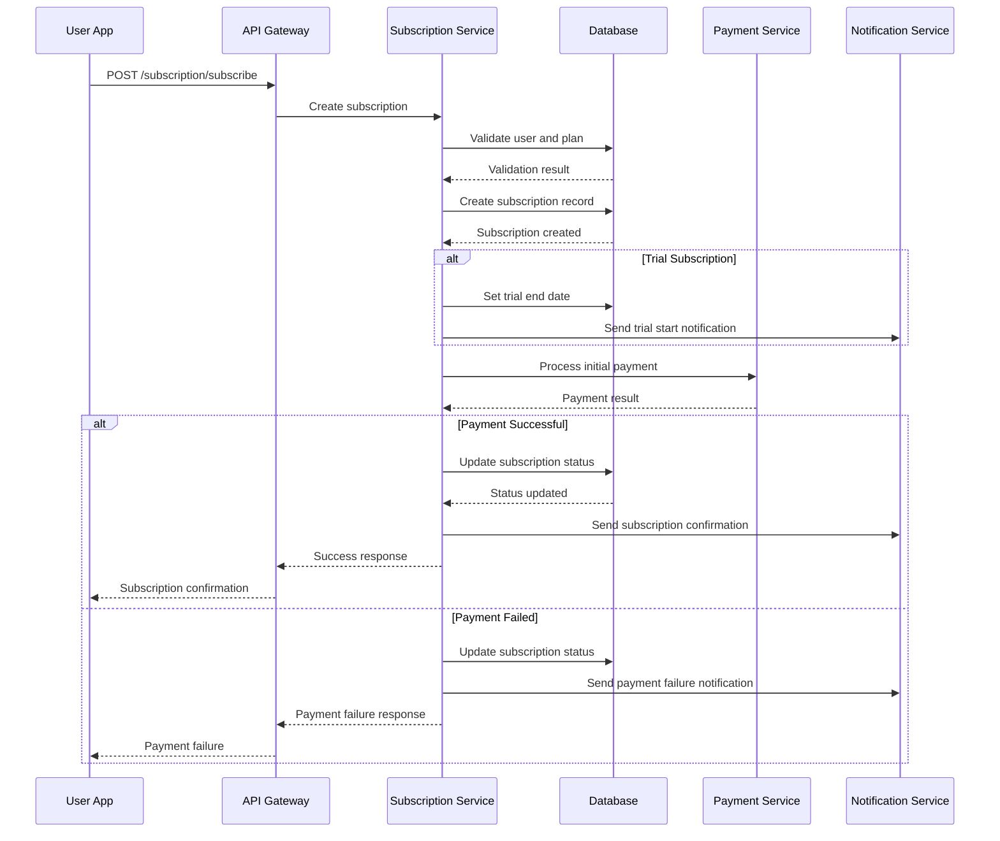
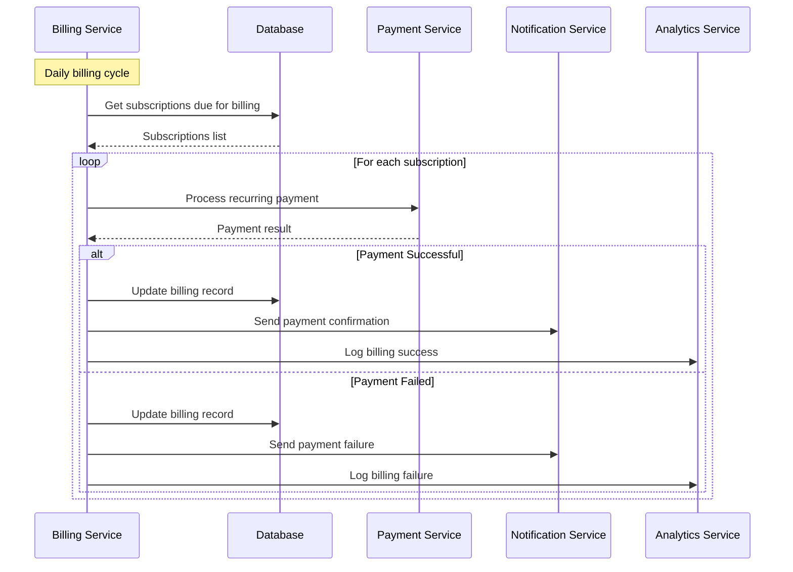
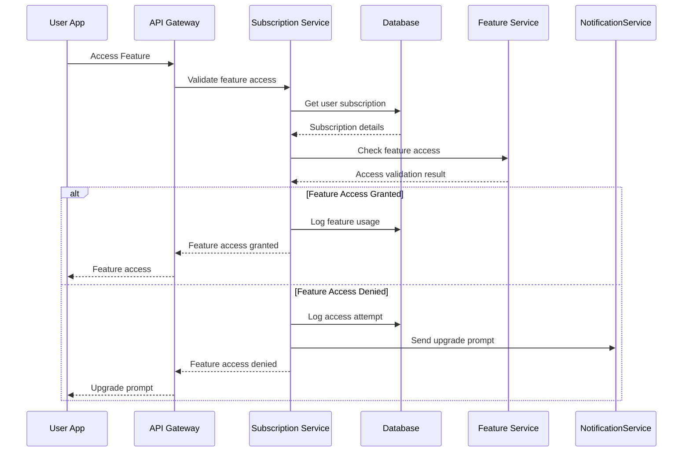

# Subscription System Technical Specification - FINAL VERSION

## Executive Summary

This document provides the complete and final technical specification for the subscription management platform of the reverse marketplace, supporting multiple tiers, recurring payments, feature gating, and revenue optimization for merchants and premium features for buyers.

---

## 1. System Architecture

### 1.1 Core Design Principles

✅ **Flexible Subscription Management**
- Multiple subscription tiers with feature-based pricing
- Automated recurring billing with proration support
- Comprehensive plan management and versioning
- Real-time subscription status updates

✅ **Feature-Based Access Control**
- Real-time feature validation based on subscription
- Granular permission and usage limit enforcement
- Dynamic feature activation and deactivation
- Comprehensive feature analytics and tracking

✅ **Revenue Optimization**
- Automated billing and revenue collection
- Comprehensive analytics and reporting
- Churn prediction and prevention strategies
- Multiple billing cycles and payment methods

### 1.2 Platform Integration

| Platform | Primary Features | Secondary Features | Use Case |
|----------|------------------|-------------------|-----------|
| **Merchant App** | Plan management, billing | Revenue analytics, feature usage | Business subscription management |
| **Buyer App** | Premium features, trials | Plan comparison, upgrade prompts | Personal subscription management |
| **Admin Panel** | Plan configuration, analytics | Revenue tracking, user management | System oversight and control |

---

## 2. Database Schema Specification

### 2.1 Core Subscription Tables

#### `subscription_plans` Table
```sql
CREATE TABLE subscription_plans (
    id UUID PRIMARY KEY DEFAULT gen_random_uuid(),
    name VARCHAR(100) NOT NULL,
    description TEXT NULL,
    type plan_type NOT NULL DEFAULT 'STANDARD',
    price DECIMAL(12, 2) NOT NULL,
    currency VARCHAR(3) NOT NULL DEFAULT 'OMR',
    billing_cycle billing_cycle_type NOT NULL DEFAULT 'MONTHLY',
    trial_days INTEGER DEFAULT 0,
    features JSONB DEFAULT '{}',
    is_active BOOLEAN DEFAULT TRUE,
    sort_order INTEGER DEFAULT 0,
    max_users INTEGER NULL,
    created_at TIMESTAMP WITH TIME ZONE DEFAULT NOW(),
    updated_at TIMESTAMP WITH TIME ZONE DEFAULT NOW()
);

CREATE TYPE plan_type AS ENUM ('STANDARD', 'PREMIUM', 'ENTERPRISE', 'CUSTOM');
CREATE TYPE billing_cycle_type AS ENUM ('DAILY', 'WEEKLY', 'MONTHLY', 'QUARTERLY', 'YEARLY');

-- Indexes
CREATE INDEX idx_subscription_plans_type ON subscription_plans(type);
CREATE INDEX idx_subscription_plans_active ON subscription_plans(is_active);
CREATE INDEX idx_subscription_plans_sort_order ON subscription_plans(sort_order);
CREATE INDEX idx_subscription_plans_price ON subscription_plans(price);
```

#### `subscriptions` Table
```sql
CREATE TABLE subscriptions (
    id UUID PRIMARY KEY DEFAULT gen_random_uuid(),
    user_id UUID NOT NULL REFERENCES users(id) ON DELETE CASCADE,
    plan_id UUID NOT NULL REFERENCES subscription_plans(id) ON DELETE CASCADE,
    status subscription_status NOT NULL DEFAULT 'ACTIVE',
    current_period_start DATE NOT NULL,
    current_period_end DATE NOT NULL,
    next_billing_date DATE NOT NULL,
    auto_renew BOOLEAN DEFAULT TRUE,
    cancelled_at TIMESTAMP WITH TIME ZONE NULL,
    cancelled_reason TEXT NULL,
    trial_ends_at DATE NULL,
    plan_price DECIMAL(12, 2) NOT NULL,
    currency VARCHAR(3) NOT NULL DEFAULT 'OMR',
    created_at TIMESTAMP WITH TIME ZONE DEFAULT NOW(),
    updated_at TIMESTAMP WITH TIME ZONE DEFAULT NOW()
);

CREATE TYPE subscription_status AS ENUM ('TRIAL', 'ACTIVE', 'PAUSED', 'CANCELLED', 'EXPIRED', 'SUSPENDED');

-- Indexes
CREATE INDEX idx_subscriptions_user_id ON subscriptions(user_id);
CREATE INDEX idx_subscriptions_plan_id ON subscriptions(plan_id);
CREATE INDEX idx_subscriptions_status ON subscriptions(status);
CREATE INDEX idx_subscriptions_next_billing ON subscriptions(next_billing_date);
CREATE INDEX idx_subscriptions_auto_renew ON subscriptions(auto_renew);
```

#### `subscription_features` Table
```sql
CREATE TABLE subscription_features (
    id UUID PRIMARY KEY DEFAULT gen_random_uuid(),
    plan_id UUID NOT NULL REFERENCES subscription_plans(id) ON DELETE CASCADE,
    feature_code VARCHAR(100) NOT NULL,
    feature_name VARCHAR(255) NOT NULL,
    feature_type feature_type NOT NULL,
    is_included BOOLEAN DEFAULT TRUE,
    usage_limit INTEGER NULL,
    reset_frequency reset_frequency_type NULL,
    created_at TIMESTAMP WITH TIME ZONE DEFAULT NOW()
);

CREATE TYPE feature_type AS ENUM ('BOOLEAN', 'COUNTED', 'METERED');
CREATE TYPE reset_frequency_type AS ENUM ('DAILY', 'WEEKLY', 'MONTHLY', 'NEVER');

-- Indexes
CREATE INDEX idx_subscription_features_plan_id ON subscription_features(plan_id);
CREATE INDEX idx_subscription_features_feature_code ON subscription_features(feature_code);
CREATE INDEX idx_subscription_features_type ON subscription_features(feature_type);
```

### 2.2 Billing and Payment Tables

#### `subscription_billing` Table
```sql
CREATE TABLE subscription_billing (
    id UUID PRIMARY KEY DEFAULT gen_random_uuid(),
    subscription_id UUID NOT NULL REFERENCES subscriptions(id) ON DELETE CASCADE,
    amount DECIMAL(12, 2) NOT NULL,
    currency VARCHAR(3) NOT NULL DEFAULT 'OMR',
    billing_period_start DATE NOT NULL,
    billing_period_end DATE NOT NULL,
    status billing_status NOT NULL DEFAULT 'PENDING',
    payment_method_id UUID REFERENCES payment_methods(id) NULL,
    transaction_id UUID REFERENCES payments(id) NULL,
    invoice_number VARCHAR(100) NULL,
    due_date DATE NOT NULL,
    paid_at TIMESTAMP WITH TIME ZONE NULL,
    failed_attempts INTEGER DEFAULT 0,
    next_retry_at TIMESTAMP WITH TIME ZONE NULL,
    created_at TIMESTAMP WITH TIME ZONE DEFAULT NOW(),
    updated_at TIMESTAMP WITH TIME ZONE DEFAULT NOW()
);

CREATE TYPE billing_status AS ENUM ('PENDING', 'PAID', 'FAILED', 'PARTIALLY_PAID', 'CANCELLED');

-- Indexes
CREATE INDEX idx_subscription_billing_subscription_id ON subscription_billing(subscription_id);
CREATE INDEX idx_subscription_billing_status ON subscription_billing(status);
CREATE INDEX idx_subscription_billing_due_date ON subscription_billing(due_date);
```

#### `subscription_usage` Table
```sql
CREATE TABLE subscription_usage (
    id UUID PRIMARY KEY DEFAULT gen_random_uuid(),
    subscription_id UUID NOT NULL REFERENCES subscriptions(id) ON DELETE CASCADE,
    feature_code VARCHAR(100) NOT NULL REFERENCES subscription_features(feature_code),
    usage_amount INTEGER NOT NULL DEFAULT 0,
    usage_period DATE NOT NULL,
    recorded_at TIMESTAMP WITH TIME ZONE DEFAULT NOW()
);

-- Indexes
CREATE INDEX idx_subscription_usage_subscription_id ON subscription_usage(subscription_id);
CREATE INDEX idx_subscription_usage_feature_code ON subscription_usage(feature_code);
CREATE INDEX idx_subscription_usage_period ON subscription_usage(usage_period);
```

### 2.3 Analytics and Monitoring Tables

#### `subscription_analytics` Table
```sql
CREATE TABLE subscription_analytics (
    id UUID PRIMARY KEY DEFAULT gen_random_uuid(),
    subscription_id UUID REFERENCES subscriptions(id) ON DELETE SET NULL,
    plan_id UUID REFERENCES subscription_plans(id) ON DELETE SET NULL,
    user_id UUID REFERENCES users(id) ON DELETE SET NULL,
    event_type analytics_event_type NOT NULL,
    amount DECIMAL(12, 2) NULL,
    currency VARCHAR(3) NULL,
    metadata JSONB DEFAULT '{}',
    created_at TIMESTAMP WITH TIME ZONE DEFAULT NOW()
);

CREATE TYPE analytics_event_type AS ENUM (
    'SUBSCRIPTION_STARTED', 'SUBSCRIPTION_CANCELLED', 'PLAN_UPGRADED', 'PLAN_DOWNGRADED',
    'BILLING_SUCCESS', 'BILLING_FAILED', 'TRIAL_STARTED', 'TRIAL_CONVERTED',
    'FEATURE_USED', 'RENEWAL_SUCCESS', 'RENEWAL_FAILED'
);

-- Indexes
CREATE INDEX idx_subscription_analytics_subscription_id ON subscription_analytics(subscription_id);
CREATE INDEX idx_subscription_analytics_plan_id ON subscription_analytics(plan_id);
CREATE INDEX idx_subscription_analytics_user_id ON subscription_analytics(user_id);
CREATE INDEX idx_subscription_analytics_event_type ON subscription_analytics(event_type);
```

---

## 3. Event Publishing

### 3.1 Subscription Events

The Subscription Service publishes the following events to RabbitMQ:

| Event | Trigger | Data | Consumers |
|-------|---------|------|-----------|
| `subscription.started` | New subscription created | SubscriptionStartedEvent | Notification, Analytics, Payment |
| `subscription.cancelled` | Subscription cancelled | SubscriptionCancelledEvent | Notification, Analytics, Payment |
| `subscription.upgraded` | Plan upgraded | SubscriptionUpgradedEvent | Notification, Analytics, Payment |
| `subscription.downgraded` | Plan downgraded | SubscriptionDowngradedEvent | Notification, Analytics, Payment |
| `billing.success` | Billing successful | BillingSuccessEvent | Notification, Analytics, Payment |
| `billing.failed` | Billing failed | BillingFailedEvent | Notification, Analytics, Payment |
| `trial.started` | Trial period started | TrialStartedEvent | Notification, Analytics |
| `trial.ended` | Trial period ended | TrialEndedEvent | Notification, Analytics |

### 3.2 Event Schemas

```typescript
// Base Event Structure
interface BaseEvent {
  eventId: string;
  eventType: string;
  timestamp: string;
  version: string;
  source: 'subscription-service';
  data: any;
  metadata?: {
    correlationId?: string;
    userId?: string;
    subscriptionId?: string;
  };
}

// Subscription Events
interface SubscriptionStartedEvent extends BaseEvent {
  eventType: 'subscription.started';
  data: {
    subscriptionId: string;
    userId: string;
    planId: string;
    planName: string;
    planType: 'STANDARD' | 'PREMIUM' | 'ENTERPRISE' | 'CUSTOM';
    billingCycle: 'DAILY' | 'WEEKLY' | 'MONTHLY' | 'QUARTERLY' | 'YEARLY';
    amount: number;
    currency: string;
    trialEndsAt?: string;
    startedAt: string;
  };
}

interface SubscriptionCancelledEvent extends BaseEvent {
  eventType: 'subscription.cancelled';
  data: {
    subscriptionId: string;
    userId: string;
    planId: string;
    cancelledAt: string;
    reason?: string;
    immediateEffect: boolean;
  };
}

interface SubscriptionUpgradedEvent extends BaseEvent {
  eventType: 'subscription.upgraded';
  data: {
    subscriptionId: string;
    userId: string;
    oldPlanId: string;
    newPlanId: string;
    oldAmount: number;
    newAmount: number;
    prorationAmount: number;
    upgradedAt: string;
  };
}

interface SubscriptionDowngradedEvent extends BaseEvent {
  eventType: 'subscription.downgraded';
  data: {
    subscriptionId: string;
    userId: string;
    oldPlanId: string;
    newPlanId: string;
    oldAmount: number;
    newAmount: number;
    effectiveDate: string;
    downgradedAt: string;
  };
}

// Billing Events
interface BillingSuccessEvent extends BaseEvent {
  eventType: 'billing.success';
  data: {
    billingId: string;
    subscriptionId: string;
    userId: string;
    amount: number;
    currency: string;
    billingPeriodStart: string;
    billingPeriodEnd: string;
    paymentId: string;
    billedAt: string;
  };
}

interface BillingFailedEvent extends BaseEvent {
  eventType: 'billing.failed';
  data: {
    billingId: string;
    subscriptionId: string;
    userId: string;
    amount: number;
    currency: string;
    failureReason: string;
    attemptCount: number;
    nextRetryAt?: string;
    failedAt: string;
  };
}

// Trial Events
interface TrialStartedEvent extends BaseEvent {
  eventType: 'trial.started';
  data: {
    subscriptionId: string;
    userId: string;
    planId: string;
    trialDays: number;
    trialEndsAt: string;
    startedAt: string;
  };
}

interface TrialEndedEvent extends BaseEvent {
  eventType: 'trial.ended';
  data: {
    subscriptionId: string;
    userId: string;
    planId: string;
    trialEndsAt: string;
    converted: boolean;
    endedAt: string;
  };
}
```

---

## 4. API Specifications

### 3.1 Subscription Management Endpoints

#### GET `/subscription/plans`
```typescript
interface PlanSelectionRequest {
  filters?: {
    type?: PlanType[];
    priceRange?: { min: number; max: number; };
    features?: string[];
  };
}

interface PlanSelectionResponse {
  plans: SubscriptionPlan[];
  currentPlan?: CurrentSubscription;
  recommendations?: PlanRecommendation[];
  trialOptions?: TrialOption[];
}
```

#### POST `/subscription/subscribe`
```typescript
interface SubscriptionRequest {
  planId: string;
  paymentMethodId: string;
  trialPeriod?: number;
  metadata?: Record<string, any>;
}

interface SubscriptionResponse {
  success: boolean;
  subscriptionId?: string;
  status?: SubscriptionStatus;
  trialEndsAt?: string;
  nextBillingDate?: string;
  message: string;
  requiresAction?: {
    type: 'PAYMENT' | 'VERIFICATION';
    details: any;
  };
}
```

#### GET `/subscription/{id}`
```typescript
interface GetSubscriptionResponse {
  success: boolean;
  subscription?: {
    id: string;
    userId: string;
    planId: string;
    status: SubscriptionStatus;
    currentPeriodStart: string;
    currentPeriodEnd: string;
    nextBillingDate: string;
    autoRenew: boolean;
    trialEndsAt?: string;
    planPrice: number;
    currency: string;
    createdAt: string;
    updatedAt: string;
    cancelledAt?: string;
    cancelledReason?: string;
  };
  message?: string;
}
```

#### PUT `/subscription/{id}`
```typescript
interface UpdateSubscriptionRequest {
  action: 'UPGRADE' | 'DOWNGRADE' | 'CANCEL' | 'PAUSE' | 'RESUME';
  planId?: string;
  reason?: string;
}

interface UpdateSubscriptionResponse {
  success: boolean;
  subscription?: Subscription;
  message: string;
  proration?: {
    creditAmount: number;
    chargeAmount: number;
    effectiveDate: string;
  };
}
```

### 3.2 Billing Management Endpoints

#### GET `/subscription/billing`
```typescript
interface BillingHistoryRequest {
  subscriptionId?: string;
  dateRange?: {
    startDate: string;
    endDate: string;
  };
  status?: BillingStatus[];
}

interface BillingHistoryResponse {
  billingRecords: BillingRecord[];
  pagination: {
    page: number;
    limit: number;
    total: number;
    totalPages: number;
  };
}
```

#### POST `/subscription/billing/pay`
```typescript
interface PayBillingRequest {
  billingId: string;
  paymentMethodId: string;
}

interface PayBillingResponse {
  success: boolean;
  transactionId?: string;
  status?: BillingStatus;
  message: string;
  requiresAction?: {
    type: 'PAYMENT' | 'VERIFICATION';
    details: any;
  };
}
```

### 3.3 Feature Access Endpoints

#### POST `/subscription/features/check`
```typescript
interface FeatureAccessRequest {
  featureCode: string;
  userId?: string;
}

interface FeatureAccessResponse {
  success: boolean;
  hasAccess: boolean;
  usageLimit?: number;
  currentUsage?: number;
  remainingUsage?: number;
  expiresAt?: string;
  upgradePrompt?: {
    currentPlan: string;
    recommendedPlan: string;
    benefits: string[];
  };
}
```

#### POST `/subscription/features/usage`
```typescript
interface RecordUsageRequest {
  featureCode: string;
  usageAmount: number;
  metadata?: Record<string, any>;
}

interface RecordUsageResponse {
  success: boolean;
  newUsage?: number;
  remainingUsage?: number;
  message: string;
}
```

---

## 4. Billing Cycle Rules

### 4.1 Billing Configuration
```yaml
billing_cycle_rules:
  monthly_billing:
    billing_day: 1 # First day of month
    grace_period_days: 3
    late_fee_percentage: 5.0 # 5% late fee
    max_late_fee: 10.00 # Maximum late fee
  
  annual_billing:
    billing_day: 1 # First day of year
    discount_percentage: 10.0 # 10% discount for annual
    grace_period_days: 7
    auto_renewal_days_before: 30 # Renewal reminder
  
  proration_calculation:
    method: "daily_pro_rata" # Daily pro-rata calculation
    refund_policy: "unused_days" # Refund for unused days
    upgrade_credit: "remaining_value" # Credit for remaining period value
```

### 4.2 Dunning and Collection
```yaml
dunning_process:
  payment_failure_handling:
    max_retry_attempts: 3
    retry_interval_days: [3, 7, 14]
    grace_period_days: 7
    suspension_after_days: 14
  
  collection_workflow:
    day_3_notice: "email"
    day_7_notice: "email_and_sms"
    day_14_suspension: "auto_suspend"
    day_21_cancellation: "auto_cancel"
    
  communication_templates:
    payment_failed: "payment_failed_template"
    subscription_suspended: "suspension_template"
    subscription_cancelled: "cancellation_template"
```

---

## 5. Feature Gating Rules

### 5.1 Feature Validation Configuration
```yaml
feature_gating:
  validation_rules:
    real_time_check: true
    usage_limit_enforcement: true
    override_permissions: ["ADMIN", "SUPPORT"]
    grace_period_minutes: 5
  
  usage_tracking:
    reset_frequency: "monthly"
    aggregation_method: "sum"
    retention_days: 365
  
  feature_types:
    boolean_features: ["premium_support", "advanced_analytics"]
    counted_features: ["api_calls", "exports"]
    metered_features: ["storage_gb", "bandwidth_gb"]
```

---

## 6. Subscription Flows

### 6.1 Subscription Creation Flow


### 6.2 Billing Cycle Processing Flow


### 6.3 Feature Gating Validation Flow


---

## 7. Implementation Phases

### 7.1 Phase 1: Core Subscription Backend (Weeks 1-2)
- [ ] Set up database tables and indexes
- [ ] Implement subscription CRUD operations
- [ ] Create plan management system
- [ ] Set up basic billing logic
- [ ] Implement subscription state machine

### 7.2 Phase 2: Billing and Payment Integration (Weeks 2-3)
- [ ] Integrate payment processing for subscriptions
- [ ] Implement recurring billing workflows
- [ ] Create proration calculation system
- [ ] Set up billing cycle management
- [ ] Implement dunning and collection

### 7.3 Phase 3: Feature Gating System (Weeks 3-4)
- [ ] Implement feature validation service
- [ ] Create usage tracking system
- [ ] Build feature limit enforcement
- [ ] Set up feature override mechanisms
- [ ] Create feature analytics

### 7.4 Phase 4: Merchant App Integration (Weeks 4-5)
- [ ] Create merchant subscription management UI
- [ ] Build plan comparison and upgrade interface
- [ ] Implement billing history and analytics
- [ ] Create revenue tracking dashboard
- [ ] Add payout management features

### 7.5 Phase 5: Buyer App Integration (Weeks 5-6)
- [ ] Create premium features discovery interface
- [ ] Build subscription management UI
- [ ] Implement trial management system
- [ ] Create upgrade prompts and recommendations
- [ ] Add feature access validation

### 7.6 Phase 6: Admin Panel and Analytics (Weeks 6-7)
- [ ] Create admin plan configuration interface
- [ ] Build comprehensive analytics dashboard
- [ ] Implement user management tools
- [ ] Create revenue optimization features
- [ ] Set up compliance and reporting

---

## 8. Testing Requirements

### 8.1 Functionality Testing
- [ ] Test complete subscription lifecycle
- [ ] Verify plan upgrade and downgrade flows
- [ ] Test subscription billing and renewal processes
- [ ] Validate feature gating accuracy
- [ ] Test subscription pause and resume functionality

### 8.2 Performance Testing
- [ ] Test subscription creation performance under load
- [ ] Verify billing cycle processing performance
- [ ] Test feature validation performance
- [ ] Validate database query optimization
- [ ] Test concurrent subscription operations

### 8.3 Security Testing
- [ ] Test subscription access control
- [ ] Verify payment processing security
- [ ] Test feature override security
- [ ] Validate admin access controls
- [ ] Test data privacy and compliance

---

## 9. Monitoring & Analytics

### 9.1 Key Metrics
- Subscription acquisition and retention rates
- Plan performance and conversion rates
- Billing success and failure rates
- Feature usage and engagement metrics
- Revenue and churn analytics

### 9.2 Performance Monitoring
- API response times for subscription operations
- Database query performance optimization
- Billing processing throughput
- Feature validation performance
- System resource utilization

### 9.3 Business Analytics
- Customer lifetime value (LTV) calculation
- Churn prediction and prevention
- Revenue optimization opportunities
- Plan performance comparison
- Market demand analysis

---

## 10. Security Considerations

### 10.1 Subscription Security
- Secure subscription data storage
- Access control for plan management
- Audit logging for all changes
- Rate limiting for subscription operations
- Payment data protection

### 10.2 Payment Security
- PCI DSS compliance for payment processing
- Secure payment method storage
- Recurring payment security
- Fraud detection for subscription payments
- Payment data encryption

### 10.3 Data Protection
- GDPR compliance for subscriber data
- Data retention and deletion policies
- Privacy controls for subscription data
- Secure backup and recovery
- Access logging and audit trails

---

## 11. User Experience (UX) Specifications

### 11.1 Admin Panel Subscription UX

#### Subscription Management Dashboard
**Visual Design:**
- Comprehensive subscription overview with real-time metrics
- Interactive revenue charts with breakdown by plan type
- Customer lifecycle visualization with churn analysis
- Feature usage analytics with engagement tracking
- Performance dashboard with KPI monitoring

**Interaction Design:**
- Draggable dashboard widgets for customization
- Advanced filtering with date range and segmentation
- Quick export functionality for reports (CSV, PDF, Excel)
- Bulk subscription management with selection tools
- Real-time data refresh with configurable intervals

**Administrative Tools:**
- Plan configuration wizard with visual previews
- Customer segmentation with behavioral targeting
- Revenue optimization with A/B testing interface
- Compliance monitoring with regulatory checklists
- Performance alerts with automated recommendations

#### Plan Configuration Interface
**Visual Interface:**
- Plan builder with drag-and-drop feature selection
- Pricing calculator with revenue projections
- Feature comparison matrix with visual indicators
- Trial configuration with timeline visualization
- Migration tools with impact analysis

**Configuration Features:**
- Dynamic pricing with tier-based structures
- Feature bundling with package creation
- Discount management with promotional campaigns
- Geographic pricing with regional variations
- Usage-based billing with meter visualization

### 11.2 Buyer App Subscription UX

#### Subscription Discovery
**Visual Design:**
- Clean plan comparison interface with visual hierarchy
- Interactive feature matrix with checkmarks and indicators
- Pricing cards with value proposition highlights
- Trial promotion banners with clear CTAs
- Social proof with customer testimonials

**Interaction Design:**
- Swipe gestures for plan navigation
- Tap-to-expand for detailed feature information
- Pull-to-refresh for updated pricing
- Long-press for quick action menus
- Pinch-to-zoom for detailed plan comparison

**Smart Features:**
- Personalized plan recommendations based on usage
- Smart trial suggestions with conversion probability
- Usage analytics with optimization tips
- Cost savings calculator with projections
- Feature education with interactive tutorials

#### Subscription Management
**Visual Organization:**
- Dashboard with current plan status and benefits
- Usage tracking with visual progress bars
- Billing history with detailed receipts
- Upgrade/downgrade options with comparison tools
- Account settings with preference management

**User Experience:**
- One-click plan changes with confirmation flow
- Automatic upgrade suggestions based on usage
- Billing reminders with calendar integration
- Cancellation flow with retention offers
- Subscription pause with resume options

### 11.3 Merchant App Subscription UX

#### Business Subscription Hub
**Visual Design:**
- Professional subscription dashboard with business metrics
- ROI calculator with revenue projections
- Team management with seat allocation
- Feature usage analytics with business insights
- Performance tracking with competitor benchmarks

**Interaction Design:**
- Quick seat management with drag-and-drop
- Bulk user management with CSV import
- Advanced filtering with department segmentation
- Real-time usage tracking with alerts
- One-click billing with approval workflows

**Business Intelligence:**
- Cost optimization recommendations
- Feature utilization analysis with team insights
- Budget forecasting with predictive analytics
- Performance comparison with industry standards
- ROI tracking with detailed reporting

#### Team Management
**Visual Interface:**
- Team member management with role-based access
- Permission matrix with visual indicators
- Onboarding workflow with progress tracking
- Performance analytics with team metrics
- Training resources with skill development

**Collaboration Features:**
- Shared subscription benefits with team access
- Collaborative tools with integration options
- Usage monitoring with team leaderboards
- Cost allocation with department tracking
- Custom reporting with business metrics

### 11.4 Cross-Platform Subscription Experience

#### Responsive Design
**Mobile Optimization:**
- Touch-optimized subscription interface
- Gesture-based navigation for quick actions
- Adaptive layouts for different screen sizes
- Offline mode with subscription data caching
- Push notifications for billing reminders

**Desktop Experience:**
- Multi-window support for parallel subscription management
- Keyboard shortcuts for power users
- Advanced filtering with complex criteria
- Bulk operations for efficiency
- Detailed analytics with drill-down capabilities

#### Real-Time Features
**Live Updates:**
- Real-time usage tracking with visual indicators
- Live billing status with payment processing
- Instant feature activation with confirmation
- Real-time analytics with live dashboards
- Live support with chat integration

**Synchronization:**
- Cross-device subscription status synchronization
- Usage tracking synchronization across platforms
- Billing notification synchronization with smart filtering
- Preference synchronization with cloud backup
- Real-time collaboration with team members

### 11.5 Accessibility & Inclusivity

#### Accessibility Standards
**WCAG 2.1 AA Compliance:**
- Screen reader compatibility for subscription content
- Keyboard navigation for all subscription functions
- High contrast mode for better visibility
- Voice control support for hands-free operation
- Adjustable text sizes without layout breakage

**Inclusive Design:**
- Multi-language support with localized pricing
- Cultural sensitivity in subscription presentation
- Cognitive accessibility with clear subscription flows
- Motor accessibility with large touch targets
- Visual accessibility with color-blind friendly design

#### Personalization Options
**User Preferences:**
- Customizable dashboard layouts and widgets
- Adaptive plan recommendations based on usage
- Personalized billing preferences and reminders
- Theme and color scheme adjustments
- Language and regional settings

**Accessibility Features:**
- Text-to-speech for subscription plan details
- Voice commands for subscription management
- Screen magnification for detailed review
- Alternative input methods for mobility
- Cognitive assistance for complex subscription decisions

### 11.6 Performance & Optimization

#### Loading Performance
**Speed Optimization:**
- Instant subscription loading with progressive enhancement
- Smart caching for frequently accessed subscription data
- Predictive loading for likely user actions
- Background sync for offline subscription functionality
- Optimized billing processing with parallel execution

**Network Efficiency:**
- Data compression for reduced bandwidth usage
- Intelligent retry mechanisms for failed subscription operations
- Offline mode with subscription queue management
- Graceful degradation on poor connections
- Background updates for real-time subscription synchronization

#### User Experience Metrics
**Key Performance Indicators:**
- Subscription conversion rate optimization
- Average time to plan selection
- User engagement with subscription features
- Churn rate reduction through UX improvements
- Support ticket reduction through self-service

**Continuous Improvement:**
- A/B testing for subscription interface optimization
- User behavior analysis for UX improvements
- Performance monitoring with real-time alerts
- User feedback integration with rapid iteration
- Machine learning for personalized subscription experiences

---

## 12. Conclusion

This final specification provides a complete, scalable, and secure subscription system that:

✅ **Supports Flexible Subscription Management** - Multiple tiers with feature-based pricing
✅ **Enables Automated Billing** - Recurring payments with proration and dunning
✅ **Provides Real-Time Feature Gating** - Dynamic feature access with usage tracking
✅ **Ensures Revenue Optimization** - Comprehensive analytics and churn prevention
✅ **Delivers Performance** - Optimized for high-volume marketplace usage

The system is ready for implementation with clear phases, testing strategies, and deployment guidelines. All security considerations have been addressed, and the architecture supports the specific needs of a reverse marketplace while maintaining security, performance, and scalability standards.

---

## 12. Implementation Checklist

### 12.1 Pre-Implementation
- [ ] Review and approve subscription configurations
- [ ] Select and configure payment providers
- [ ] Set up feature gating rules
- [ ] Prepare database migration scripts
- [ ] Configure monitoring and alerting

### 12.2 Implementation
- [ ] Implement all database schemas
- [ ] Develop subscription management APIs
- [ ] Create billing and payment integration
- [ ] Build feature gating system
- [ ] Implement analytics and monitoring

### 12.3 Post-Implementation
- [ ] Conduct comprehensive testing
- [ ] Perform load and stress testing
- [ ] Validate all subscription flows
- [ ] Deploy to production environment
- [ ] Monitor and optimize performance

This specification serves as a complete technical foundation for implementing a robust, scalable, and user-friendly subscription system for a reverse marketplace platform.
